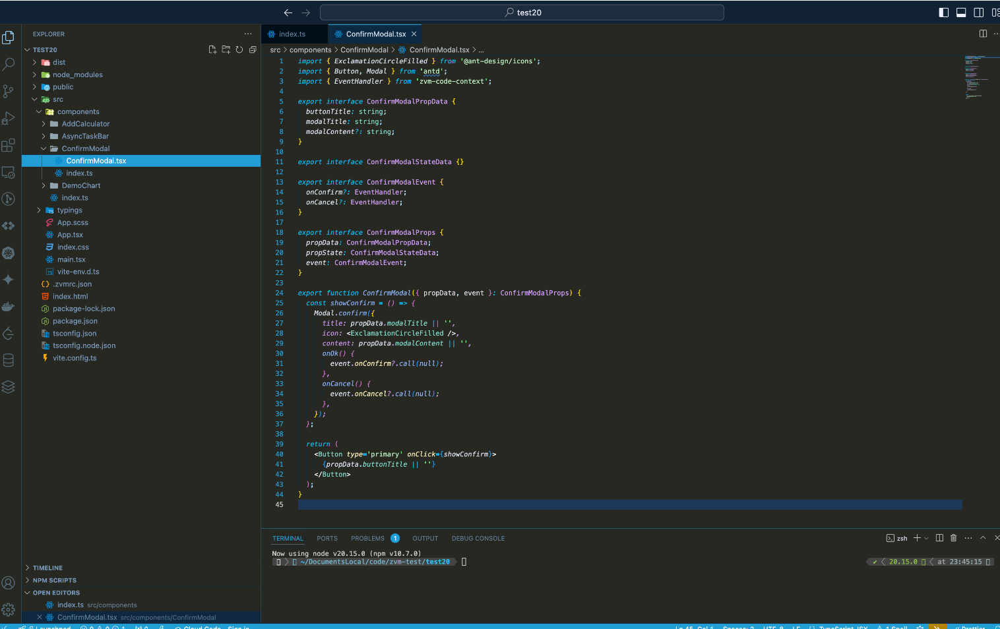
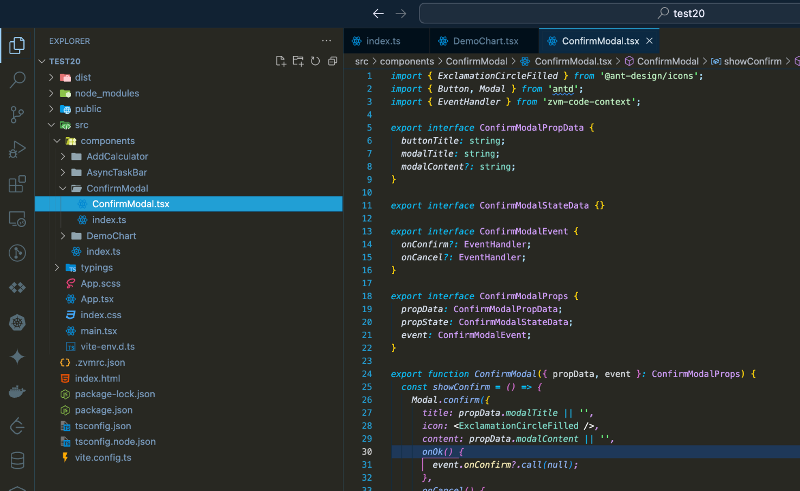
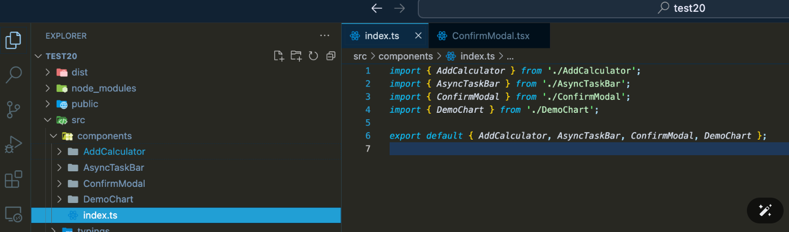
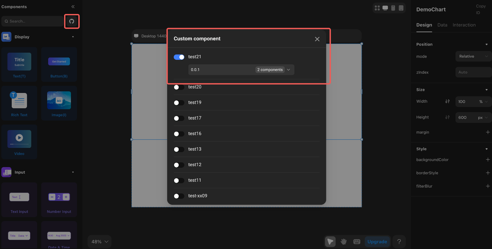
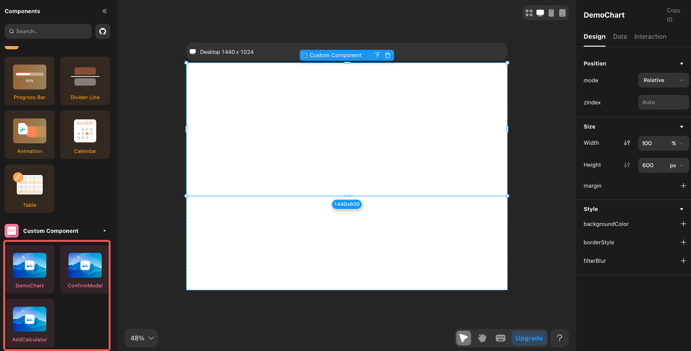
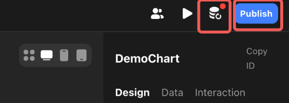
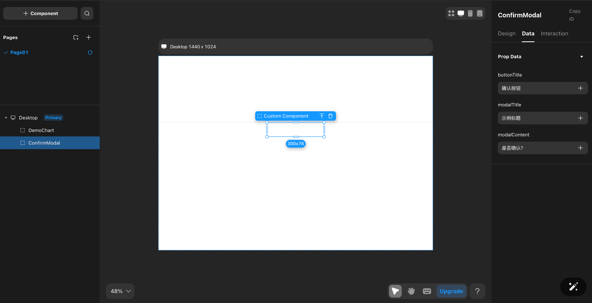

# Code Component

## Introduction

Enhance your applications by adding custom-built React components. These components enable dynamic forms with live validation, data-driven charts, advanced animations, transitions, interactive maps, and other data visualizations, expanding the range of interactive functionality. See a data visualization showcase [here](https://dev.to/momen_hq/interop-between-code-and-no-code-using-code-components-to-add-echart-in-your-project-4ifp).

## Prerequisites

Before you begin, ensure you meet the following prerequisites:

- Working knowledge of Momen
- Basic front-end development experience
- Familiarity with TypeScript
- Ability to develop custom React components

If you are new to React, refer to the [React official docs](https://react.dev/learn).

## Getting Started

To begin, install Momen CLI globally for local development. This provides the `zvm` command alias for platform operations.

```bash
# Install globally
npm i -g momen-cli
```

Verify the installation by running:

```bash
zvm --version
```

### Platform Login

Sign in from your project’s working directory. Replace `username` and `password` with your actual credentials.

```bash
momen signin username password
```

### Project Creation

Create a new code component project:

```bash
momen create project_name
```

This command generates a template and registers it as a new code component project in Momen. Multiple components can be added, but the initial setup does not publish a version—further steps are required to release it.

### Editing Code

Navigate to your project directory and install dependencies:

```bash
cd project_name
npm install
```

A typical code component library project has the following structure:



For each custom component, create a dedicated folder under `src/components` with:

- **`index.ts`**: for exporting the component
- **`[ComponentName].tsx`**: for component logic

Each component file must export four interfaces for property types:

- **`[ComponentName]PropData`**: Defines data types received from the host project (supported types: string, number, boolean)
- **`[ComponentName]StateData`**: Declares component states exposed to the host, with type `State` from the `zvm-code-context` package
- **`[ComponentName]Event`**: Declares internal events with properties typed as `EventHandler` from `zvm-code-context`
- **`[ComponentName]Prop`**: Combines the above three interfaces as `propData`, `propState`, and `event`



Expose newly created components in `src/components/index.ts`.



Refer to the template’s example code for guidance. Follow the conventions strictly for proper component and declaration recognition.

### Publishing the Project

Update the `version` field in `package.json` to follow npm semantic versioning (e.g., `1.0.0`). Then, publish your project:

```bash
momen publish
```

After publishing, the new code component library will be available for configuration in any Momen project.

### Importing Code Components

To add your custom code component to a no-code project:

1. Click the code component icon on the left sidebar.
2. Select your newly published component project in the pop-up window.



Once added, the component will appear at the bottom of the left sidebar.



### Database Synchronization

After configuring or modifying a component, sync the database or preview to ensure it functions at runtime. Click the **database sync icon** (upper left of the interface).



### Configuring Component Properties

Properties are parsed according to their declared types. Follow naming conventions and structure precisely to ensure compatibility with Momen.



## About Momen

[Momen](https://momen.app/?channel=docs) is a no-code web app builder that lets you create fully customizable web apps, marketplaces, social networks, AI tools, enterprise SaaS platforms, and more. Iterate and refine your projects in real time for a smooth, streamlined creation process. Momen also offers powerful API integration, making it easy to connect your app to any service. Bring your ideas to life and launch products faster than ever with Momen.
