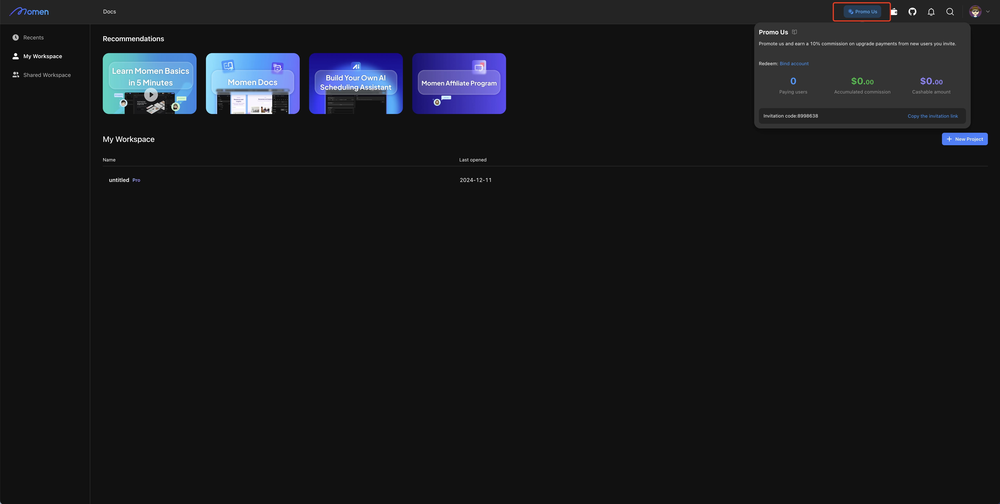
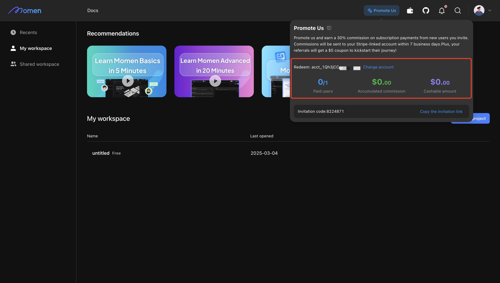

# Promoting Momen

Momen offers a commission program, designed to empower users and expand Momen's reach. Through this program, users can earn generous rewards by promoting Momen to others, with an easy-to-follow process that attracts individuals and businesses interested in no-code development.

## What You Can Earn

By sharing your unique invite code, you can earn up to 10% commission when a new user successfully registers and makes a payment when buying project plan. The commission is based on the new user’s payment actions, and there is no upper limit to how much you can earn, offering great potential for promoters.

## How to Become a Promoter

**Get Started:** Click the "Promote Us" button in the top right corner of the platform.

<figure><figcaption></figcaption></figure>

**Get Your Promo Code:** Copy your unique invitation code or link and start sharing it. Ask your friends to fill in the invitation code when they register. Alternatively, they can directly sign up via your link, and the invitation code will be automatically filled.

**Link Your Withdrawal Account:** You can only withdraw commissions to your Stripe connect account.

## Commission Details

You earn 10% commission. If your referral uses a discount, your commission is based on the discounted price.

* Example: If your referral subscribes to the monthly Pro plan for $99, you earn $9.9. With a 50% discount, your commission is $4.95.

Program End Date: December 31st, 2025

_Please note: Commission rates and terms are subject to change at any time._

## Successful Referral Criteria

A successful referral occurs when a new user signs up with your link and pays for at least one month’s **subscription**. (Buying computing resources does not count.)

You’ll earn commissions if your referral remains a paid customer within one year of signing up.

If your referral upgrades (e.g., from Basic to Pro), the original commission will be refunded, and you’ll receive the new commission based on the Pro plan.

## How to Receive Your Rewards

**Receive Commissions:**

Within 7 business days, your earnings will be automatically transferred to your linked Stripe account.

**Track Your Promotion Performance:**

<figure><figcaption></figcaption></figure>

Paid Users: number of paid users / number of users you’ve referred.

Accumulated Commissions: view your total earnings.

Cashable Cash: Check how much cash is available for withdrawal.
