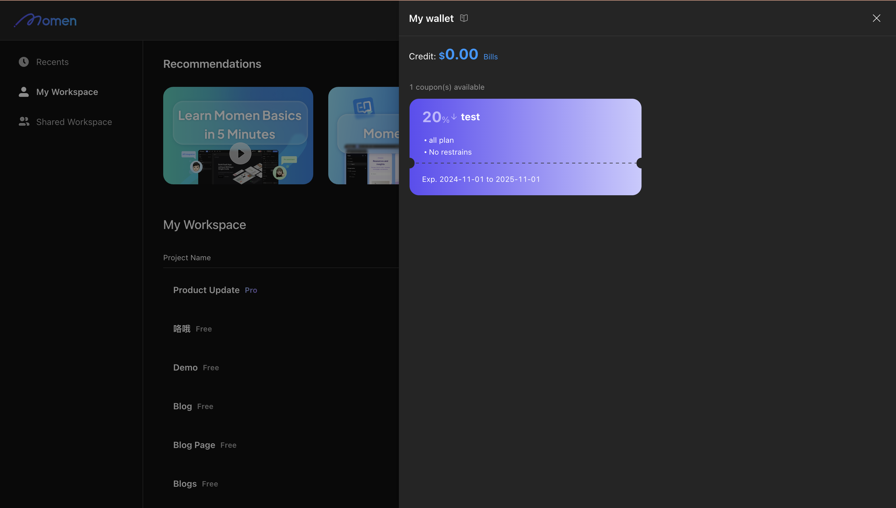

# My Wallet

## Introduction

"My Wallet" provides users with convenient payment options on Momen, enabling purchases using discount coupons and credits.

## Benefits

- **Discounts:** Use coupons to reduce the cost of purchases.
- **Credit Payments:** Pay for plans, computing resources, and single-tenant servers directly from your account credit.
- **Transaction Records:** Access records of all transactions, upgrades, and refund in the "Bill" section in My Wallet.

## Overview of My Wallet

### Coupons

**Details:**

- **Types:** Percentage off, dollar off and promotional credit
- **Applicable Products:** Plans, computing resources, and single-tenant servers
- **Usage Restrictions:** Vary by project plan and minimum spending amount
- **Validity:** Must be used within a specified period

**Usage:**  
The system automatically selects the best available coupon on the order page if applicable coupons exist.

**Records:**  
All coupons used or expired in the last 7 days are documented.

**Notes:**

- Coupons cannot be transferred or gifted.
- Only one coupon can be used per order.
- Coupons applied to premium plan subscriptions provide discounts only for the first month or first year.
- When an order is created with a coupon, the coupon is locked. If not paid within 5 minutes or if the order is manually closed, the coupon will be returned.

### Credits

- **Viewing:** Access "My Wallet" and view your credit balance in the top left corner.

- **Usage:** If your credit is sufficient, credit payment is the default option. Users can also choose Stripe payment.

.png)

- **Records:** View records of purchases made using credits in the billing section.

**Notes:**

- Mixed payments using both credits and bank cards are currently not supported.
- Add funds is currently unavailable.

## About Momen

[Momen](https://momen.app/?channel=docs) is a no-code web app builder that lets you create fully customizable web apps, marketplaces, social networks, AI tools, enterprise SaaS platforms, and more. Iterate and refine your projects in real time for a smooth, streamlined creation process. Momen also offers powerful API integration, making it easy to connect your app to any service. Bring your ideas to life and launch products faster than ever with Momen.
