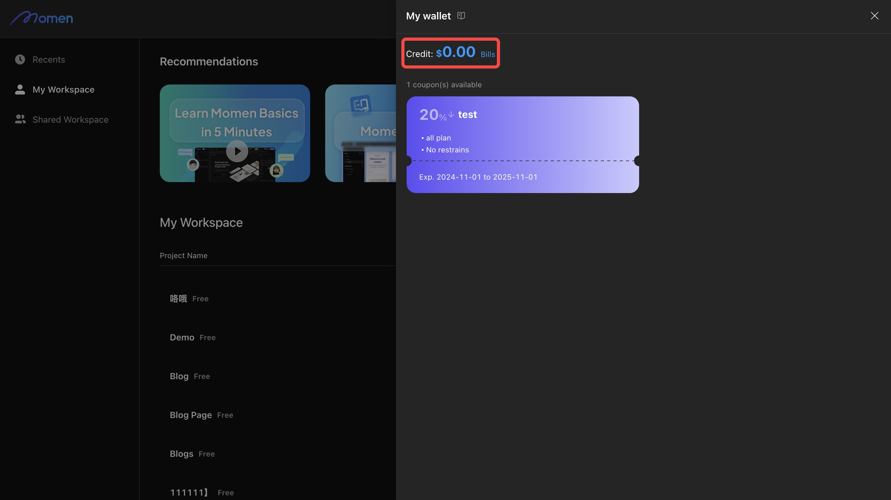
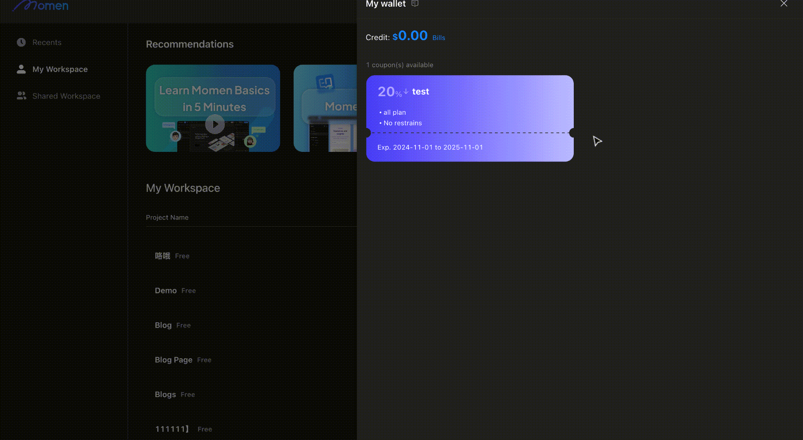

# My Wallet

## Introduction

"My Wallet" provides users with convenient payment options on Momen, enabling purchases using discount coupons and credits.

## Benefits

- **Discounts:** Use coupons to reduce the cost of purchases.
- **Credit Payments:** Pay for plans, computing resources, and single-tenant servers directly from your account credit.
- **Transaction Records:** Access a record of all transactions, upgrades, and refunds through the "Bill" function in My Wallet.

## Overview of My Wallet

### Coupons

**Details:**

- **Types:** Discount coupons and cash vouchers
- **Applicable Products:** Plans, computing resources, and single-tenant servers
- **Usage Restrictions:** Vary by project plan and minimum spending amount
- **Validity:** Must be used within a specified period

**Usage:**  
The system automatically selects the best available coupon on the order page if applicable coupons exist.

**Records:**  
All coupons used or expired in the last 7 days are documented.

**Important Notes:**

- Coupons cannot be transferred or gifted.
- Only one coupon can be used per order.
- Coupons applied to premium plan subscriptions provide discounts only for the first month.
- When an order is created with a coupon, the coupon is locked. If not paid within 5 minutes or if the order is manually closed, the coupon will be returned.

### Credits

- **Viewing:** Access "My Wallet" and view your credit balance in the top left corner.

- **Usage:** If your credit is sufficient, credit payment is the default option. Users can also choose Stripe payment.

.png)

- **Records:** View records of purchases made using credits in the billing section.

**Important Notes:**

- Mixed payments are not supported.
- Recharge is currently unavailable.

## About Momen

[Momen](https://momen.app/?channel=blog-about) is a no-code web app builder that allows users to build fully customizable web apps, marketplaces, social networks, AI apps, enterprise SaaS, and more. You can iterate and refine your projects in real time for a seamless creation process. Momen offers powerful API integration, enabling you to connect your projects to any service. With Momen, you can bring your ideas to life and launch web app products faster than ever.
