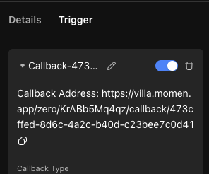
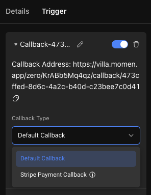

# Scheduled Job/Callbacks

### **Configuration Portal**

In the Configure Action Flow interface, find the lightning bolt-shaped button next to the \[Create] button and add a scheduled job/callback

.png>)

### **Scheduled Job**

#### **Application Scenario**

Trigger an actionflow at regular intervals or once.

#### **Configuration Item Description**

Time Range: Configure the start and end time of the timed trigger.

Cycle Type: Configure whether the action flow is triggered "every minute", "every hour", "every day", "every week" or "every year", and at which point in time it is triggered.

Binding actionflows: Select the action flows that need to be triggered at regular intervals.

Tips:

⚠️ Note: Once a timed trigger is configured, it can not be deleted and will not stop until it reaches the end time, so when testing timed triggers, you can set a shorter cycle time and a close end time.

The current entry box only supports input, not data selection.

#### **Callback Triggering (High-Level)**

Definition of the callback: In scenarios that require a third-party server to push, such as payment, or CRM Service workflow push, you may encounter scenarios that require us to provide a webhook/callback address for the other party to call.

For users who have an API base, it can be understood that the defined custom actionflow is encapsulated into an API.

#### **Application Scenarios**

1. Trigger action through links
2. Payment configuration callbacks

#### **Basic Configuration**

1. Add a callback

.png>)

2. Configure parameters

.png>)

3. Bind the action flow and configure the inbound parameters

.png>)

4. Copy the path to the desired place

#### **Stripe Callback**

By selecting Stripe payment callback, the parameters are automatically configured.

If you encounter any issues during the process, feel free to join our [Discord community](https://discord.com/invite/UCyhySSXfz) for assistance.​​​

### **About Momen​​​​​**

[Momen](https://momen.app/?channel=blog-about) is a no-code web app builder, allows users to build fully customizable web apps, marketplaces, Social Networks, AI Apps, Enterprise SaaS, and much more. You can iterate and refine your projects in real-time, ensuring a seamless creation process. Meanwhile, Momen offers powerful API integration capabilities, allowing you to connect your projects to any service you need. With Momen, you can bring your ideas to life and build remarkable digital solutions and get your web app products to market faster than ever before.​​
