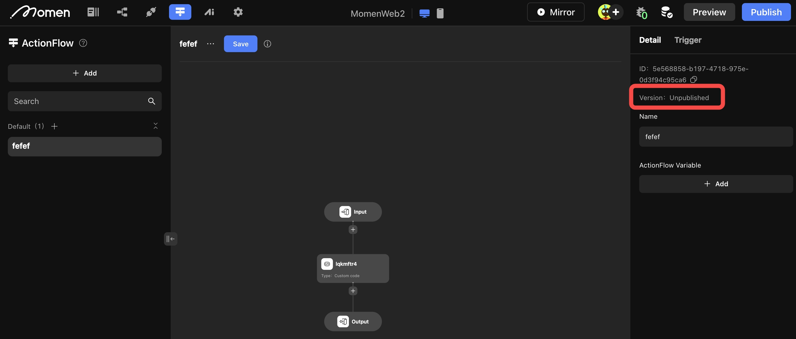
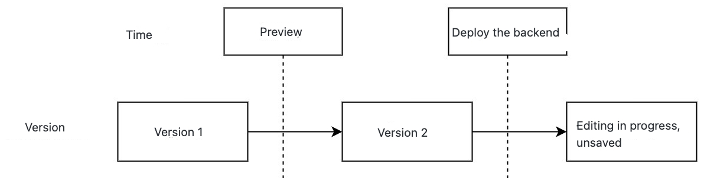
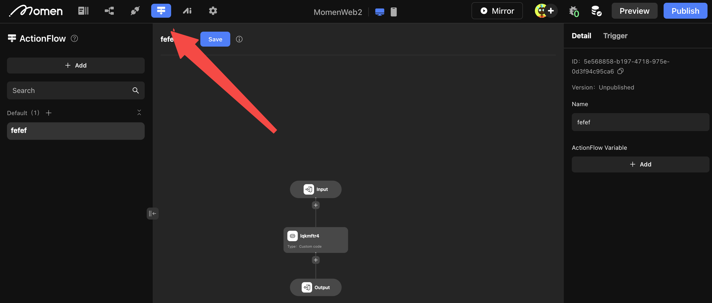
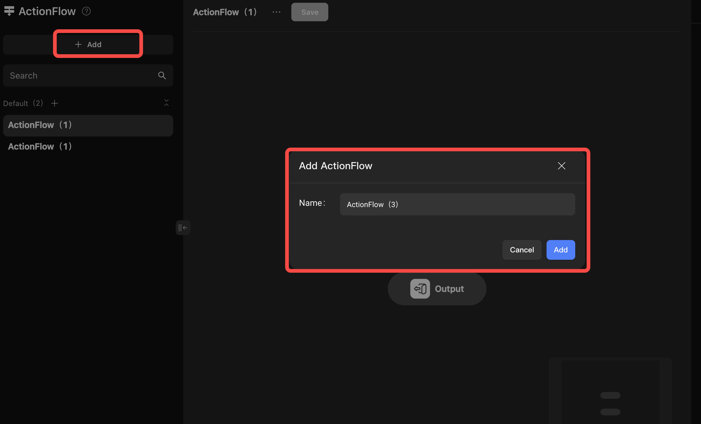
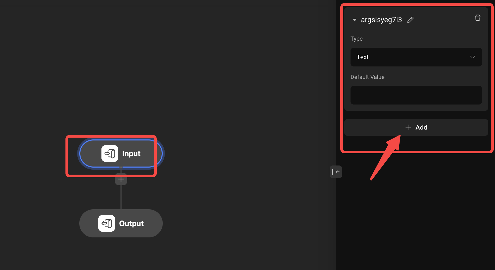
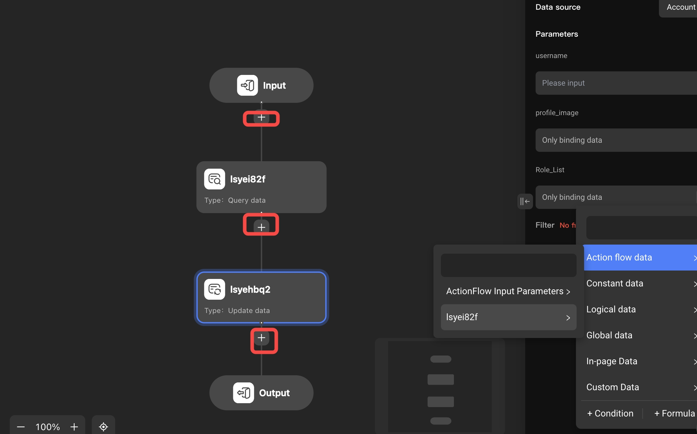
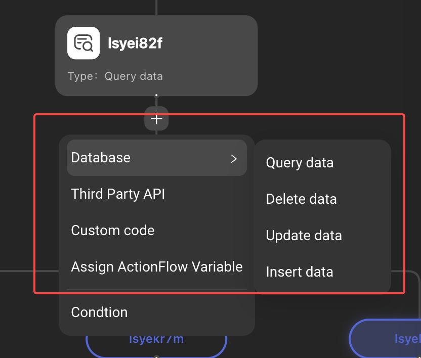

# Actionflow Fundamentals

## Introduction

Building in Momen is like building Legos. However, there are always some functions that can not be built by the existing components and actions in Momen.

For example:

* Randomly draw a question from the question bank that the current user has not done;
* Change the order status to "transaction expired" every minute if it has been "pending" for more than 15 minutes
* Encapsulate the commands to operate the database into API for external calls, such as operating the database after payment.

These functions need to rely on Momen's actionflow to complete. We can understand Momen's actionflow as a function or API. Given an input, it executes the corresponding actions, and returns an output. The logic of execution is fully customizable based on your needs.

## Concept of ActionFlow Versions
* ActionFlow won't be saved automatically. Make sure to click Save in the upper right corner. Otherwise, the latest Action Flow will not be executed.
* After each save, the version will be updated.
* Callbacks and timed triggers execute the latest version of the deployed backend.

<figure><figcaption></figcaption></figure>

Example:

* The version executed in your app is version 1.
* The version executed by callbacks and timed triggers is version 2.

<figure><figcaption></figcaption></figure>

## Access Actionflow 

Click on the \[Action Flow] button in the upper left corner of the editor to enter the action flow creation page.

<figure><figcaption></figcaption></figure>

## Creating an ActionFlow

Click the \[Add] button on the left side of the action flow creation page to create an action flow.

<figure><figcaption></figcaption></figure>

## Configuring an ActionFlow

A complete action flow configuration consists of three parts: input parameters, action operations/branches, and output parameters.

### 1. Configuring Input Parameters

If your actionflow is to further process the data entered by the user or generated by the front-end page logic, you need to click the \[Input] button at the top of the action flow to add input parameters. It is recommended to rename the parameters and select the appropriate data type.

<figure><figcaption></figcaption></figure>

### 2. Concepts of Nodes, Operations and Branches

**Nodes**

Each \[+] sign in the actionflow represents a \[node], in each node you can use the result data generated by the parent node.

For example: you can directly refer to actionflow data as the filter condition to update the same data.&#x20;

<figure><figcaption></figcaption></figure>

**Operations**

Actions to be performed in the actionflow. The order of execution of operations is from top to bottom.

**Branches**

When executing different operations under different conditions, you can add branches to set conditions, the evaluation order of the conditions is from left to right, and there are at least two branches when adding.\

## Adding Actions

In order to realize various business requirements, the following seven operations can be configured in the action flow.

<figure><figcaption></figcaption></figure>

\
**Query Data**

After adding this operation, when running the actionflow, you can configure filtering conditions, making distinct, sorting, and directly read one or more pieces of data in the data table, and the acquired data can be used in other operations or branches of the subsequent action flow.

\
**Delete Data**

After adding this action, data that meets the filter criteria will be deleted when the actionflow is run.

\
**Update Data**

When this action is added, the act of updating the data in a table that meets the filter criteria is performed when the action flow is run.

\
**Insert Data**

This action will add one piece of data to a table, and when you turn on the batch operation, then you can add multiple items.&#x20;

\
**Custom Code**

JS code can be edited in the actionflow to implement more complex logic.

\
**Third-party APIs**

You can call APIs to get/modify external data in the actionflow.

\
**Configuration Output**

If you need to take the result of actionflow processing to the front-end page, you need to configure the output parameter.

## Note

* Actionflow does not use strict type checking; therefore, assigning a \[text] variable to a \[integer] variable is not forbidden.
* Before deleting a node, first delete the output of the node that will be used later.

## About Momen

[Momen](https://momen.app/?channel=blog-about) is a no-code web app builder, allows users to build fully customizable web apps, marketplaces, Social Networks, AI Apps, Enterprise SaaS, and much more. You can iterate and refine your projects in real-time, ensuring a seamless creation process. Meanwhile, Momen offers powerful API integration capabilities, allowing you to connect your projects to any service you need. With Momen, you can bring your ideas to life and build remarkable digital solutions and get your web app products to market faster than ever before.

