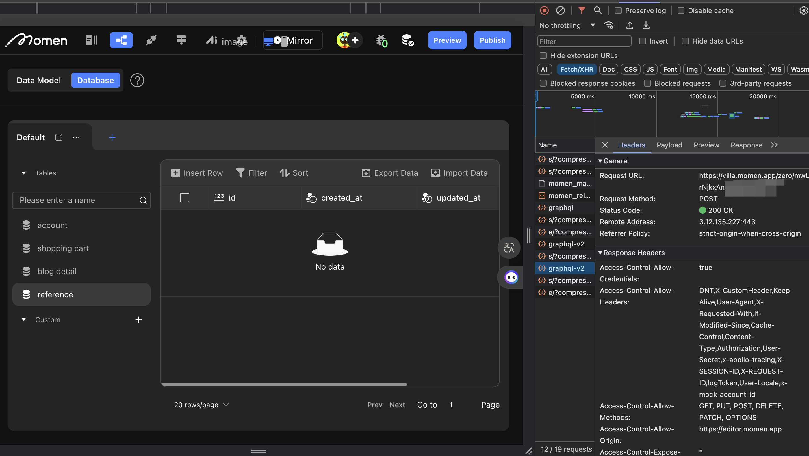
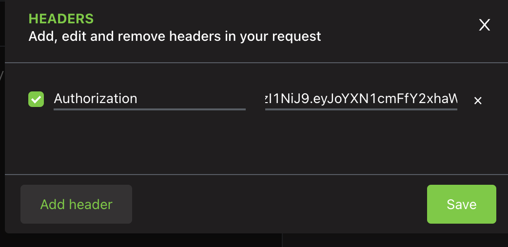
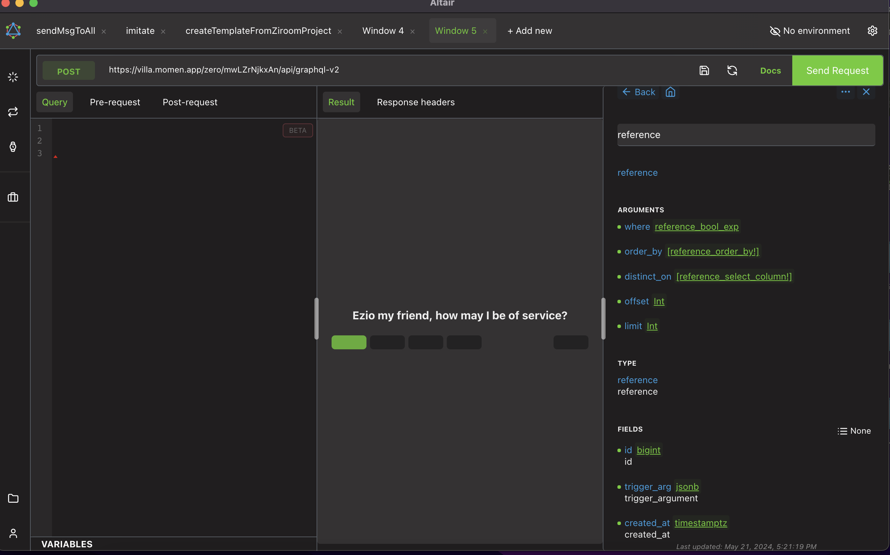
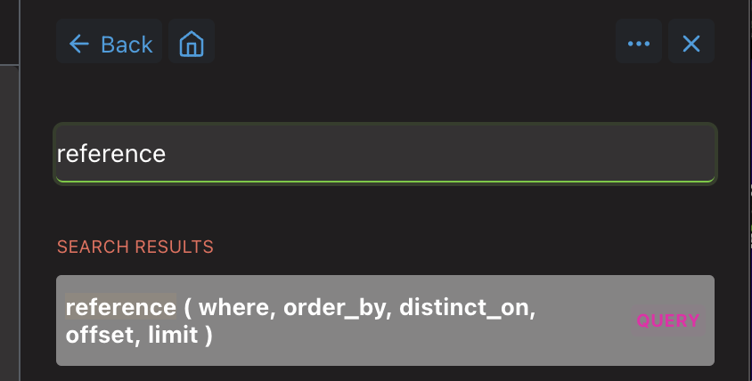
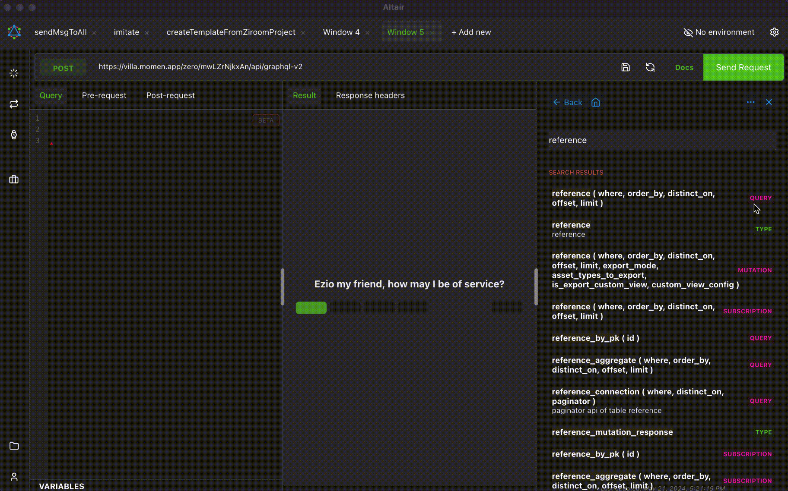
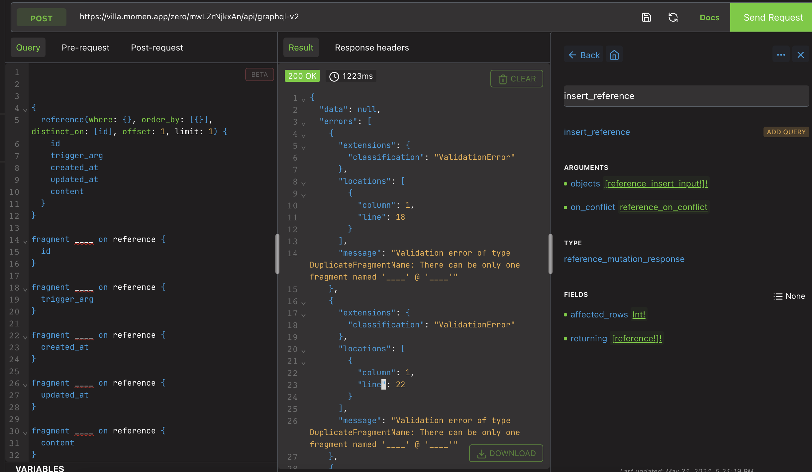
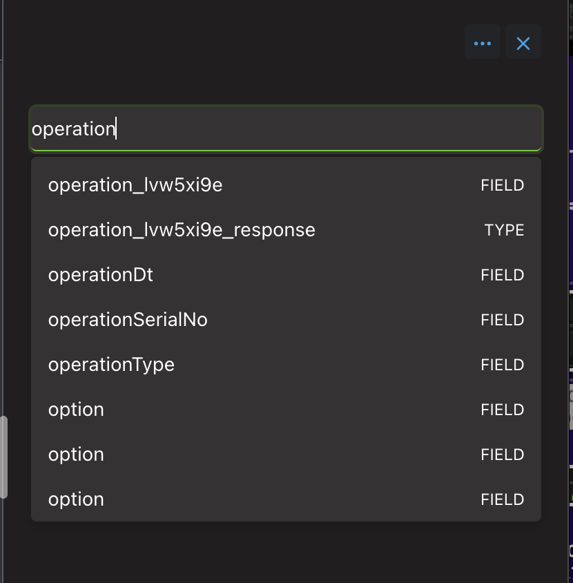

# Custom Code

## Prerequisites

You should have a basic understanding of JavaScript, including variables, functions, loops, and conditionals.

## Adding Custom Code

Currently, the "Custom Code" node in Momen Actionflow only supports JavaScript.

.png)

## Configure Custom Code

After adding a code block, you can rename it and write JS code in the code editor on the right. Click the expand button in the upper right corner for a larger editing area.

.jpeg)

## Configuring and Getting Inputs

If your code block needs to process user input (the top-level "Input" of the Actionflow) or data from previous nodes, you must first define the required input in the code block.

For example, to process phone number masking:

First, configure the input parameter in the Actionflow. This allows you to pass parameters into the Actionflow from the page.

.jpeg)

Next, configure the input in the Custom Code node. This tells the code block which value to use.

**Note:** The input name must match the parameter name used in the code.

.jpeg)

To access the input parameter in code, use the Momen built-in `context.getArg("input parameter name")` function.

**Note:** Names must be wrapped in single or double quotes.

```javascript
const thing1 = context.getArg('thing1');
const thing4 = context.getArg('thing4');
const date2 = context.getArg('date2');
const accountId = context.getArg('accountId');
const data = { 'thing1':thing1, 'date2':date2, 'thing4':thing4
};
const gql = `mutation publishWechatMessage($data: Map_String_StringScalar,$accountId:Long!){
  publishWechatMessage(
    accountId: $accountId
    data: $data
    miniprogramState: FORMAL
    page: "pages/lil7gbne/lil7gbne"
    lang: CN
    templateId: "RQH7FafxS4_jQsRSN6ujLLKUoWuXpC3uLvYP1WL75Ys"
  )
}`;
context.runGql('publishWechatMessage', gql,{data,accountId}, { role: 'admin'});
```

## Configuring and Returning Output

If you want to pass the result of the code block to downstream nodes, configure the output parameter in the code block and use the appropriate return statement in your code.

To return output, use Momen's built-in `context.setReturn("outputName", outputValue)` function.

```javascript
const phone_number = context.getArg('phone_number'); 
const result = `${phone_number.substring(0,3)}****${phone_number.substring(7,11)}`; 
context.setReturn('result_phone', result) ; 
```

Configure the output in the Custom Code node to specify the output name and type.

**Note:** The output name must match the name used in `context.setReturn()` in your code.

.png)

Configure the output in the Actionflow to make the result available to the frontend. After this step, when the frontend page calls this Actionflow, the result data will be available for use.

.jpeg)

If you encounter any issues, join our [Discord community](https://discord.com/invite/UCyhySSXfz) for assistance.

### Running gql in a Custom Code

Prerequisite: Understand the GraphQL basics below.

### Basic Code Structure

```graphql
// GraphQL content
const gql = `query findPaymentTransactionById ($paymentTransactionId: bigint!){
    response: payment_transaction_by_pk(id:$paymentTransactionId) {
      id
      status
      currency
      amount
      description
      order_id
      account_id
      payment_method
    }
  }`;

// Run GraphQL query
context.runGql('findPaymentTransactionById', gql, { paymentTransactionId: 1 }, { role: 'admin' });
```

### runGql Parameter Description

context.runGql( operationName , gql , variables , permission );

* operationName: is the name of the gql.
* operationName: the name of the gql, it needs to be the same as the name inside the gql, e.g. the name after the query in the above gql is the name of the gql.
* gql: the content of the gql, e.g. the request in the symbol is the result of the keystroke above the tab key in English input mode
* variables: If gql uses a parameter declaration, the parameter cannot be null.
* permission: Declare the role of calling gql, usually admin.

### GraphQL Basics and Role

GraphQL is a data query language developed by Facebook.

Momen uses GraphQL (gql) for frontend-backend communication and debugging.  
By embedding GraphQL in Actionflow, you can define code blocks to achieve complex requirements, such as batch operations.

### Altair Interface

Altair GraphQL Client is a tool for debugging gql. Download and open Altair as shown below:

.png)

**Altair Debugging gql Configuration Content**

- Add new request
- Set request headers
- Set request method
- Add request URL
- Click Docs to view documentation
- Configure test parameters
- Beautify request code

### Configuring the Request URL and Headers

1. In Momen, create a new project and a data table called reference, add the ‘content’ field, and update the backend.
2. In the database, open the console, click Network, clear requests, click the reference table, and check Requests in Network:



3. Copy the inner URL from the Request URL in Headers and paste it into Altair (default method: POST).
4. Copy the Authorization value from Request Headers and paste it into Altair's request header.



### How to View Docs

Configure a query request for the reference table data. Click Docs on the right in Altair, type "reference" to see available requests. Select one to view parameters, types, and fields. Click any field for more details.



### Arguments for Data Requests

When requesting data, you can configure the following parameters:

- **where**: Specifies conditions for filtering data.
- **order_by**: Defines sorting criteria.
- **distinct_on**: Sets deduplication conditions.
- **offset**: Indicates the starting index for data retrieval.
- **limit**: Specifies the number of records to retrieve.

### Type Determination

- **No symbol**: Represents an object.
- **[]**: Represents an array.
- **Specific types**: Can be explicitly defined (e.g., `int`).

### Selecting Parameters

- Click a parameter to view its configuration options.
- Click on content to see available operators.

### Basic Comparison Operators

- `_eq`: Equal to
- `_is_null:true`: Is null
- `_is_null:false`: Is not null
- `_gte`: Greater than or equal to
- `_lte`: Less than or equal to
- `_and`: Logical AND
- `_or`: Logical OR
- `_not`: Logical NOT
- `_gt`: Greater than
- `_lt`: Less than
- `_in`: In a list
- `_nin`: Not in a list
- `_like`: Matches a pattern
- `_nlike`: Does not match a pattern
- `_ilike`: Case-insensitive match
- `_inc`: Increment
- `_dec`: Decrement

### Sorting Options

- `desc`: Descending order
- `asc`: Ascending order

### Type and Fields

- **TYPE**: Refers to the table name.
- **FIELDS**: Represents the fields in the table. Click a field to view related table configurations.

### Requests

**Query Basic Scenarios**

1. According to the filter conditions, get the data in the one-to-one association table: get the personal information of the current user.

```bash
query getAccount($accountID: bigint) {
account(where: { id: { _eq: $accountID } }) {
id
profile {
id
name: ud_xingming_e1693e
gender: ud_xingbie_7644ed
phone_number: ud_shoujihaoma_e3188e
}
}
}

```

2. Based on the filter conditions, get the data in the one-to-many association table: get the registration record of this event in the event table, get the media - image data.

```bash
# Request sign-up records for a specific activity
query getsign_record($activityID: bigint) {
activity(where: {}, order_by: [{}], distinct_on: [id], offset: 1, limit: 1) {
id
name
image {
url
}
sign_record(where: { activity_id_activity: { _eq: $activityID } }) {
id
activity_id_activity
ud_account_id_zhanghu_999f9c
}
}
}
```

3. Request aggregated data: Search the query request for "table\_aggregate" in Docs to request aggregated data for this table.

```bash
# Request aggregate information from the reference table
query getReferenceAggregate {
reference_aggregate {
aggregate {
count(columns: [id, content], distinct: true)
max {
id
}
}
}
}

```

4. Requests the count of a related table to sort and displays the count of the related table, for example, to display the content of an event in descending order based on the number of registrations for the event.

```bash
# Request activity information ordered by sign-up count in descending order
query activity_order_by_sign_count {
activity(order_by: [{ sign_record_aggregate: { count: desc } }]) {
id
name
image {
url
}
sign_record_aggregate {
aggregate {
count
}
}
}
}
```

**Query - Query Request** Search for a table name in Docs, find a query request for that table, and click on it to go to the request Docs.

<figure><figcaption></figcaption></figure>

**Adding a Request**

When the mouse hovers over the top table name, on the right side you can click ADD QUERY, which will automatically populate the request code to the left side (so you don't actually have to write the gql yourself), and in the left editing area you can delete/increase the conditions, fields, and associated table content, keeping the condition you want.

<figure><figcaption></figcaption></figure>

**Basic Structure of the Request**

```javascript
# Query
query commandName($argumentName1: type) {
tableName(where: {field1: { comparisonMethod: comparisonValue },
field2: { comparisonMethod: comparisonValue }
},
order_by: [{ field: sortingMethod }],
distinct_on: [distinctField],
limit: 1) {
alias: desiredReturnField
}
}
```

when: Used to configure request conditions and is an object.

order\_by: Used to configure sorting conditions and is an array. The array contains individual objects specifying sorting criteria.

distinct\_on: Used to set deduplication conditions and is an array. The array contains fields for deduplication.

limit: Used to set the number of data records to be requested and is an integer.

**To tailor the returned data fields based on your needs and set request parameters:**

1. After the query's "command name," add a pair of parentheses. Inside the parentheses, provide the request parameter name and type, like this: $argumentname1: parameter type

In the editing interface, click on 【VARVARLABES】 to expand the parameter editing window. Start by entering a pair of curly braces {}. Inside the curly braces, specify the content of the parameters. The parameter names within this content should still begin with a dollar sign $. Since this parameter is an object, if you configured multiple parameters in the command name, you can set multiple parameter contents here.

**To execute the request:**

Click on the "send query" button located above the request. The execution of the request will then take place, and you can view the results on the right side of the interface.

### Mutation - Insert Request

Search for `insert_tableName` in Docs, find the mutation request for that table, and click on it to go to the request Docs.

Adding a request

When hovering over the top table name, you can click ADD QUERY on the right side, which will automatically copy the request code on the left side.

<figure><figcaption></figcaption></figure>

Basic structure of the request

```bash

mutation commandName {
insert_tableName(
objects: [
{ data1_field1: value1, data1_field2: value2 },
{ data2_field1: value1, data2_field2: value2 }
],
on_conflict: {
constraint: constraintName,
update_columns: [updateField1, updateField2],
}
) {
# You can ignore this section; it's for more advanced users. Beginners don't need to worry about it.
whatever: anything
}
}
```

**objects:** Used to specify the data to be inserted, in the form of an array. Each item in the array represents a set of data and is structured as an object.

**on\_conflict:** Used to determine the actions to be taken when there is a conflict in data insertion. It is an object type, and if there are no constraints, it may not need to be configured.

**constraint:** Specifies the name of the constraint causing the conflict.

**update\_columns:** Specifies the fields that should be updated in the event of a conflict.

### Mutation - Update Request

To search for or add an update request:

In the documentation (Docs), search for update\_tableName.

Locate the mutation request associated with the table you're interested in.

Click on the specific update request to navigate to the request documentation.

Follow the same approach as described above for adding requests.

Basic structure of the request

```bash
/mutation commandName {
update_tableName(
_set: { field1: value1, field2: value2 },
where: { field1: { comparisonMethod: comparisonValue }, field2: { comparisonMethod: comparisonValue } }
) {
# You can ignore this section; it's for more advanced users. Beginners don't need to worry about it.
whatever: anything
}
}
```

**\_set:** Used to define the fields and their corresponding values that need to be updated. It is of object type.

**where:** Used to configure the conditions for the update. It is also of object type.

### Mutation - Delete Request

To search for or add a delete request:

In the documentation (Docs), search for delete\_tableName.

Locate the mutation request associated with the table you're interested in.

Click on the specific delete request to navigate to the request documentation.

Follow the same approach as described earlier for adding requests.

Basic Structure of the Request:

```bash
mutation commandName {
delete_tableName(
where: { field1: { comparisonMethod: comparisonValue }, field2: { comparisonMethod: comparisonValue } }
) {
# You can ignore this section; it's for more advanced users. Beginners don't need to worry about it.
whatever: anything
}
}
```

**where:** Used to configure the conditions for deleting data. It is of object type.

### Running the API in a Custom Code

Prerequisite: The API must be added and debugged in Momen.

callThirdPartyApi('$operationId', $args): Call the API.

- `$operationId`: API id
- `$args`: API arguments, e.g. {fz_body:{"appKey": "f46dce7fa0566f0c"}}

```javascript
context.callThirdPartyApi('$operationId', {"body": {"appKey": "f46dce7fa0566f0c","sign": "OTljNjYyNXXX=="}});
```

**How to Find the API id:**

In Altair Docs, search for "operation" to find the relevant request. If you have multiple APIs, click each to view configuration parameters and identify the correct one.


