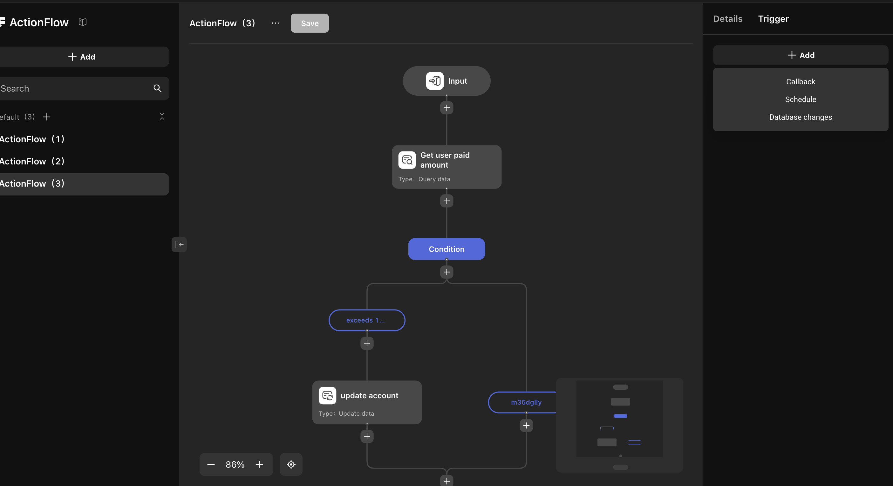
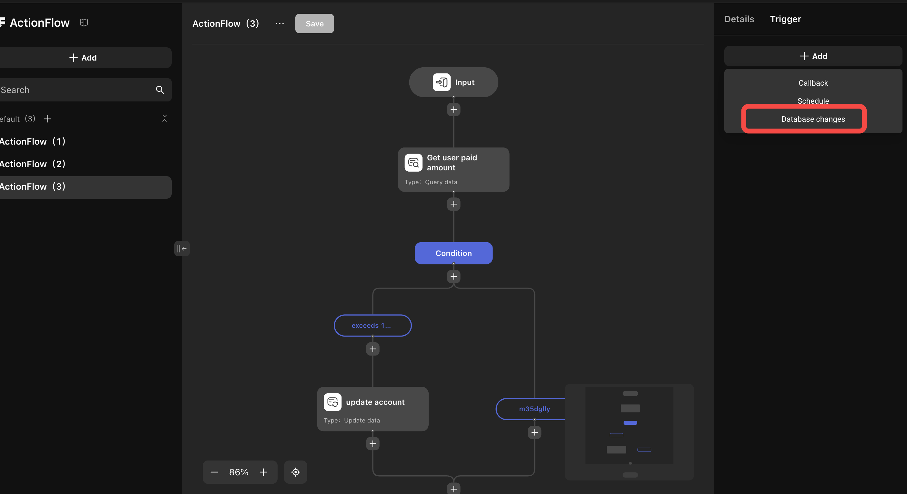
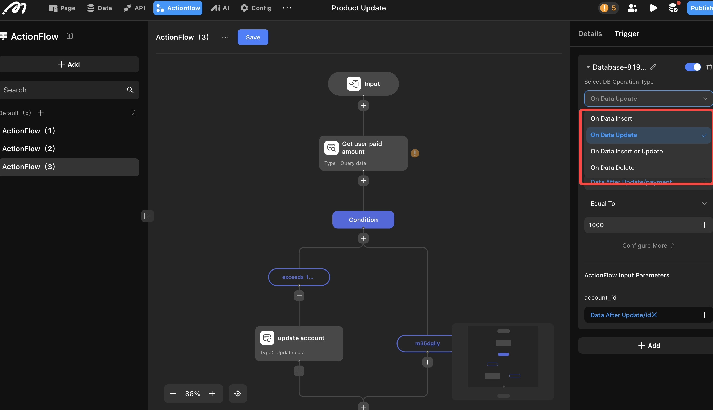
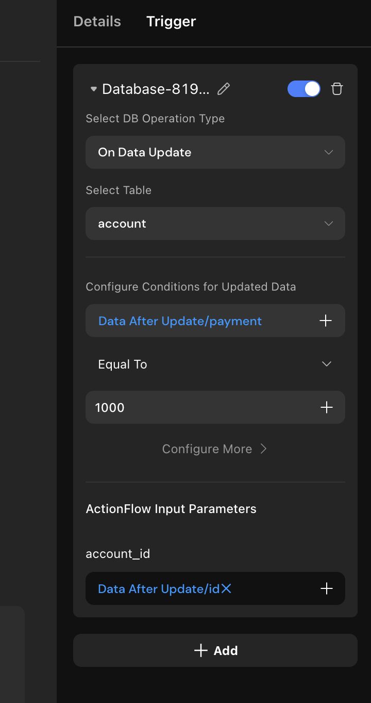

# Database Trigger

## Introduction

The **Database Trigger** feature automatically runs Actionflows when data is inserted, updated, or deleted, enabling powerful automation in your project.

**Common use cases:**
- Upgrade a user to VIP when their payment exceeds a threshold
- Send a notification when an order is completed
- Generate an operation record when user points change

---

## How to Configure

**Example:** Automatically upgrade a user to VIP when their payment exceeds $1000.

1. **Add Actionflow**
   - Set the input parameter `account_id`.
   - Add a "Get Payment Amount" node to calculate the user's total payment.
   - Add an "Update Account" node to set the user as "VIP".

   

2. **Add Trigger**

   In the Actionflow's right sidebar, under the trigger section, add a database change trigger. (You can only add a trigger after saving the Actionflow.)

   

3. **Select Operation Type and Data Table**

   Supported operation types:

   

   - On Data Insert
   - On Data Update
   - On Data Delete
   - On Data Insert or Update

4. **Set Conditions and Actionflow Parameters**

   Triggers can access both previous and updated data values. In the "Configure Conditions for Updated Data" section, choose to use either the data after update or before update to design your trigger logic.

   

---

## View Trigger History

You can view the history of database triggers in the log system.

---

## Quota and Purchase Limits

Automated Actionflows (triggered by scheduled tasks or database changes) have usage limits:

- **Free Tier** (resets monthly):
  - Free plan: 1,000 executions/month
  - Basic plan: 10,000 executions/month
  - Pro plan: 50,000 executions/month
- **Paid Option** (valid indefinitely):
  - $10 for 10,000 executions

---

## Notes

1. **Cyclic Trigger Prevention**  
   The system ensures each trigger in a chain is only executed once. For example, in a sequence:  
   Trigger A → Actionflow A → Trigger B → Actionflow B → Trigger A, the second Trigger A will not be executed again.

2. **Avoid Concurrent Modifications**  
   Simultaneous updates from multiple Actionflows to the same data may cause deadlocks.

3. **Data Imports May Trigger Multiple Events**  
   If an "On Data Insert" trigger is set on a table, importing data will trigger the flow for each record imported.
