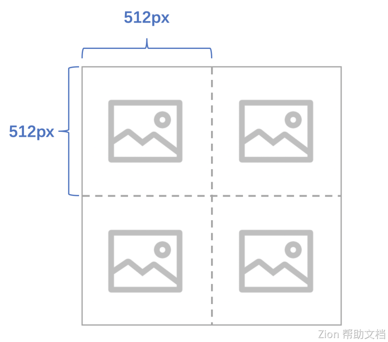

# AI Point Consumption

### Introduction

AI Points are crucial in AI interaction. AI Points are deducted based on token usage when calling AI.Learn how to purchase and use AI Points in Momen AI.


* AI Points for each plan are as follows. For premium plans, points will be automatically reset at the end of each month:
  * Free plan: 50k AI Points in total
  * Basic plan: 50k AI Points per month
  * Pro plan: 50k AI Points per month
* Insufficient AI Points may affect online projects (e.g., errors during relevant searches or not generating vectors for new data). When your AI Points are running low, Momen will provide corresponding prompts.
* After recharging AI Points, it may take a few minutes to generate vectors for previously unprocessed data.


### Point Consumption When Requesting Momen AI

#### Estimate Consumption of Text Input

For example, generating a 300-word X post:Pro version large model: Consumes about 600 AI Points, and takes about 60 seconds.Basic version large model: Consumes about 30 AI Points, and takes about 30 seconds.Quality differences in a generated post may not be significant in this scenario, so it's suggested to test and choose based on expected results.

#### Estimate Consumption of Image Input

Token consumption of images is determined by two factors:

* Size
* Precision:
  * If the precision is set to "Simple," each image consumes 85 tokens.
  * If the precision is set to "Fine," the calculation is based on the size of the image, determining how many 512 px squares compose the image. The cost for each square is 170 tokens. The final total cost always increases by an additional 85 tokens.

<figure><figcaption></figcaption></figure>

Here is an example:

For a square image of size 1024 x 1024, in fine mode, it requires 4 squares of 512 px each to represent the image. So, the final token cost is 170 \* 4 + 85 = 765.

### AI Point Balance Check and Purchase

To view your AI Point balance and purchase more, go to your profile, hover over a project, and click 'Details'.

<figure><figcaption></figcaption></figure>

<figure><figcaption></figcaption></figure>

Click the 'Purchase Resource Kit' button to purchase additional AI Points in a new window. The price is $1 for 6,000,000 AI Points.

<figure><figcaption></figcaption></figure>

### AI Point Consumption

#### Basic Consumption Scenarios

* Saving content as vector data in the database, which occurs when opening vector storage for a field in a data table and adding data to that field, consumes AI Points.
* Sending content to AI and receiving results from AI consumes AI Points.

#### Consumption Estimate


The consumption of AI Points is directly related to the number of input and output words.


For example, sending a message to AI like 'I want to develop a web page for purchasing products. Please tell me the key steps to develop it will consume approximately 60 AI Points, with the number of tokens AI returns counted separately."

\

### About Momen

[Momen](https://momen.app/?channel=blog-about) is a no-code web app builder, that allows users to build fully customizable web apps, marketplaces, Social Networks, AI Apps, Enterprise SaaS, and much more. You can iterate and refine your projects in real-time, ensuring a seamless creation process. Meanwhile, Momen offers powerful API integration capabilities, allowing you to connect your projects to any service you need. With Momen, you can bring your ideas to life and build remarkable digital solutions and get your web app products to market faster than ever before.