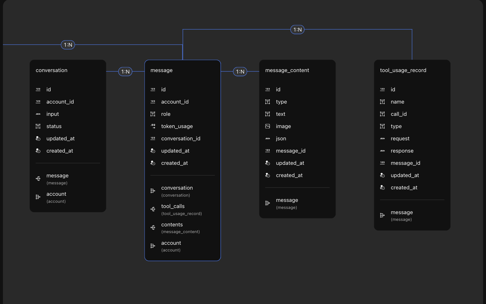

# AI Data Model

Momen AI provides four data tables to record information generated during interactions with AI. Developers can use these tables directly for AI application data display and interaction.

## Conversation

Records data for each AI session. When you debug or invoke **Start Conversation** in the AI configuration interface, a new entry is automatically added.

**Fields:**
- **Account ID:** Integer. Relates to the account table; records which user started the session.
- **Input:** Stores the AI configuration at session start (prompts, knowledge base, tool config, output config).
- **Status:** Tracks the session state. Default statuses:
  - `CREATED`: Initial state.
  - `IN PROGRESS`: Awaiting AI reply.
  - `STREAMING`: AI is streaming output.
  - `COMPLETED`: AI has finished replying.
  - `FAILED`: Failure state.
  - `CANCELED`: Stopped by user.

## Message

Records message logs for each session (not the message content itself).

**Fields:**
- **Account ID:** Integer. Relates to the account table; records the message owner.
- **Role:** Text. Indicates sender:
  - `system`: System-generated (prompts, knowledge base/tool results).
  - `assistant`: AI-generated reply.
  - `user`: User input.
- **Conversation ID:** Integer. Relates to the session table; links message to session.

- In single-turn conversations, only `system` and `assistant` roles appear.
- In multi-turn, the first message is `system`, followed by `assistant`. For **Continue Conversation**, messages are sent as `user`, and `assistant` replies.

---

## Message Content

Stores the actual content of each message. Since messages may include both images and text, Momen AI saves them separately and links them to the message.

**Fields:**
- **Type:** Text. One of: `text`, `image`, `JSON`.
- **Text:** Text content (if applicable).
- **Image:** Image content (if applicable).
- **JSON:** JSON content (if applicable).
- **Message ID:** Integer. Relates to the message table; links content to message.

## Tool Usage Record

Tracks tool usage during AI operations. If AI calls multiple tools for a message, each usage is recorded and linked to the message.

**Fields:**
- **Name:** Text. Tool name.
- **Call ID:** Text. Tool call identifier.
- **Type:** Text. One of:
  - `ACTION_FLOW`: Actionflow.
  - `TPA`: Third-party API.
  - `Momen AI`: Other AI.
  - `OBTAIN_MORE_INFORMATION`: Fetch more info.
- **Request:** JSON. The request sent to the tool.
- **Response:** JSON. The tool's response.
- **Message ID:** Integer. Relates to the message table; links usage record to message.

