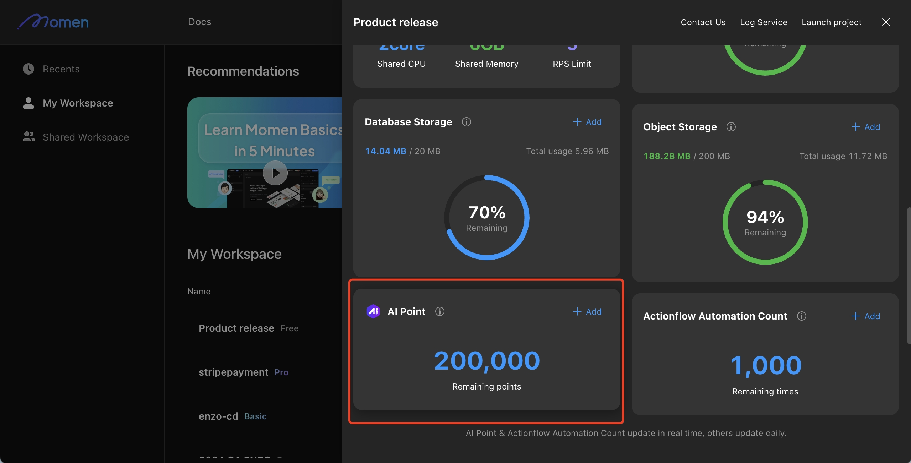

# AI Point Consumption
AI Point represents the computing resource required for AI functionalities. When using AI, the corresponding AI Point is deducted proportionally based on the number of tokens consumed by the large model.
  - Basic Version: Upon creating a project, users are granted 50,000 AI Points for free.
  - Insufficient AI Points: If the AI Point balance runs out, operations such as data vectorization, vector sorting, and ZAI calls will no longer function.
  - Delayed Processing: After recharging AI Points, it may take a few minutes for previously unprocessed vector data to be generated.

## Checking and Purchasing AI Points
Go to suer center Center. Hover over a specific project and click Manage. In the project details page, you can check the remaining AI Point balance and purchase additional AI Points.

<figure><figcaption></figcaption></figure>

## AI Point Consumption
- Vector Data Storage: AI Points are consumed when saving content as vector data in the database. This occurs when vector storage is enabled for a specific field and data is added to that field.
- AI Requests and Responses: AI Points are deducted for both sending content to the AI and receiving responses from it. You can view detailed records of AI Point consumption and additions in the Order&usage details section under project details in the personal center.

<figure><figcaption></figcaption></figure>