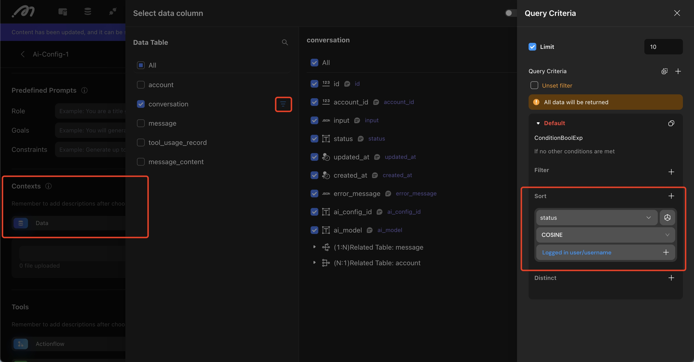

# Vector Data Storage and Sorting

## Introduction
When using large language models (LLMs) for similarity search, the goal is to find the most similar data from massive unstructured datasets. This requires storing each data object as a vector in a vector database, enabling efficient similarity comparisons based on vector distances.

## How to Save Vector Data

### Create a Data Table
- Open the editor and click the "Data" button in the top-left corner to access the data model design interface.
- Create a new data table and add a "Text" type field (column) where you want to store text data for vectorization.

### Enable Vector Storage
- After adding the field, click the Settings button next to the field.
- Toggle "Enable Vector Storage" to ON. Once enabled, all text data saved under this field will be processed and stored as vector data.

## What is Vector Sorting?
Vector sorting arranges data by comparing the vector distances between a sorting object and a reference object. It sorts in ascending order of distance, meaning data with higher similarity appears first.

### Distance Calculation Methods:
1. Cosine Distance (COSINE):   
Measures directional similarity, focusing on relative relationships and alignment. Suitable for use cases like search engines, text classification, and recommendation systems.
2. Euclidean Distance (EUCLIDEAN):   
Measures absolute difference, focusing on numeric values and physical distances. Suitable for scenarios like navigation systems, logistics optimization, and comparing physiological parameters over time.

### Use Case
In search applications (e.g., drug search or hardware tool search), users may describe the item by its use case rather than its exact name. By using vector sorting, similar items can be displayed based on the input, enhancing search accuracy.

Steps to Configure Vector Sorting:   
1. Bind Data Table to the List Component   
Select a data table with a vector-enabled field and bind it to the list component.

2. Enable Vector Sorting   
In the list component's "Sort" settings, choose the vector-enabled field. Select "Vector Mode" as the sorting method.

3. Select Distance Calculation Method   
Choose either Cosine Distance or Euclidean Distance based on your use case.

4. Bind the Reference Object   
Set the value of the reference object against which the vector distance will be calculated.

## Using Vector Sorting with AI for Custom Knowledge

### Use Case
In scenarios where a large language model (LLM) needs to interact with private knowledge bases, vector sorting can be used to enhance responses. For example, using RAG (Retrieval-Augmented Generation), the model can answer questions or generate new content based on private knowledge.

### Configuration guide
1. Pre-Configuration Requirement   
Ensure that a data table storing private data is created, and that the text fields in this table have vector storage enabled.

2. Configuration Steps
- On AI congifuration page, under Contexts section,select the target data table.
- Click the filter icon when hovering on a data table.
- In the right-side configuration panel, add a Sort setting:
  - Sorting Field: Choose the vector-enabled field.
  - Sorting Method: Select either Cosine Distance or Euclidean Distance.
  - Comparison Content: Bind the comparison value of which the sorting will be performed.

  <figure><figcaption></figcaption></figure>

## Semantic Search
In a case database that includes specific meanings of Internet slang, the Internet slang uploaded to the database has been transformed into vector data. The entered content in the search box will also be converted into vector data. After clicking the search button, the \[List] component will return results based on vector distance comparison and sorted results.

**Reference link for Internet slang:** [\[Internet Slang Collection\]](https://www.ruf.rice.edu/~kemmer/Words04/usage/slang_internet.html)

**Showcase**

<figure><figcaption></figcaption></figure>

## Note
- Currently, Momen only supports vectorization for text data.
- Enabling vector storage will consume database capacity.
