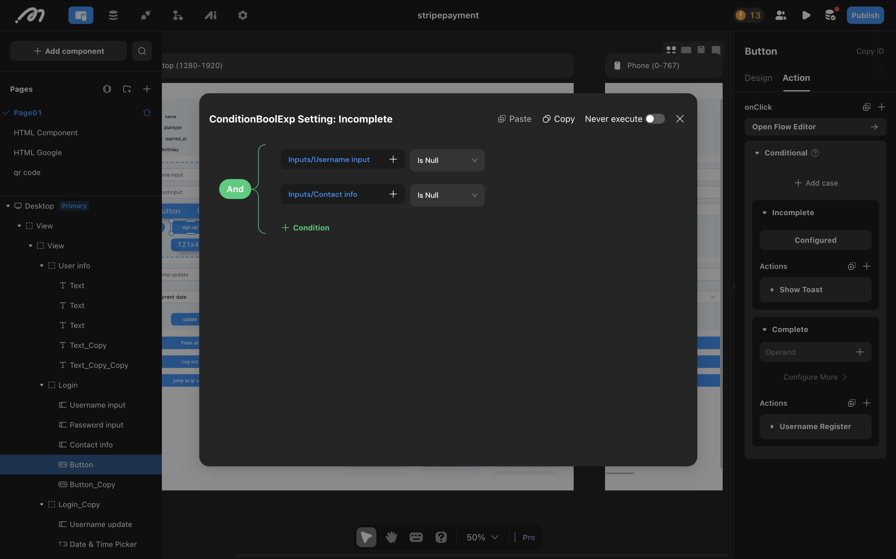

# Conditional

## Introduction
Different actions are performed according to different conditions

## Scenerio
In an event registration, users need to input their name and contact information. When they click the registration button without entering the required information, a show modal appears, asking them to enter their name or contact information first.

**The configuration of conditional actions:** In the example mentioned above, we typically add two conditional actions to the registration button.   
1. Condition 1: The first one is named "Incomplete" and its conditions are configured to check if the customer's name and contact phone number input fields are empty. When the "Incomplete Registration Information" condition is met, the action is configured to display a show moadal saying "Please complete the registration information." 
2. Condition 2: The second one is named "Complete," and its condition is set as "Always"(leaves empty). In this case, if the previous condition is not met, it indicates that the information is complete, and then execute the registeration action set under condition 2.

<figure><figcaption></figcaption></figure>

## Action configuration guide
1. In the right-side bar, under the action section of a component, you can add a conditional action. Once added, two default sub-conditions are created. You can rename each sub-condition by clicking its name. In the operand section of a sub-condition, you can set the evaluation criteria, and in the Actions section, you can define what actions to execute when the condition is met.

2. The evaluation order for conditional actions is top to bottom. If a condition is met, the configured actions under that condition will be executed automatically. If the current condition is not met, it will proceed to evaluate the next one. If none of the conditions are met, no action will be performed.

3. At least one sub-condition must be configured. Depending on the business requirements, you can set actions such as page navigation, table data modification, or displaying a prompt when the condition is satisfied.

## Note
1. By default, the conditions are run in a top-down manner. You can drag and arrange the condtions in a desired order.
2. You can continue to add conditions within conditional branches to customize the business logic you see fit.
3. Special Comparison Operators

| Operators      | Definition                                | Role/ Using Scenario                                                                |
| -------------- | ----------------------------------------- | ----------------------------------------------------------------------------------- |
| Null           | The data is empty, i.e. there is no data  | Determine that there is no data in the input box                                    |
| Not null       | The data is not empty, i.e. there is data | Determine that there is data in the input box                                       |
| Included       | Certain data exist in a collection        | Typically used as a filter to determine whether or not data exists in a collection. |
| Not included   | Data does not exist in a collection       | Typically used as a filter to determine if data does not exist in a collection.     |
| Similar to     | Some data is similar to certain data      | Generally used as a filter to filter data, often used to do fuzzy search            |
| Not similar to | Some data is not similar to certain data  | Typically used as a filter to filter data                                           |