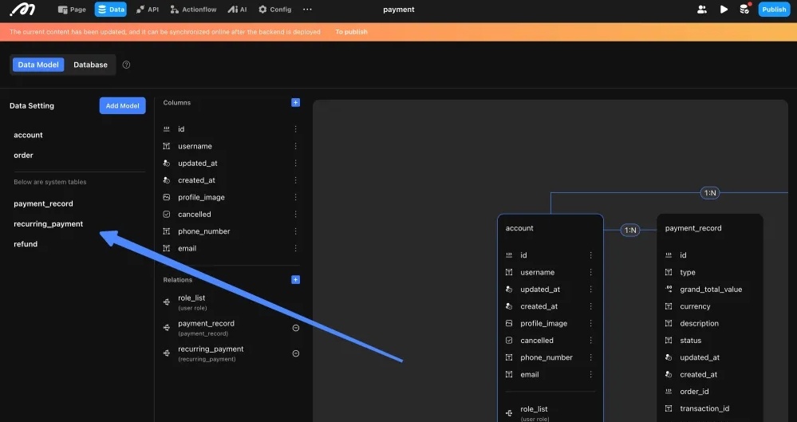
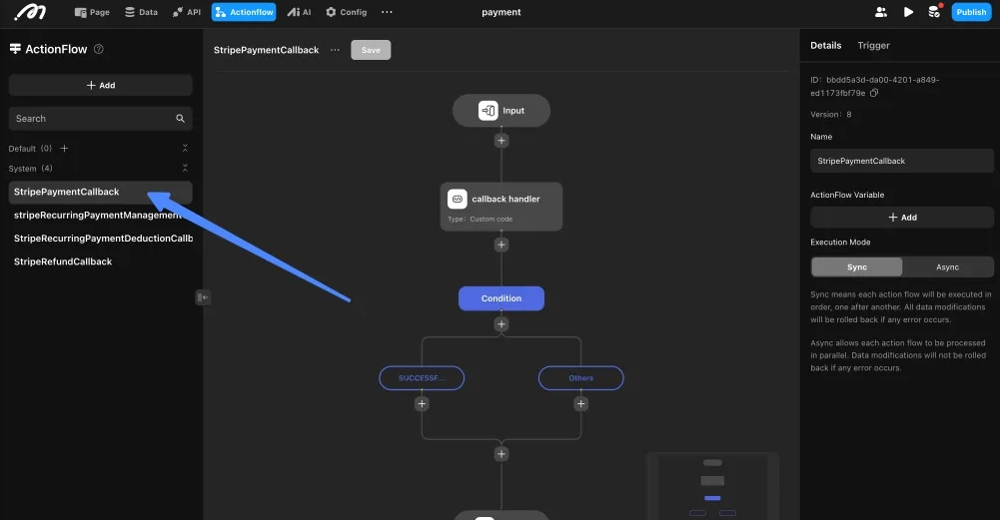
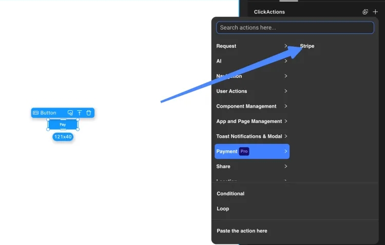
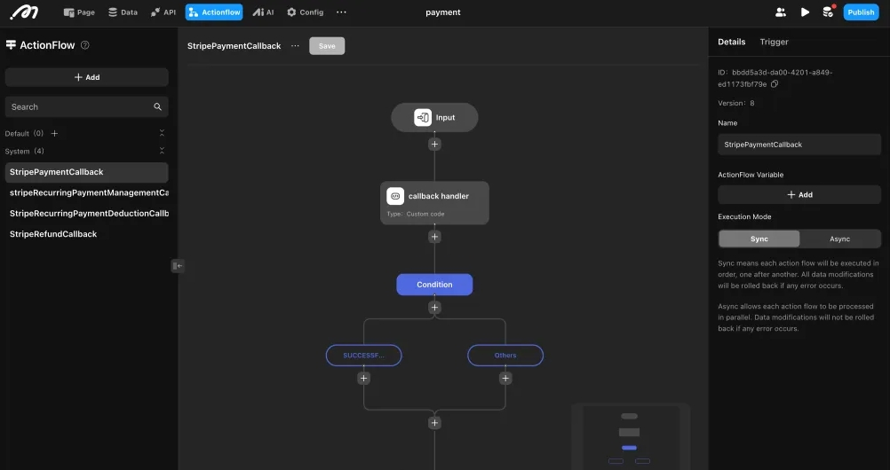
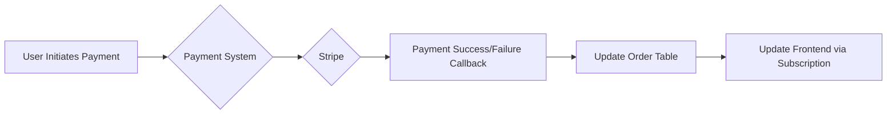

# Payment with Stripe

## 1. Preparation

### 1.1 Set Up a Stripe Account
- Sign up or log in to [Stripe](https://stripe.com/).
- Obtain your **Publishable Key** and **Secret Key** from the Stripe Dashboard.

### 1.2 Upgrade Your Project
Ensure your project is on the **Pro plan** or higher to enable payment features.

### 1.3 Create an Order Table
Before activating payment, you must create an **Order Table** in your project.  
This table will store essential order information like:

| Field        | Example  |
| ------------ | -------- |
| `price`      | 99.99    |
| `userId`     | user_123 |
| `status`     | pending  |

> **Warning:** Once the order table is linked to payment features, **it cannot be unlinked, replaced, or deleted**.

---

## 2. Activating Stripe Payment

### 2.1 Enable Payment
Navigate to **Configuration → Payment**, and activate the payment module.

Once activated, the system will automatically:

- Create three backend tables:
  - **Payment Table**: Stores one-time payment records.
  - **Recurring Payment Table**: Manages subscription billing.
  - **Refund Table**: Tracks refund transactions.

- Generate four system Actionflows:
  - `StripePaymentCallback`
  - `StripeRefundCallback`
  - `StripeRecurringPaymentManagementCallback`
  - `StripeRecurringPaymentDeductionCallback`

<figure><figcaption></figcaption></figure>

<figure><figcaption></figcaption></figure>

> These system-generated flows securely handle payment event processing in the backend.

### 2.2 Configure Stripe Credentials
Input the following information into your project settings:

| Field            | Where to Find |
| ---------------- | ------------- |
| Publishable Key  | Stripe Dashboard |
| Secret Key       | Stripe Dashboard |

<figure><figcaption></figcaption></figure>

---

## 3. Using Payment Actions
<figure><figcaption></figcaption></figure>

### 3.1 One-Time Payment

Use the **Stripe Payment Action** to charge users.

| Parameter | Type    | Description |
| --------- | ------- | ----------- |
| `orderId` | Integer | The ID from the order table |
| `currency` | String | Currency code (e.g., `USD`) |
| `amount` | Decimal | Charge amount (in **smallest currency unit**, e.g., cents for USD) |

> **Tip:** To charge **$10.00 USD**, input `1000` because Stripe expects cents.

### 3.2 Refund Payment

Use the **Stripe Refund Action** to refund a payment.

| Parameter     | Type    | Description |
| ------------- | ------- | ----------- |
| `paymentId`   | Integer | The ID from the payment table |
| `refundAmount`| Decimal | Amount to refund (must not exceed the original payment amount) |

> **Important:** Restrict refund permissions to admin users to avoid financial risks.

### 3.3 Recurring (Subscription) Payments

Before initiating recurring payments:

- Create a **Recurring Price** object in Stripe.
- Obtain the **Price ID**.

| Parameter | Type    | Description |
| --------- | ------- | ----------- |
| `orderId` | Integer | The ID from the order table |
| `priceId` | String  | The Stripe-generated Price ID |

Recurring actions allow:
- Starting a subscription
- Canceling an existing subscription

---

## 4. Handling Payment Events via Actionflows

Stripe automatically triggers backend **Actionflows** for different payment events.  
These Actionflows allow you to **parse the event data**, **validate results**, and **configure your own business logic** securely.

Here are the main Actionflows provided:

### 4.1 Stripe Payment Callback

- **Trigger:** After a successful one-time payment
- **System:**
  - Parse payment data (e.g., `orderId`, `paymentStatus`)
  - Ensure **duplicate callbacks** are detected via `callbackProcessed`
- **Custom business logic:**
  - Update the order status to `paid`
  - Grant access to purchased services
  - Send a confirmation email or notification

<figure><figcaption></figcaption></figure>

### 4.2 Stripe Refund Callback

- **Trigger:** After a successful refund
- **System:**
  - Parse refund data
  - Detect duplicate callbacks
- **Custom business logic:**
  - Update the order status to `refunded`
  - Adjust user benefits or subscriptions
  - Notify the user about the refund

### 4.3 Stripe Recurring Payment Management Callback

- **Trigger:** Upon **starting** or **canceling** a subscription
- **System:**
  - Update the `Recurring Payment Table`
- **Custom business logic:**
  - Activate or deactivate subscription-based features

### 4.4 Stripe Recurring Payment Deduction Callback

- **Trigger:** When Stripe automatically charges for subscription renewal
- **System:**
  - Create a new order record
- **Custom business logic:**
  - Mark subscription as renewed
  - Notify the user about renewal success and next billing cycle

> **Tip:** Customize each Actionflow to suit your app's logic, such as sending receipts, adjusting access rights, or linking to CRM systems.

---

## 5. Retrieving Payment and Refund Status (Frontend)

Since payment operations are asynchronous:

- Subscribe to the `Payment` or `Refund` tables while using a list component to display results.
- Listen for real-time updates to refresh the frontend dynamically.

---

## 6. Best Practices

- Validate input parameters before initiating payments.
- Cross-check the order amount and payment amount after a payment succeeds.
- Handle duplicate callbacks using `callbackProcessed`.
- Restrict sensitive operations like refunds to admins.
- Monitor your Stripe account for unusual activities.

---

## 7. Common Issues and Troubleshooting

| Problem | Cause | Solution |
|---------|-------|----------|
| Incorrect charge amount | Misunderstanding Stripe's smallest unit format | Always multiply amounts by 100 for currencies like USD |
| Payment not reflected in order | Missing or misconfigured callback Actionflow | Ensure callback Actionflows are properly set up |
| Refund not updating order | Refund callback not processed | Check the refund callback subscription and flow |

---

# 👌 Conclusion

By following this guide, you can seamlessly integrate Stripe payments into your project, offering users a secure, scalable, and professional checkout experience.

> **Remember:** Always rely on secure backend Actionflows rather than frontend assumptions for critical payment processes.

---

## Quick Payment Action Flow

