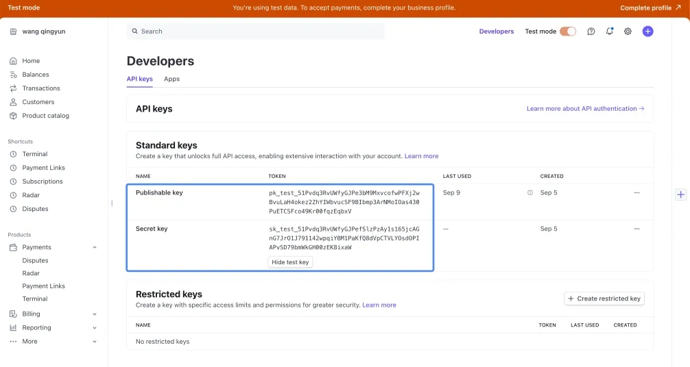

# Stripe Payment Integration Guide

## Introduction

This guide explains how to enable and use Stripe payment features in your Momen project.  
It covers account setup, configuration, payment actions, event handling, and best practices to ensure a secure and professional payment experience.

---

## Preparation

### Set Up a Stripe Account

- Sign up for or log in to your [Stripe account](https://stripe.com/).
- Retrieve your **Publishable Key** and **Secret Key** from the Stripe Dashboard.

### Upgrade Your Project

- Ensure your project is on the **Pro plan** or above to access payment features.

### Create an Order Table

Before enabling payments, create an **Order Table** in your project to store essential order details, such as:

| Field    | Example   | Description                |
|----------|-----------|---------------------------|
| `price`  | 99.99     | Order amount (in dollars) |
| `userId` | user_123  | User identifier           |
| `status` | pending   | Order status              |

> **Warning:** Once the order table is linked to payment features, it **cannot be unlinked, replaced, or deleted**.

---

## Activating Stripe Payment

### Enable Payment Module

- Go to **Settings → Payment** and activate the payment module.

Upon activation, the system will automatically:

- Create three backend tables:
  - **Payment Table**: Stores one-time payment records.
  - **Recurring Payment Table**: Manages subscription billing.
  - **Refund Table**: Tracks refund transactions.
- Generate four system Actionflows:
  - `StripePaymentCallback`
  - `StripeRefundCallback`
  - `StripeRecurringPaymentManagementCallback`
  - `StripeRecurringPaymentDeductionCallback`

> These system-generated Actionflows securely handle backend payment event processing.

### Configure Stripe Credentials

- Enter the following credentials in your project settings:

| Field            | Location in Stripe Dashboard |
|------------------|----------------------------|
| Publishable Key  | API Keys section           |
| Secret Key       | API Keys section           |

---

## Using Payment Actions

### One-Time Payment

Use the **Stripe Payment Action** to charge users for a single transaction.

| Parameter  | Type    | Description                                                                 |
|------------|---------|-----------------------------------------------------------------------------|
| `orderId`  | Integer | The ID from the order table                                                 |
| `currency` | String  | Currency code (e.g., `USD`)                                                 |
| `amount`   | Decimal | Charge amount (in the **smallest currency unit**, e.g., cents for USD)      |

> **Note:** To charge **$10.00 USD**, enter `1000` as Stripe expects the amount in cents.

### Refund Payment

Use the **Stripe Refund Action** to process a refund.

| Parameter      | Type    | Description                                                        |
|----------------|---------|--------------------------------------------------------------------|
| `paymentId`    | Integer | The ID from the payment table                                      |
| `refundAmount` | Decimal | Amount to refund (must not exceed the original payment amount)     |

> **Important:** Restrict refund permissions to admin users to minimize financial risk.

### Recurring (Subscription) Payments

Before starting recurring payments:

- Create a **Recurring Price** object in Stripe and obtain its **Price ID**.

| Parameter  | Type    | Description                        |
|------------|---------|------------------------------------|
| `orderId`  | Integer | The ID from the order table        |
| `priceId`  | String  | The Stripe-generated Price ID      |

Recurring actions support:

- Starting a subscription
- Canceling an existing subscription

---

## Handling Payment Events via Actionflows

Stripe automatically triggers backend **Actionflows** for different payment events.  
These Actionflows allow you to parse event data, validate results, and implement custom business logic securely.

### Stripe Payment Callback

- **Trigger:** After a successful one-time payment
- **System actions:**
  - Parse payment data (e.g., `orderId`, `paymentStatus`)
  - Detect duplicate callbacks using `callbackProcessed`
- **Custom logic examples:**
  - Update order status to `paid`
  - Grant access to purchased services
  - Send confirmation emails or notifications

### Stripe Refund Callback

- **Trigger:** After a successful refund
- **System actions:**
  - Parse refund data
  - Detect duplicate callbacks
- **Custom logic examples:**
  - Update order status to `refunded`
  - Adjust user benefits or subscriptions
  - Notify the user about the refund

### Stripe Recurring Payment Management Callback

- **Trigger:** When starting or canceling a subscription
- **System actions:**
  - Update the Recurring Payment Table
- **Custom logic examples:**
  - Activate or deactivate subscription-based features

### Stripe Recurring Payment Deduction Callback

- **Trigger:** When Stripe automatically charges for subscription renewal
- **System actions:**
  - Create a new order record
- **Custom logic examples:**
  - Mark subscription as renewed
  - Notify the user about renewal success and next billing cycle

> **Tip:** Customize each Actionflow to fit your app's logic, such as sending receipts, adjusting access rights, or integrating with CRM systems.

---

## Retrieving Payment and Refund Status (Frontend)

Payment operations are asynchronous.  
To display real-time results:

- Subscribe to the `Payment` or `Refund` tables using a list component.
- Listen for real-time updates to refresh the frontend dynamically.

---

## Best Practices

- Validate input parameters before initiating payments.
- Cross-check the order amount and payment amount after a payment succeeds.
- Handle duplicate callbacks using `callbackProcessed`.
- Restrict sensitive operations like refunds to admin users.
- Monitor your Stripe account for unusual activity.

---

## Troubleshooting Common Issues

| Problem                        | Cause                                         | Solution                                                      |
|--------------------------------|-----------------------------------------------|---------------------------------------------------------------|
| Incorrect charge amount        | Amount not in smallest currency unit          | Always multiply by 100 for currencies like USD                |
| Payment not reflected in order | Missing or misconfigured callback Actionflow  | Ensure callback Actionflows are properly set up               |
| Refund not updating order      | Refund callback not processed                 | Check the refund callback subscription and Actionflow         |

---

## Conclusion

By following this guide, you can seamlessly integrate Stripe payments into your project, providing users with a secure, scalable, and professional checkout experience.

> **Reminder:** Always rely on secure backend Actionflows for critical payment processes, rather than frontend assumptions.

---

## Quick Payment Action Flow

