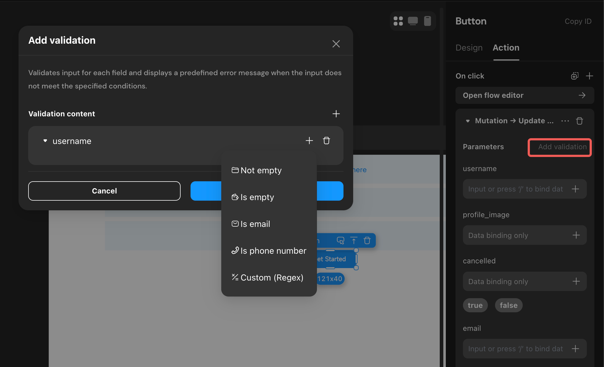

# Request Actions

Request actions enable direct operations on the database, including adding, updating, and deleting records, as well as executing pre-defined actionflows. Momen supports three types of request actions: data mutation, batch mutation, and actionflow.

**Types of Request Actions:**
1. Data Mutation
2. Batch Mutation
3. Actionflow
4. API

## 1. Data Mutation

### Overview

Data mutation actions allow you to add, update, or delete records in the database.

- **Insert**: Add data to the database.
  - Single Insert
  - List Mutation (batch insert)
- **Update**: Update records in the database that match specified filter criteria.
- **Delete**: Delete records in the database that match specified filter criteria.

### Input Validation

Input values for each field can be validated. Currently, six rules are supported: Is empty, Not empty, Is phone number, Is email and Custom (Regex). Error prompts can be configured.

### Notes

1. **List Mutation**  
   When adding data, you can enable "List Mutation" for batch insertion. You must specify a data source containing multiple records.

2. **On Conflict**  
   When adding or updating data, you can configure how to handle data conflicts.  
   If a data field has a unique constraint, you can choose to update the conflicting record (by setting the constraint action type to *Update*) or take no action (by setting the constraint action type to *None*).

3. **On Success/Failure**  
   These refer to actions triggered after a data mutation succeeds or fails. This is crucial in real-world applications. For example, after modifying table data, you can configure actions such as Show Toast, Refresh, or Redirect to notify users. You can also chain additional actions, such as another data mutation or conditional branches, to execute subsequent logic as needed.

4. **Result Data**  
   Upon successful execution, result data is returned, containing the newly added or updated record, including its ID and other details.

## 2. Batch Mutation

### Overview

Batch mutation actions allow you to execute multiple database operations as a single transaction.

### Notes

1. **Transaction Rollback**: If any operation within the transaction fails, the entire transaction is rolled back. For example, if three operations are configured and the third fails, all preceding operations are undone.
2. **Use Cases**: Batch mutation is suitable for scenarios that require strict data integrity during complex modification processes.

## 3. [Actionflow](./actionflow/basics.md)

### Overview

Actionflow actions execute a pre-configured actionflow, enabling you to implement a sequence of actions or complex logic.

### Notes

- **Result Data**: If the actionflow defines output parameters, these will be available as result data for further use.  
  For example, if the actionflow generates a random number between 0 and 100 and you want to use this value, first define an integer-type Page Variable. Then, on success, add a Set Page Variable action to assign the output parameter to that variable.

## 4. [API](../data/api.md)

### Overview

Actionflow actions execute a pre-configured API.