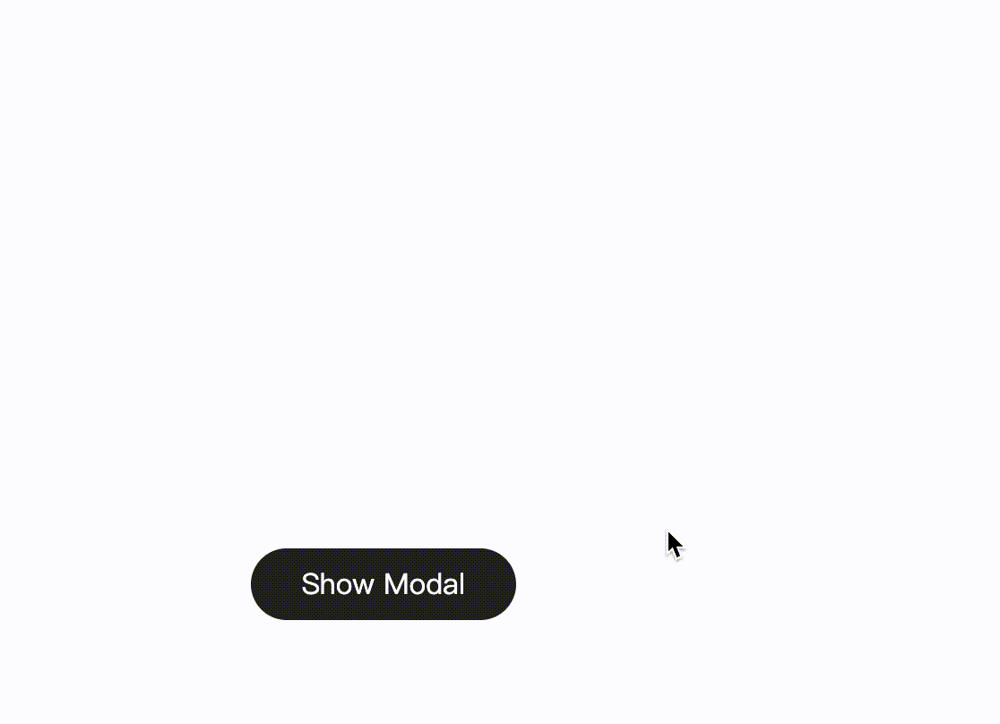

# Toast Notifications & Modal Dialogs

## 1. Toast Notification

### Overview

This guide explains how to use Momen's **Show Toast** action to display concise, informative notifications in your web applications.

### Typical Use Cases

Trigger this action to display a toast message at the top of the page. Common scenarios include:

- Displaying "Submit Successfully" after a form submission.
- Showing "Login/Registration Failed" when authentication fails.

### How to Configure

The **Show Toast** action is commonly used to indicate the successful execution of a mutation or operation. You can find the "Show Toast" action under **Action on Click > Toast&Modal > Show Toast**.

### Display Effect

The toast notification appears at the top of the interface, displaying your message in black text on a white background. The style is fixed and cannot be customized.

.png)

## 2. Modal Dialog

### Overview

This section introduces the modal dialog functionality in Momen, supporting both default and custom modes for flexible user interactions.

### Modal Types

Momen provides two modal dialog modes:

1. **Default Mode**  
   Configure the title, content, cancel/confirm button text, and define actions for the confirm button.

2. **Custom Mode**  
   Enter edit mode to drag and drop components into the modal container, allowing full customization.
   - In the **Preview** area, adjust the modal's width, height, and position.
   - Under **Interaction**, enable "Close on click overlay" to allow closing the modal by clicking outside its content area.
   - Add the **Hide Modal** action to components (such as buttons) within the modal to provide explicit close controls.

### How to Configure

#### Default Mode

1. Go to **Action on Click > Toast & Modal > Show Modal > Default**.
2. Modify the cancel/confirm button text and configure confirm actions as needed.

.png)

#### Custom Mode

1. Add a **Show Modal** action and switch the mode to **Custom**.
2. Enter edit mode, then resize and reposition the modal window in the **Preview** interface.
3. Build the modal content by dragging components into the **Focus View** (upper area).
4. Configure modal closing behavior:
   - Enable **Close on click overlay** in the right sidebar of the modal view to allow closing by clicking outside the modal.
   - Add a button or other component inside the modal and assign the **Hide Modal** action to it for explicit closing.

| .png) | .png) |
| ------------------------------------------------------------------------------------------------ | ---------------------------------------------------------------------- |

### Important Notes

When triggering a modal action from within a **List** component, direct access to the list item data is restricted. To work around this:

- Use the **Set Page Variable** action to transfer the relevant list item data to a page variable.
- Reference this variable in the modal to access the specific data as needed.
