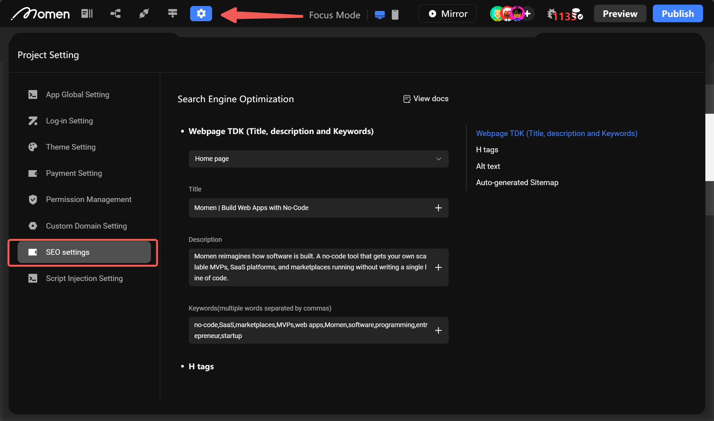
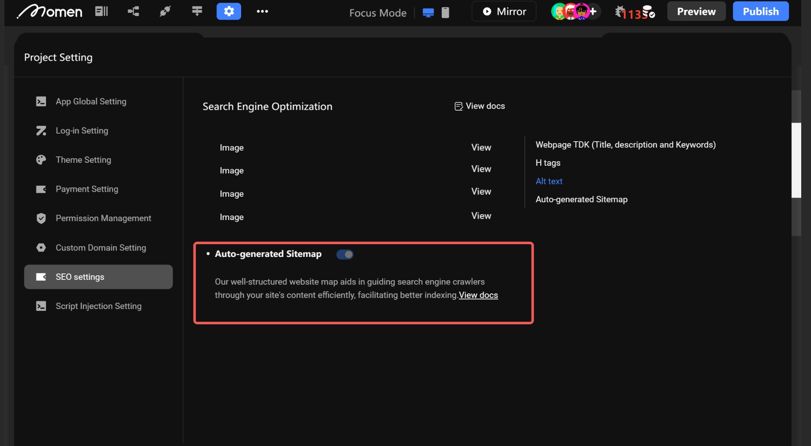

# SEO

### Introduction

SEO (Search Engine Optimization) refers to improving the natural ranking of a website within search engines. The aim is to gain branding recognition and get more traffic.&#x20;

In short, it means making improvements to make it easier for users to search for your website. In this tutorial, you'll explore how to configure your SEO in Momen.

### SEO Configuration Classification

* Page TDK (Page Title, Page Description, Site Keywords)
* H tags
* Image Alt Text
* Others: Page Map, Anchor Text, etc.

**In this version, we only support TDK configuration for now.**\

### Configuration & Overview

Clicking the settings button in the top-left corner of the editor allows you to choose SEO configuration. This takes you to the SEO configuration overview, where you can set up TDK (Title, Description, Keywords), H tags, image alt text, and SiteMap for each page.

<figure><figcaption></figcaption></figure>

### TDK Configuration

SEO configuration is currently exclusive to the Pro project. Ensure you're using the correct version before proceeding.

1. #### Select the page and find the SEO settings in the right column under "Content".

<figure><figcaption></figcaption></figure>

2. #### Fill in the TDK

Title: The title of the page.

Description: A brief description of the page.

Keywords: Relevant keywords for your website. You can configure up to 10 keywords, and they must not be repeated.

<figure><figcaption></figcaption></figure>

3. #### Preview to check TDK

Preview your website, then click a link to enter it. First, observe the title. Upon entering the site, you'll see the SEO title, which is what web crawlers detect.

<figure><figcaption></figcaption></figure>

Then the page reverts to displaying the regular title that users see.

<figure><figcaption></figcaption></figure>

Next, verify the description and keywords. Press F12 in your browser, navigate to the console, and inspect the page's elements. Locate the head tag and find two meta tags: description and keywords. Confirm that they have been successfully configured.

<figure><figcaption></figcaption></figure>

### H Tags

You can configure SEO H tags for text components in your website. Momen provides options to set tags from H1 to H6.

<figure><figcaption></figcaption></figure>

### Alt Text

You can configure alt text for your image components. Alt text includes descriptive information about the image, which helps search engines understand its content. This can lead to higher rankings for your website in search engine results.

<figure><figcaption></figcaption></figure>

### Sitemap

Enabled by default and requiring no additional configuration, a sitemap helps search engines index your website's structure more rapidly and comprehensively, enhancing visibility and search rankings. This, in turn, attracts potential, highly-relevant business clients.

<figure><figcaption></figcaption></figure>

If you encounter any issues during the process, feel free to join our [Discord community](https://discord.com/invite/UCyhySSXfz) for assistance.

### About Momen

[Momen](https://momen.app/?channel=blog-about) is a no-code web app builder, allows users to build fully customizable web apps, marketplaces, Social Networks, AI Apps, Enterprise SaaS, and much more. You can iterate and refine your projects in real-time, ensuring a seamless creation process. Meanwhile, Momen offers powerful API integration capabilities, allowing you to connect your projects to any service you need. With Momen, you can bring your ideas to life and build remarkable digital solutions and get your web app products to market faster than ever before.
