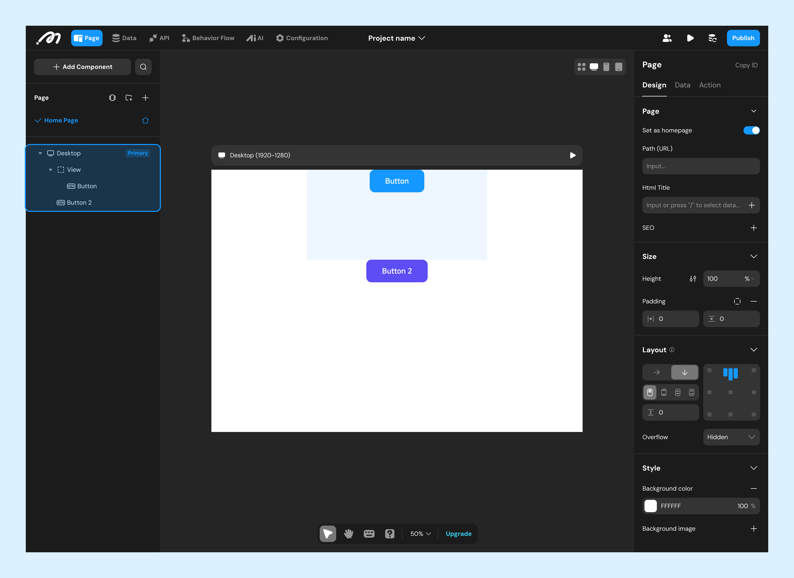
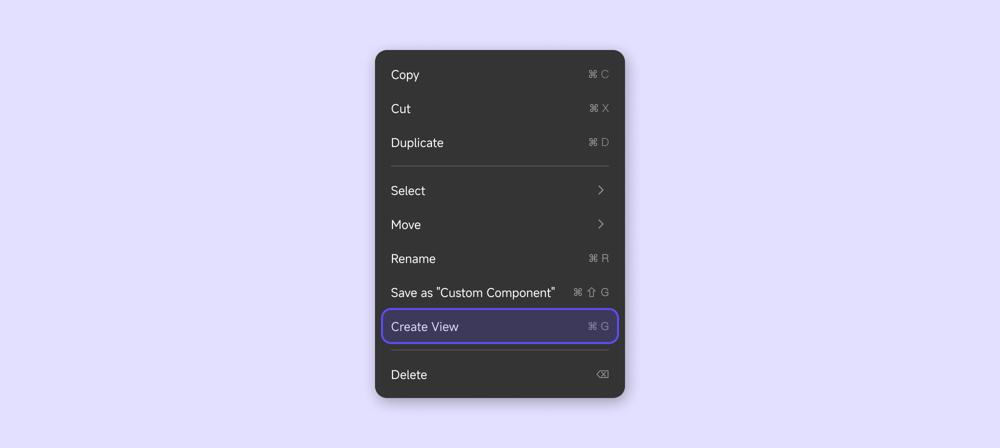

# Canvas operations

## Hierarchical Structure
Pages Pages and container components support nesting other components. The component tree in the left sidebar displays these nesting relationships.

> Currently, Cross-level dragging to adjust nesting is unavailable; use the cut-and-paste method instead.

Components at the same level follow a display order: newer components overlay older ones. To control the display order, drag components in the left sidebar or use the "Move" option in the right-click menu. You can also use the following shortcuts:

**Bring to Front**: **]**

**Send to Back**: **[**

**Move Up One Layer**: **⌘ ] | Ctrl ]**

**Move Down One Layer**: **⌘ [ | Ctrl [**

**Move Up**: **↑**

**Move Right**: **→**

**Move Down**: **↓**

**Move Left**: **←**

## Selection

### Single Selection

**Interaction**

Click a component directly to select it, or hold **⌘ | Ctrl** to select its parent component. After selecting, you can use shortcuts to switch selection:

**Select Parent**: **Shift ⏎**

**Select Child**: **⏎**

**Select All Siblings**: **⌘ A | Ctrl A**

**Select Previous Component**: **Shift Tab**

**Select Next Component**: **Tab**

### Multi-Selection

**Interaction**

To multi-select components on a page, hold **Shift** and click each component. Alternatively, in the left sidebar, hold **⌘ | Ctrl** and click components to achieve the same effect.

For batch selection, use the pointer to draw a selection box on the canvas, or in the left sidebar, hold **Shift** to select all components between two.

After multi-selecting, shared properties can be modified in the right sidebar.

**Grouping**

Group selected components into a view using the "Create View" option in the right-click menu or the shortcut **⌘ G | Ctrl G**.

