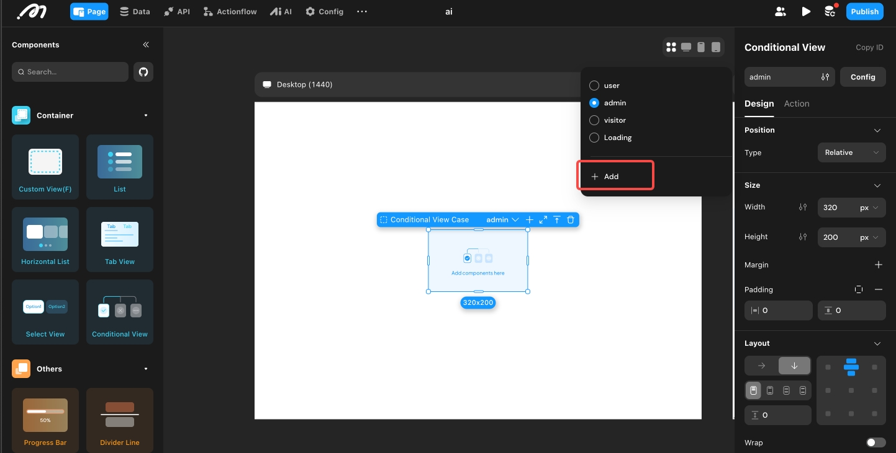
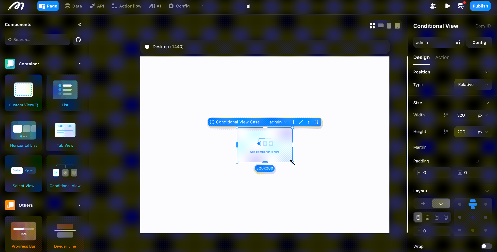
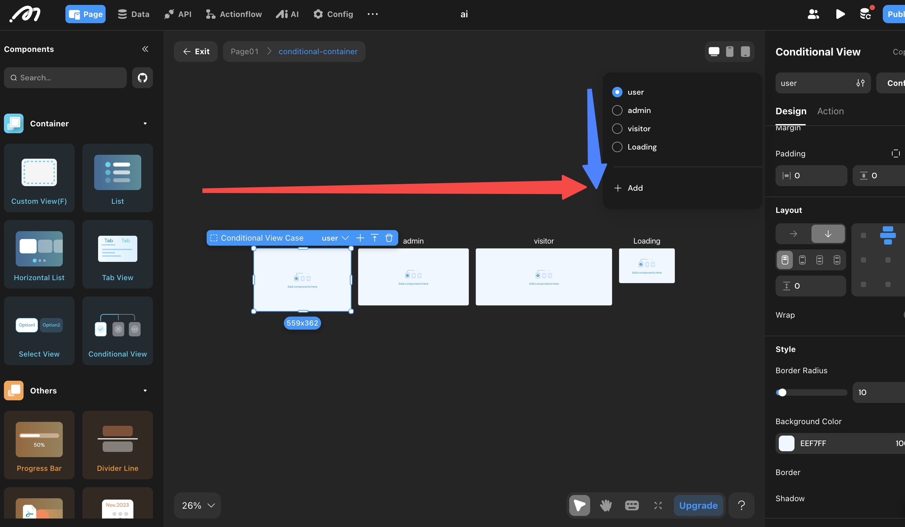
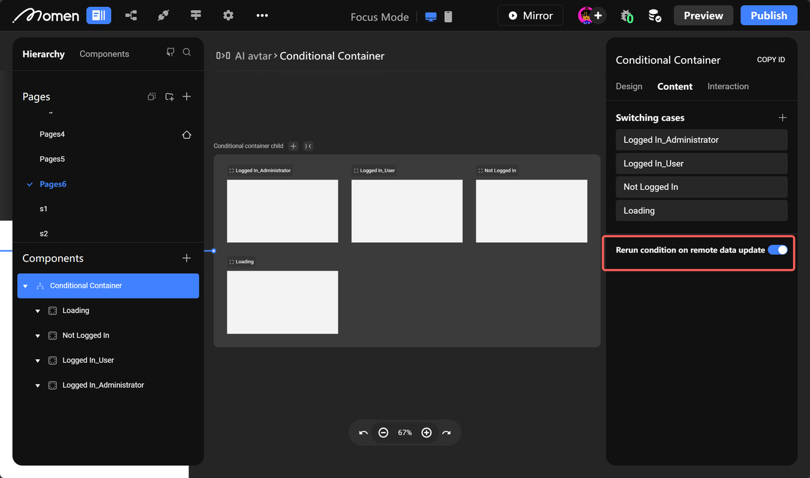
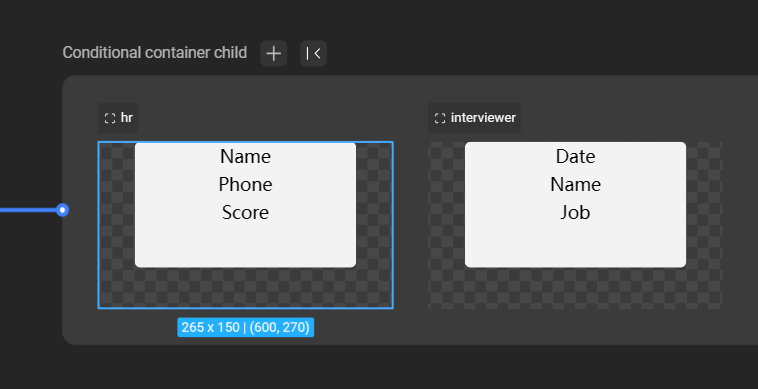
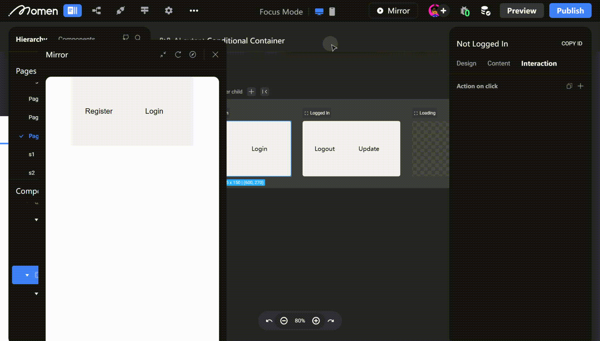
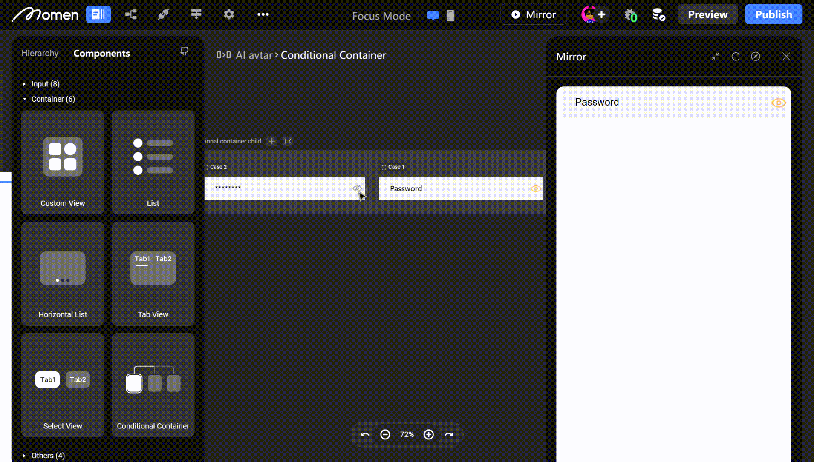
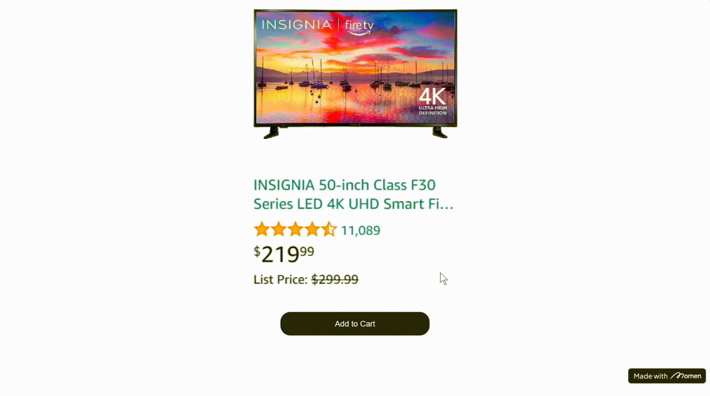
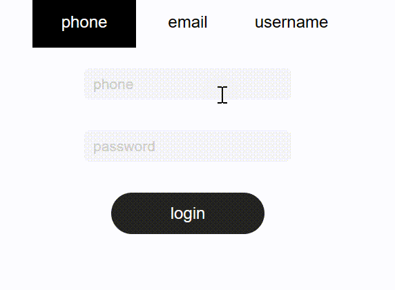
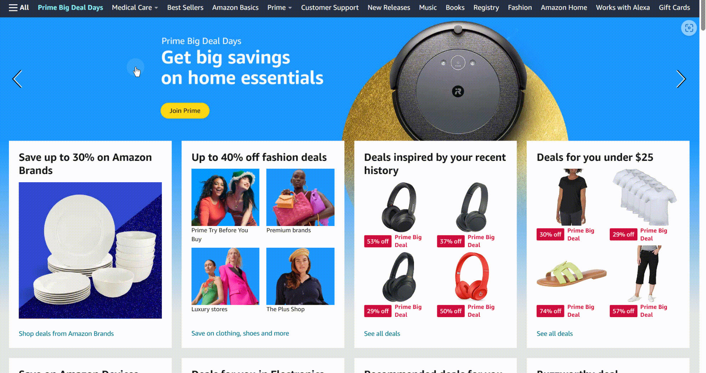

# Component - Conditional View

## Usage Scenario

Conditional views serve the purpose of displaying different content based on specific conditions. These conditions can encompass various elements, including data, user interfaces, or different functional entrances with varying permissions, all within the same interface. Here are some common scenarios where you can leverage this component:

* Different views on the Same Page: You can showcase different views on a single webpage based on conditions. For instance, the page's display can vary for users who are logged in and those who aren't.
* View Switching with Buttons: Conditional views allow you to change the displayed content on the same page by clicking a button. For example, clicking the "Send CAPTCHA" button can switch the display to a CAPTCHA Countdown.
* Combining with Select View: You can use Conditional views to create an effect similar to a tab bar or expand a catalog subset based on user selections.

## Add Subview in Conditional View

In Conditional View, you can add/modify/delete conditional sub-views to display different content under different conditions.

For example, when creating a login screen, there are three conditions based on user identities: "visitor," "user," and "admin." To display different interface content under different conditions, you need to add three more sub-views to the content of the Conditional View.

<figure><figcaption></figcaption></figure>

💡Tips: Conditional views have a default condition, "loading..." When the page data is still loading, the Conditional View will show that it's loading. This condition cannot be deleted, and you cannot set conditions to it either. It is recommended not to make any changes to it!

After adding the view, you can click "Focus Mode" to enter the conditional sub-view, where you can see four sub-views. You can click on the sub-view to configure the display conditions of the sub-view and drag other components to build the corresponding business logic.

<figure><figcaption></figcaption></figure>

### Conditional Judgment Order Logic

The order in which sub-views are evaluated follows the red arrow, from left to right, or according to the order of adding sub-views from top to bottom. When a condition is met, the view displays the content below that condition. If no conditions are met, the result of the last matching condition is shown.

<figure><figcaption></figcaption></figure>

💡Tips:

1. The order of the conditions can be changed by dragging and dropping the condition name from the optional condition in the content bar of the Conditional View (red box in the figure below).
2. When all conditions are always or the same, the Conditional View displays the topmost condition view (e.g., "not logged in").
3. When all conditions are not set, the condition is always by default. Then you can switch the view of the current conditional sub-view through the \[Switch View Condition] action.

### Rerun Conditions on Remote Data Update

In some cases, remote data can be used as conditions for Conditional View. As remote data changes, the conditions may need to be recalculated in real-time. Momen provides a \[Remote Condition on Remote Data Update] mode to handle such situations.

<figure><figcaption></figcaption></figure>

💡Tips: The update of remote data depends on the request type. In query-type requests, remote data is fetched or updated when the page loads or refreshes, while in subscription-type requests, data is updated when backend data changes (not applicable to media and file types).

### Use cases

#### Different Conditions, Different Display View

1. When user rights differ, the displayed page content can also differ. For instance, when user rights are "hr," the condition can be set to "user type=hr," and specific components are placed in that condition view.

<figure><figcaption></figcaption></figure>

<figure><figcaption></figcaption></figure>

2. When the user's login status varies, the display view can change. For instance, when a user is not logged in, the condition can be set to the "Register," while for logged-in users, it's set to "Update"

<figure><figcaption></figcaption></figure>

💡Tips:

For non-logged-in users, configure the one-click authorization button to complete the login, refreshing the user data or switching the view to the logged-in state.\\

#### Click the Button to Switch the View Display

💡Tips:

This approach is suitable for Conditional View with a condition set to "always." By configuring a button to switch the view condition, you can achieve the effect of changing the view display by clicking the button.\\

1. In a login scenario, where the user enters a password, the text input box can be placed in a Conditional View. By clicking show/hide buttons, you can switch the password display mode.

<figure><figcaption></figcaption></figure>

2. On an e-commerce webpage, you can use Conditional View to switch between the state of having an item in the shopping cart and not having one, allowing for different views.

<figure><figcaption></figcaption></figure>

💡Tips:

Similar to this need to determine in advance Conditional View to pre-display the view of the situation, as shown in the figure below, need to first determine whether the user's shopping cart has been added to the current purchase of goods, Conditional View need to set the status of the condition can not be placed in "always" otherwise when the user's shopping cart has been added to the current purchase of goods, but also still will be the first to display the situation of the un-added.\\

#### Combining Selection View

1. Conditional View can display different views based on the selection, similar to a tab bar. While they can't be scrolled, you can find specific configuration methods in the \[Help Center] documentation on Conditional View and Selection of view.

<figure><figcaption></figcaption></figure>

2. In a shopping webpage, you can display parent categories first, and after clicking a category, you can expand sub-categories. This allows users to view products under those sub-categories, and the specific configuration is described in the \[Help Center] documentation on Conditional View Sets Selection View (Expanding Sub-directories).

<figure><figcaption></figcaption></figure>
