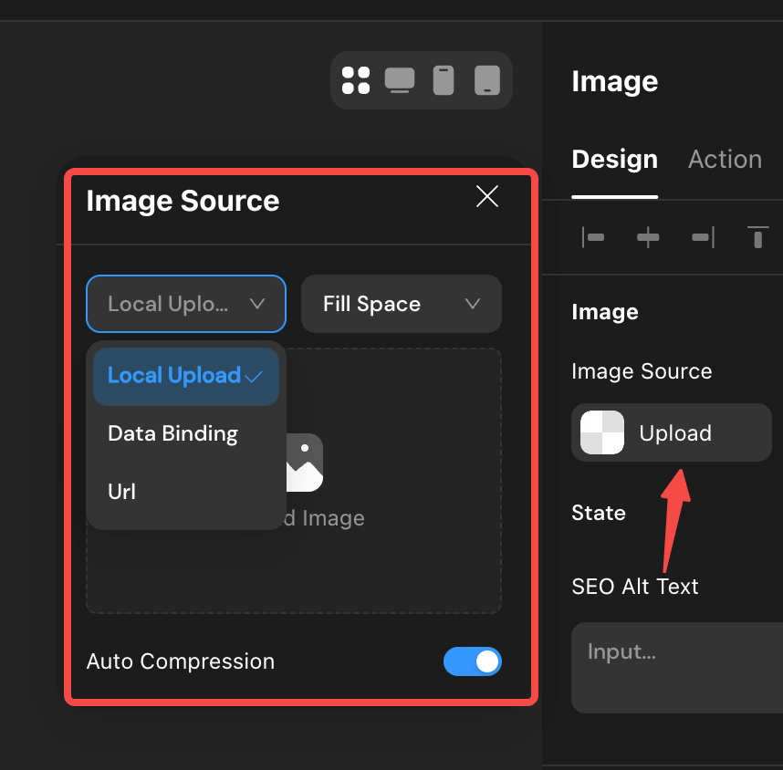
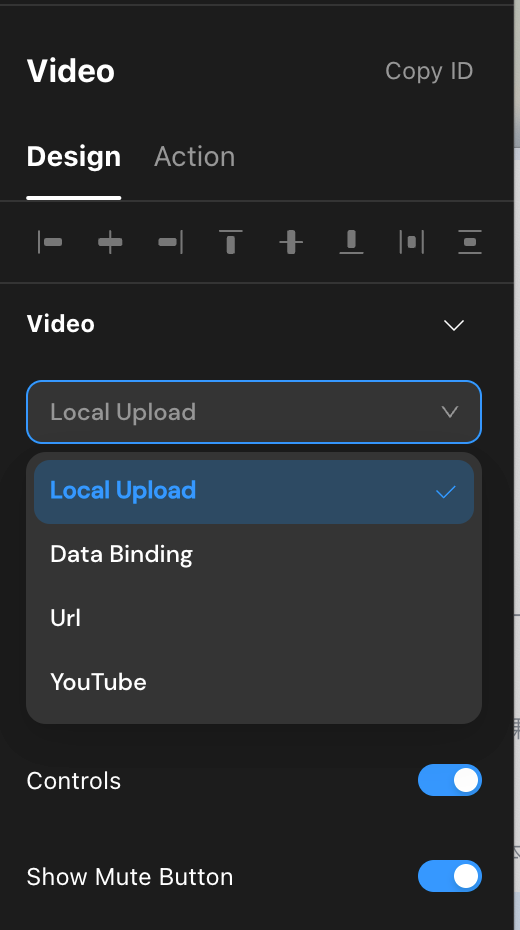

# Components - Display
Includes Text, Button, Image, Video, and Rich Text Component.

## Text   
Generally used to display text, numbers, time, date, and other text-based content.

### Configuration Instructions
1. By clicking the [+] sign in the content input box, you can reference other data.
2. Momen supports handwriting input and data binding concatenation. If you want to reference other data in the middle of the input text, please press the "/" key.   

## Button
Used in various scenarios where users need to click on the screen to trigger a certain action. Common actions include adding data, navigating to pages, etc.

> 💡 **Tips:**
>   - Currently, Momen's interactive actions only support click actions and do not support long press, double-click, etc.
>   - Most components can set click actions. Pay attention to the "Action" prompt in the right sidebar of each component, which shows "Action on Click" and can set actions when clicked.

## Configuration Instructions
In daily use, button styles often have various effects, and the Button Component may not meet the usage requirements. At this time, you can use the [Image] Component to replace the [Button], upload the image slices to the [Image] Component, and configure the corresponding actions to achieve the same effect as the button.

## Image
Generally used to display avatars, product images, and other scenarios.

### Configuration Instructions
1. Local Upload Content     
As shown in the figure below, when the image source is set to "Local Upload," click the image area, select the local image on the computer to upload, and after a successful upload, it can be previewed directly.       

> 💡** Tips:**
>   - The width or height of the uploaded image cannot exceed 30,000 px, and the total pixels cannot exceed 250 million px (image width x height), **size cannot exceed 20 MB**​
>   - The pixel calculation method for dynamic images (e.g., GIF images) is width * height * number of frames; for non-dynamic images (e.g., PNG images), it is width * height.
>   - Supported image file formats are: jpg, png, svg, webp, gif                     

2. Data Binding Content   
As shown in the figure below ⬇️, when the image source is set to "Data Binding," you can click the [+] sign to bind data of the image type.

3. Enter URL to Display Image          
   The Image Component also supports entering a URL that returns an image for display.          

4. Introduction to Cropping Methods      

- Full Image: the width and height of the image will be scaled proportionally to display the full image content within the Image Component, and the area outside the image content will display the background color.
- Fill Space: the image will scale to fill the entire Image Component, and the part of the image that exceeds the component will be cropped.            
        

5. More Functions of the Image   
On mobile, clicking the image can achieve functions such as zooming, downloading, forwarding the image, and recognizing QR codes. For details, please see [Component Management](../actions/component-management.md).

## Video
When you need to play video content in the application, you can choose the Video Component to achieve this.

### Configuration Instructions

1. Local Upload Video     
   After a successful upload, the video will be displayed below the local upload. Click the uploaded video to play it, check and confirm the video content, or re-upload.

2. Data Binding Video Content    
When the video source is data binding, click the + sign to bind the video data requested from the database. The data must be of the "Video Type" to be added and bound, and only a single video can be bound.    

1. Enter URL to Display Video          
   The video Component also supports entering a URL that returns a video for display, including video live streaming addresses.

2. Some Special Controls
   - Loop: Default is off, meaning that after the video starts playing, it will automatically loop.
   - Autoplay: Default is off, meaning that when entering the page where the video is located, the video will automatically play.
   - Playback Control, Mute Button: Default is on, meaning that it shows the functions of video playback start/pause, volume control, playback speed control, picture-in-picture, and full screen.

3. You can configure actions triggered when playback starts in the action.
4. You can add video control actions in the click actions of other components. For details, please see [Component Management](../actions/component-management.md).

## Rich Text
When you need to display highly uncertain content and images with richer styles, such as an article containing multiple elements or a long image, it is generally recommended to set the height mode of the Rich Text Component to "Adapt to Content."

>Rich Text refers to a text format that includes additional elements beyond plain text. These additional elements may include font styles (such as bold, italic), text colors, hyperlinks, images, tables, lists, etc. In short, Rich Text allows various formatting options to be added to the text, making the content richer and easier to understand.
Momen's mini-program end does not have a Rich Text Editor Component, but you can call the Rich Text Editor in the content of the Rich Text Component to edit rich text content. If a field type in the data table is of the text type, you can also call up the Rich Text Editor to edit the content when editing the database field content. Momen's Web end provides a **Rich Text Editor Component**, and on pages where content needs to be edited, you can directly drag in the Rich Text Editor Component to allow users to edit rich text content.

### Configuration Instructions
1. Local Editing   
   After dragging the Rich Text Component into the page, **click the content in the component to call up the Rich Text Editor for local rich text editing.**

<figure><figcaption></figcaption></figure>

2. Data Binding  
The text type fields in Momen's database also support calling up the Rich Text Editor for content editing. The edited result will be directly saved in the form of rich text. On the application page, you only need to use the Rich Text Component and directly bind the data of this field in its content to display the rich text content.       

1. Reference to Single Image/Video and Other Resources    
In some pages, exits  **long image or video  with unknown height**. At this time, Momen's Image or Video Component cannot adapt to the height, so you can add a Rich Text Component to the page, allowing the Rich Text Component to reference the URL of the image/video requested from remote data for content display.
However, it is worth noting that you cannot directly reference the URL but need to concatenate the URL in the form of HTML code.          

   > **💡Tips:** If you do not know how to write HTML code, you can try editing the content in the Rich Text Editor first, such as uploading an image, confirm and view the HTML code result, copy the code, find the prefix and suffix, and then perform remote data reference and concatenation, as shown in the figure below:
   > 
   > The concatenation method for image URLs is as follows:
   > 1. Copy the concatenation prefix and paste it into the content of the Rich Text Component:
    ``
   
   > 2. Click the + sign in the component content to bind the requested URL: the URL of the image read from remote data/in-component data.
   > 3. Copy the concatenation suffix and paste it into the content of the Rich Text Component:
    ``/>
``        

## Html
The HTML Component supports displaying a website in the form of an iframe and directly writing code for rendering. Both situations support binding data within the Project.

### Configuration Instructions
1. Code: Write HTML code for rendering, and project data can be inserted.            
2. iframe: Enter the webpage link, and project data can be concatenated.

## About Momen

[Momen](https://momen.app/?channel=momen-docs) is a no-code web app builder, allows users to build fully customizable web apps, marketplaces, Social Networks, AI Apps, Enterprise SaaS, and much more. You can iterate and refine your projects in real-time, ensuring a seamless creation process. Meanwhile, Momen offers powerful API integration capabilities, allowing you to connect your projects to any service you need. With Momen, you can bring your ideas to life and build remarkable digital solutions and get your web app products to market faster than ever before.
