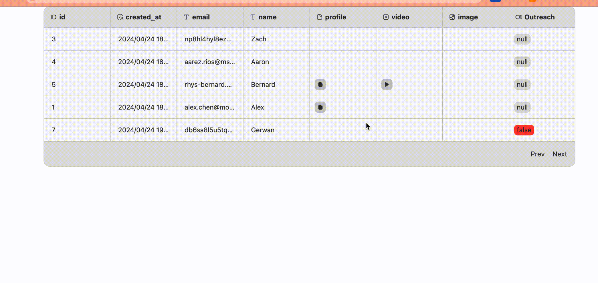

# Component - Others

Others include: Progress Bar, Divider Line, Animation, Camera View, Map, Calendar, Table.

## Progress Bar

Used to display a progress

### Configuration Instructions

1. Upload Lottie: Complete animation of the progress bar
2. Total Progress: Total frame count of the Lottie file, which can be found by opening the JSON file with a text document tool. Generally, the number after "op" in the first line is the frame count of this file.
3. Step Value: The smallest unit of change each time (frame)
4. Default Progress: The specific position displayed by the progress bar, must be numeric data, cannot be empty

## Map

Please see: [Map](map.md)

## Table

Used to display data in a table, common application scenarios include:

1. Backend management systems: Managing user information, orders, product inventory, etc.
2. Reporting functions: Displaying sales data, performance indicators, or other statistical information.

.png>)

### Configuration Instructions

1. Configure Data Source: Select the data table to be displayed in "Data". You can also drag the data columns to adjust the display order, check the data columns to be displayed, and perform data filtering. .png>)

> Various data displays and interactions in the Table Component
>
> * Integer, Text, Date, Time, Infinite Precision Decimal types of data are displayed directly in the corresponding text style
> * Image type: Displayed as a thumbnail, can be clicked to view the large image
> * Boolean type: false is displayed as black text on a red background, true is displayed as white text on a green background
> * File type: Opens a new browser tab to display the file content
> * Video type: Opens a new browser tab to display the video content 

#### Export Table Data

When a \[Table] component is present on the page, you can select the "Export Table" action on other components on the page.

.png>)

## Calendar

Used to display a calendar, with built-in light and dark color modes. Show Today: Enabled by default, the calendar will display the current month and date.

<figure><figcaption></figcaption></figure>

### Configuration Instructions

1. Selected Date: Only supports data binding, not required
2. action - Click Date Event: The action executed after clicking a date in the calendar

## Divider Line

Displays a divider line, with options for dashed, solid, and line segment direction.

## Animation

Used to display animations in Lottie format.

> A JSON-based animation data format developed by Airbnb's design team. It allows animations to be easily exported as small files that can be embedded into web pages, mobile apps, or other platforms. Recommended Lottie animations can be found at: [https://lottiefiles.com/](https://lottiefiles.com/)

The Animation Component provides two interactive operations: "Loop" and "Autoplay":

* Loop: Disabled by default, when enabled, the animation effect will loop.
* Autoplay: Enabled by default, the animation content will automatically play when entering a page with an animation component.

## **About Momen​​**

[Momen](https://momen.app/?channel=momen-docs) is a no-code web app builder, allows users to build fully customizable web apps, marketplaces, Social Networks, AI Apps, Enterprise SaaS, and much more. You can iterate and refine your projects in real-time, ensuring a seamless creation process. Meanwhile, Momen offers powerful API integration capabilities, allowing you to connect your projects to any service you need. With Momen, you can bring your ideas to life and build remarkable digital solutions and get your web app products to market faster than ever before.​​
