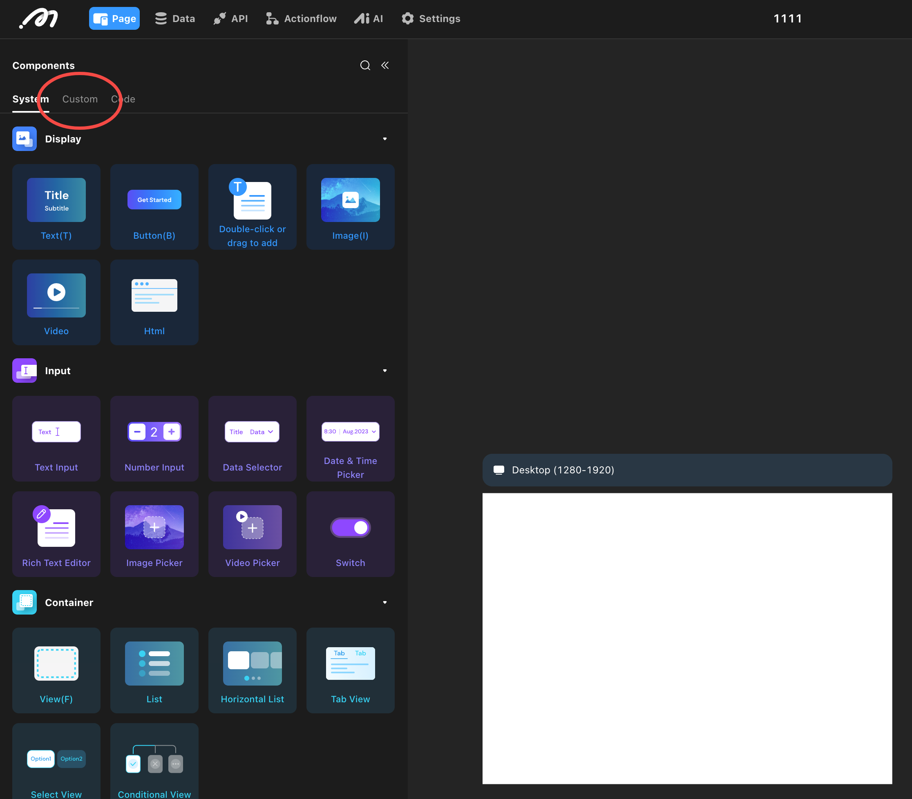
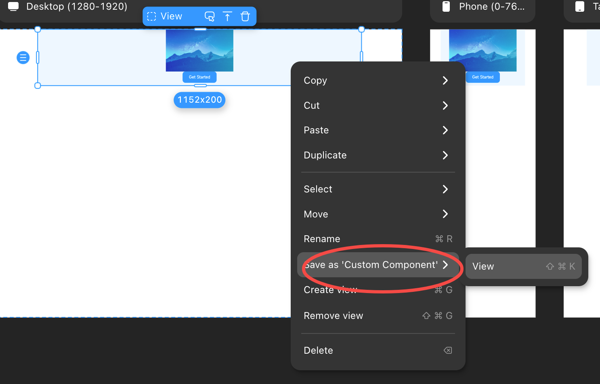

# Custom Component

## Background

Building pages with finely granular components has always been popular among users. However, as the complexity of application pages increases, building the UI becomes cumbersome. We have focused on the scenario of user reusability and introduced the Custom Component feature. This feature allows users to save configured components as Custom Components and add them to the left sidebar component library, enabling reuse in multiple places within a project to enhance building efficiency.

## Value

1. Reuse in multiple places: Once a component is saved as a Custom Component, it can be directly dragged and used on all pages within the project.
2. Collaborative efficiency: Project collaborators can directly use the saved Custom Components, improving building efficiency.

### Scenario

Repeated general components: During project building, we often encounter some general components that appear repeatedly, such as top navigation bars, product lists, and user information panels. We can build the UI once and save it as a Custom Component, then drag it out from the left sidebar's Custom Component library to use on other pages. 

### Instructions

1. **Create**: After selecting a component, save the configured component as a Custom Component through the right-click option or the shortcut `cmd+shift+K`. We will save all content, style, data configuration structure, and action configuration structure of the component. When there is a data dependency in the data or action configuration, users need to delete and reconfigure the configuration items.

    
2. **Fill in information**: Enter the Custom Component panel, where we will automatically generate a preview image of the component, and users can also upload their own. Users can name the Custom Component and add a description in the panel. After clicking save, the component will be added under the left sidebar - Custom Components.
3. **Reuse in multiple places**: Users can drag or double-click to add the saved component from the left sidebar - Custom Components to other pages for use. When there are too many Custom Components, users can accurately find the required component through the description in the upper right corner.

### Functional Boundaries

1. The maximum number of components that can be saved per project is 1000.
2. Style editing is not supported.
3. Cross-project use is not allowed.
