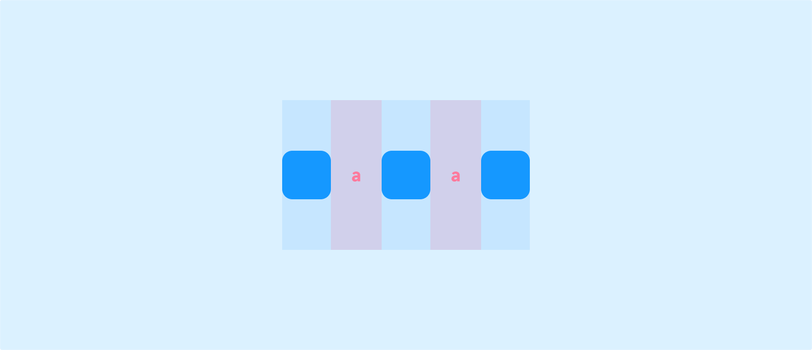

# Detailed Tutorial on Layout and Position
## Layout

Pages and Container components come with default layout properties. You can adjust the layout settings to arrange components with a "relative" position type according to the specified rules, achieving your desired layout effect.

### Direction

The extension direction of the layout.

    
    

**Horizontal**

Add, remove, and reorder objects along the X-axis.

**Vertical**

Add, remove, and reorder objects along the Y-axis.

### Distribution and Alignment

You can freely adjust the distribution of child components within a page/Container component and align them with reference to the parent.

**Stack**:

**Space Between**: The spacing between components is equal, but the first and last components are flush with the edges of the Container.

**Space Evenly**: The spacing between components is equal, and the margins at both ends of the Container are also equal.

**Space Around**: In space-around distribution, each component has equal spacing on both sides, making them appear "evenly surrounded." However, because the components at both ends only share spacing on one side with other components, the gaps between the ends and the Container edges are smaller than the spacing between components.

### Wrapping

When the content width exceeds the available space of the Container, the content will adjust to the next line for arrangement.

### Gap
The spacing settings between child components within a page or Container component.

### Overflow

1. **Scroll**: When content overflows, a scrollbar appears on the parent, allowing you to scroll to view the overflowed content.

2. **Visible**: When content overflows, the overflowed part is visible on the parent.

3. **Hidden**: When content overflows, the overflowed part is hidden on the parent.

## Position

### Type

1. **Relative**: Components are arranged in an orderly manner according to the layout of their parent.

2. **Absolute**: Components are displayed at a fixed position based on two directions (top-left, top-right, bottom-left, bottom-right) of **their parent**.

3. **Fixed**: Components are displayed at a fixed position based on two directions (top-left, top-right, bottom-left, bottom-right) of the **browser viewport**, and remain in a fixed position even when the page scrolls.

### Layer

* The default layer of all components is "auto," meaning all components are on the same layer.

* You can manually change the layer of a component (numerically), with higher values indicating a higher layer. Components on higher layers will cover those on lower layers.

* Components on the same layer are presented in the order they are added, with later additions covering earlier ones.