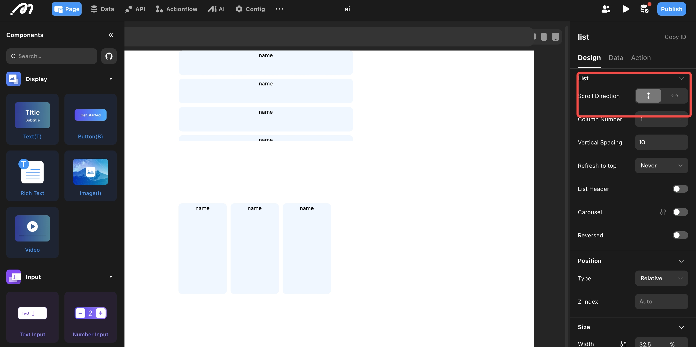
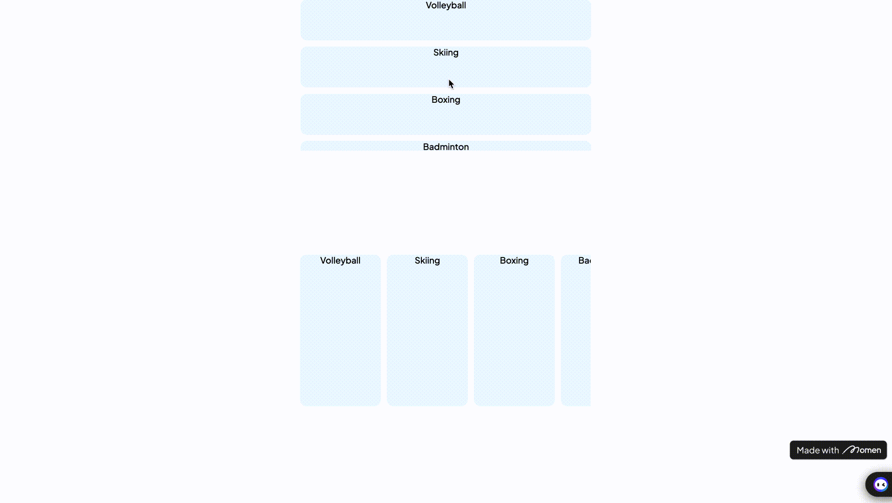
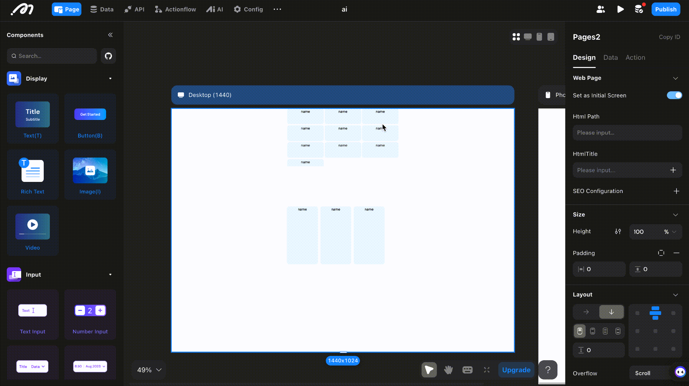
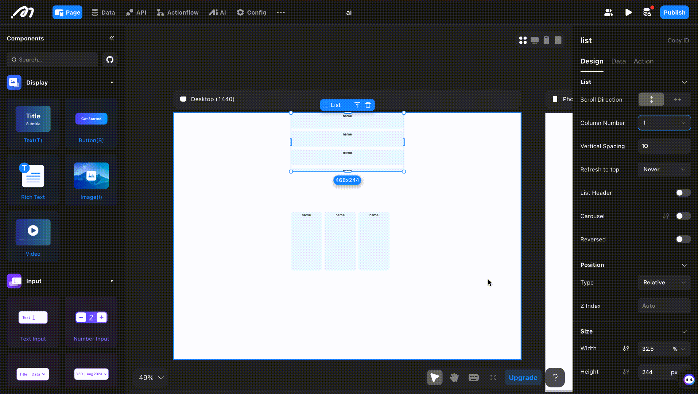
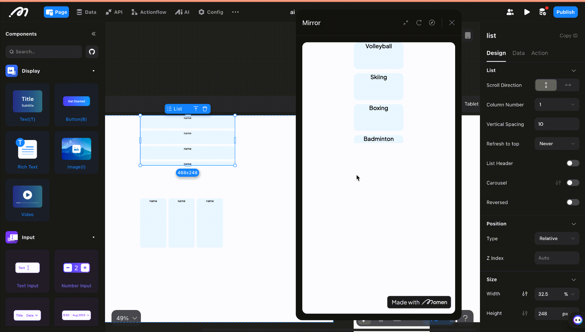
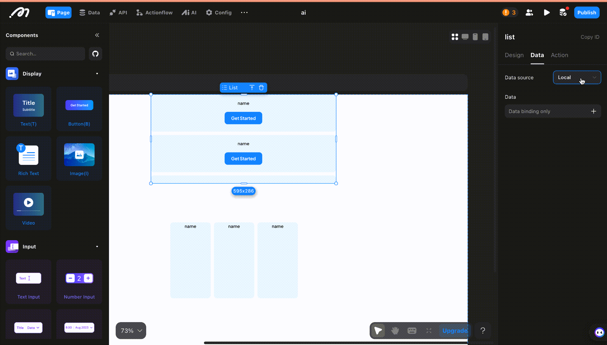
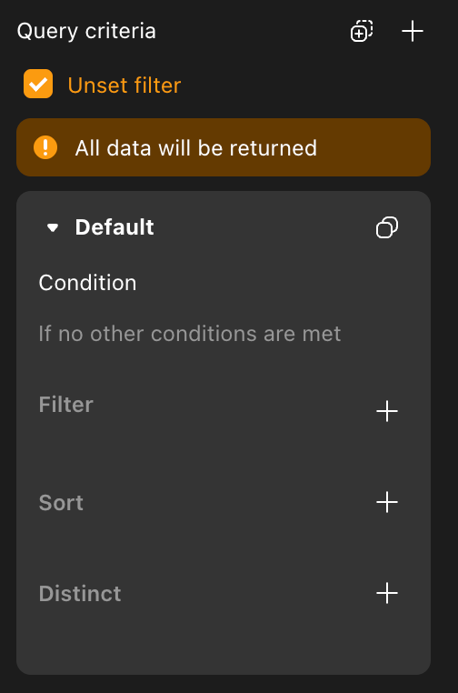
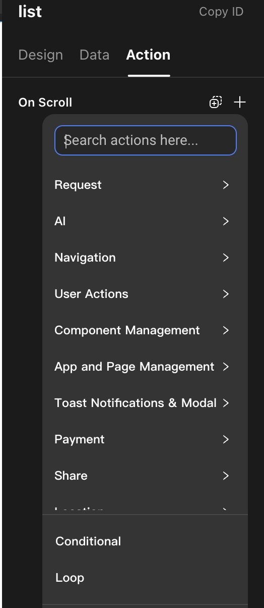

# List

## Usage Scenario

When you need to display multiple items with similar styles but different data, use the List component. For example, a product list may show product images, names, and prices—while the content differs, the layout and style remain consistent.

- Product categorization
- Product display
- Comment posting

.png)

## Configuration Instructions

Place components inside the List's sub-container and bind the data source in the Data section.

### Design

#### Scroll Direction

Set the scrolling direction for the list.

#### Number of Rows/Columns

Set the number of rows or columns. Supports fixed numbers or adapting to the screen.

1. **Fixed:** Enter the number directly.
2. **Auto:** For vertical lists, enable auto mode and configure the item width. The number of columns is calculated based on screen width and item width.
3. **Fill Remaining Width (List item):** In auto mode, enables items to fill extra space. If disabled, item width remains fixed.

#### Spacing

Set the gap between rows or columns.

#### Refresh to Top

Configure whether the list scrolls to the top when refreshed.

- **Off:** Default; does not scroll to top on refresh.
- **Refresh Action:** Scrolls to top only when the Refresh action is triggered.
- **Auto:** Scrolls to top when the filter changes and the list refreshes.
- **Always:** Always scrolls to top on refresh or filter change.

#### Header

Add components above the list as a header.

#### Carousel

Enable carousel mode for the list. Configure autoplay and loop options.

#### Reverse

Enable "Reverse Loading" to load more data above the list when swiping up (default is off; loads more when swiping down).

#### Position, Size, and Subcontainer Layout

See [Layout](layout.md).

#### Sub-containers

After adding a List, the first line shows [Add Component Here]—this is the sub-container. Configure its size, layout, and style separately.

### Data

Select the List, click on its content, choose [Remote] as the data source, and select a data table or API.

#### Limit

Limits the number of records requested and displayed at once.

Use the limit function to load a set amount of data at a time. When the user scrolls to the end, more data is loaded with [Load More].

#### Load More

If a limit is set, the list loads more data as the user scrolls down.

#### Data Criteria

Display data based on filter rules. You can implement conditional data filtering by clicking the [+] icon.

- **Unset Filter:** No filter; all data is shown (usually, you should set filters).
- **Filter:** Set conditions to filter data.
- **Sort and Distinct:**  
  - **Sort:** Choose a field and sort order (ascending/descending). If deduplication is enabled, the sort field must match.
  - **Distinct:** Select a field for deduplication; only one record per duplicate value is shown.

#### On Request Status Change Actions

Configure actions triggered when the request status changes.

#### On Success

Actions added here are triggered after the List data loads successfully.

### Action

**On Scroll:** Configure actions triggered when the list is scrolled.

## How to Bind Data to Each Item in the List

After configuring the data source, double-click the List to enter its sub-container. Drag in components (e.g., Text) to display item content.  
Select the component, click the [+] in its content, choose "Component Data," find the remote data bound to the List, select "item," and then the specific field to bind.

## About Momen

[Momen](https://momen.app/?channel=momen-docs) is a no-code web app builder that allows users to build fully customizable web apps, marketplaces, social networks, AI apps, enterprise SaaS, and more. You can iterate and refine your projects in real time for a seamless creation process. Momen offers powerful API integration, enabling you to connect your projects to any service. With Momen, you can bring your ideas to life and launch web app products faster than ever.
