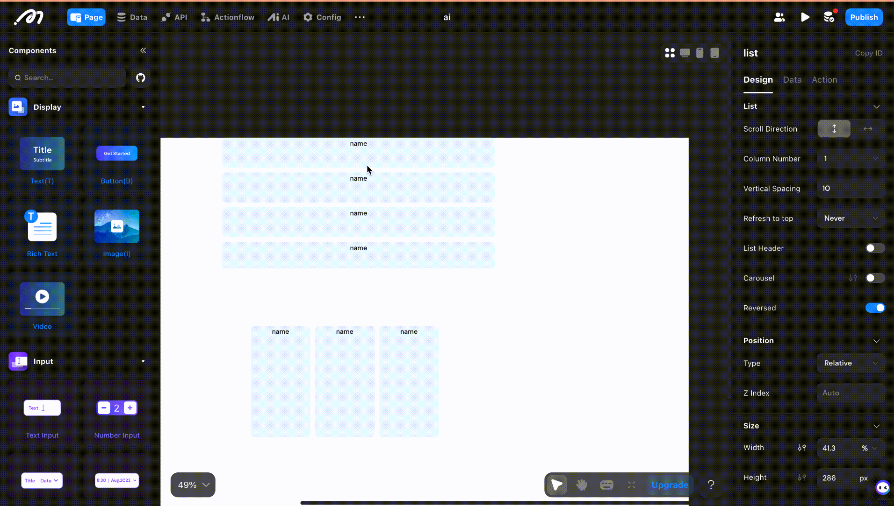

# List
## Usage Scenario
When we need to uniformly display multiple contents with similar styles but different data, we can use the List component. For example, in the common usage scenarios below, a product list includes information such as product image, product name, and product price. The specific content differs, but the layout and other styles are uniform, so we can use the [List] for data display.

- Product categorization
- Product display
- Comment posting

<figure><figcaption></figcaption></figure>

## Configuration Instructions
You can put some componets in the sub-containers,and bind data source in Data section.
### Design

#### Scroll Direction

Setting the scrolling direction when sliding the list.

<figure><figcaption></figcaption></figure>

<figure><figcaption></figcaption></figure>

#### Number of Rows/Columns
Set the number of rows or columns for the list. Currently, it supports fixed numbers or adapting to the screen.          

1. Fixed: Simply fill in the number directly.
2. Auto: Take the vertical list as an example. After enabling the automatic option, the width of each item needs to be configured for the list item container. When the page is rendered, the number of columns to be displayed will be calculated based on the screen width/item width.
3. Fill the remaining width (List item): This takes effect when in the automatic mode. After enabling it, each child item will become wider to fill the width that is not sufficient for a full column. If it is disabled, the width of each child item remains unchanged.

<figure><figcaption></figcaption></figure>

#### Spacing

The gap between rows or columns.

<figure><figcaption></figcaption></figure>

#### Refresh to top

When you refresh a list using the Refresh action, you can set whether the list scrolls to the top.

* Off: Default. i.e. does not scroll to the top when you refresh the list
* Refresh Action: If you only want to configure and actively trigger the Refresh action on other components, the list scrolls to the top
* Auto: The list will scroll to the top when the filter is set and the content of the list is refreshed when the filter condition changes
* Always: Configure this option when you want the list to scroll to the top, whether the filter conditions change or when you actively refresh the list

#### Header

You can place other components to form a whole with the list.

<figure><figcaption></figcaption></figure>

#### Carousel

Set whether the list is in carousel mode or not. The default is off. When it is on, you can set whether it is autoplay,looped or not.

<figure><figcaption></figcaption></figure>

#### Reverse

"Reverse Loading" is disabled by default, and more data is loaded when the list is swiped down by default, and when "Reverse Load" is turned on, more data will be loaded above the list when the list is swiped up.

#### Position, Size and Subcontainer Layout

Refer to Layout.

#### Sub-containers

After dragging the list component into the page, you can see that the first line of the list component has a guide [Add Component Here], which is the sub-container view of the list, and you can configure the size, layout and style of the sub-container separately

<figure><figcaption></figcaption></figure>

### Data

After selecting the List, click on the content, choose [Remote] as the data source, and select the data table created in your data model or API you configed.

<figure><figcaption></figcaption></figure>

#### Limit

This limits the number of data requested and displayed in the database at one time.

The list generally reads remote data, and there is often more than one piece of data. If it is displayed after all the data is loaded at one time, it will obviously cause a bad user experience for users. So use the limit function to request a certain amount of data, and each time it slides down to the last one, more data is obtained by [load more].

#### Load More

If you've set a limit to the data requests, the list will load more once the user swiped down.

#### Data Filtering

The data will be displayed based on corresponding rules.

<figure><figcaption></figcaption></figure>

* Unset Filter

No filter conditions, and read all the data in the data table (normally we need to set filter conditions to read the data that meets the conditions)

* Filter

Set filters to filter out data that meets the criteria.

* Sort and Distinct

Sort: Choose a field for sorting, and you can set the sort type to ascending or descending. Note that if de-duplication is enabled, the sorting field must be the same. Distinct: After selecting the basis field for de-duplication, only one duplicate data item will be displayed under this field.

#### On Request Status Change Actions

Action triggered when the state of the request changes.

#### On Success

The action added here will be triggered after the [List] data is read successfully.

### Action

On Scroll: COnfigure the actions when the list is scrolled.

<figure><figcaption></figcaption></figure>

## How to Bind Data to Each Item in the List

After completing the previous step, double-click to enter the list component, drag other components that need to display the content into the "sub-view", such as the text component.    
Click the text component, click the [+] sign in its content, select "Component Data" to find the remote data bound to this list, and then select the item, and select the specific data field to be bound.

<figure><figcaption></figcaption></figure>

## About Momen

[Momen](https://momen.app/?channel=momen-docs) is a no-code web app builder, allows users to build fully customizable web apps, marketplaces, Social Networks, AI Apps, Enterprise SaaS, and much more. You can iterate and refine your projects in real-time, ensuring a seamless creation process. Meanwhile, Momen offers powerful API integration capabilities, allowing you to connect your projects to any service you need. With Momen, you can bring your ideas to life and build remarkable digital solutions and get your web app products to market faster than ever before.
