# Map

#### Value

1. **Customizable config**: Users can set the display range and zoom level of the map, ensuring that the map content is displayed according to business requirements.
2. **Multiple Markers**: It supports adding one or more markers on the map, enabling users to display information about different locations.

#### When to use

The map component uses geographical data (latitude and longitude) to display corresponding location information. It responds to user actions, such as clicking on a marker, and can be used in applications that require the display of locations, such as company address information or navigation-based apps.

<figure><figcaption></figcaption></figure>

#### How to use

1. **Register with Mapbox and Obtain an Access Token**
   1. Go to the Mapbox platform (https://www.mapbox.com), register an account, and create an access token. It is **recommended** to restrict your token by adding your domain on the Mapbox restriction section to make your token more secrue. Once added, the token will only work for requests that originate from the URLs you specify.
   2. When access token is obtained, input the access token under Config-General-Map API key section.

<figure>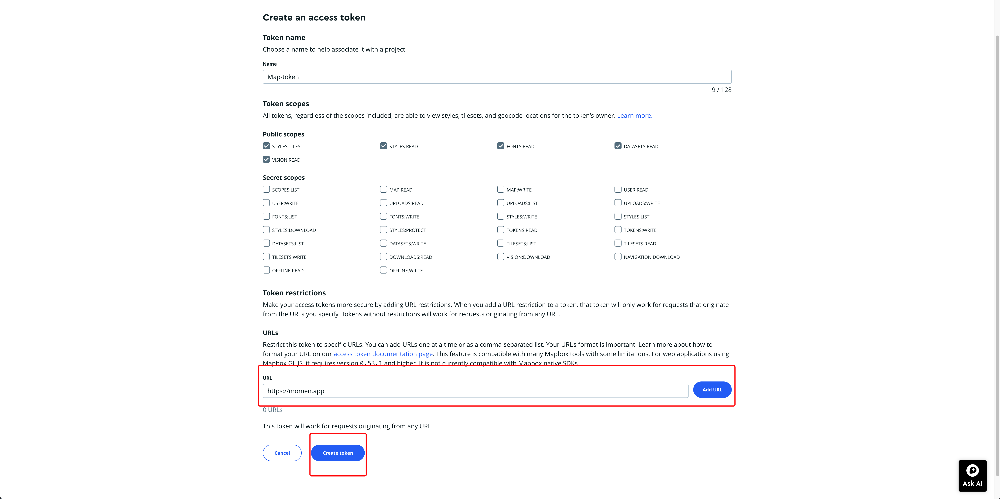<figcaption></figcaption></figure> <figure>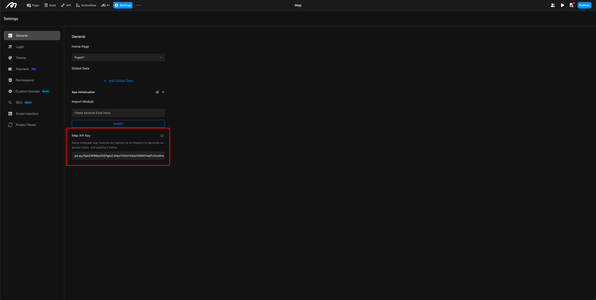<figcaption></figcaption></figure>

2. &#x20; **Obtain GeoPoint data**

Users can obtain geopoint data through the action of Get Location and assign it to Page data while constructing the map. Other than that, you can obtain these data by looking it up on map providers and inserting it into the Momen built-in database. In your database, create an "Address Information" table based on your business logic. Common fields include:

1. **Text type**: Marker name
2. **Image type**: Marker icon
3. **Boolean：**&#x43;enter point
4. **Geo point type**: Marker coordinates

<figure>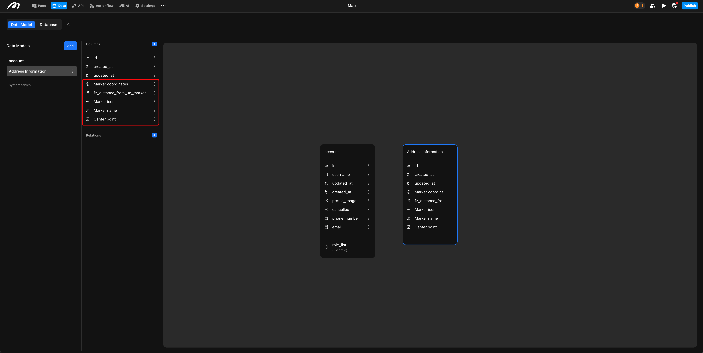<figcaption></figcaption></figure> <figure>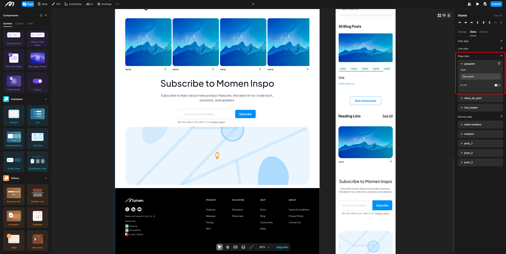<figcaption></figcaption></figure> <figure>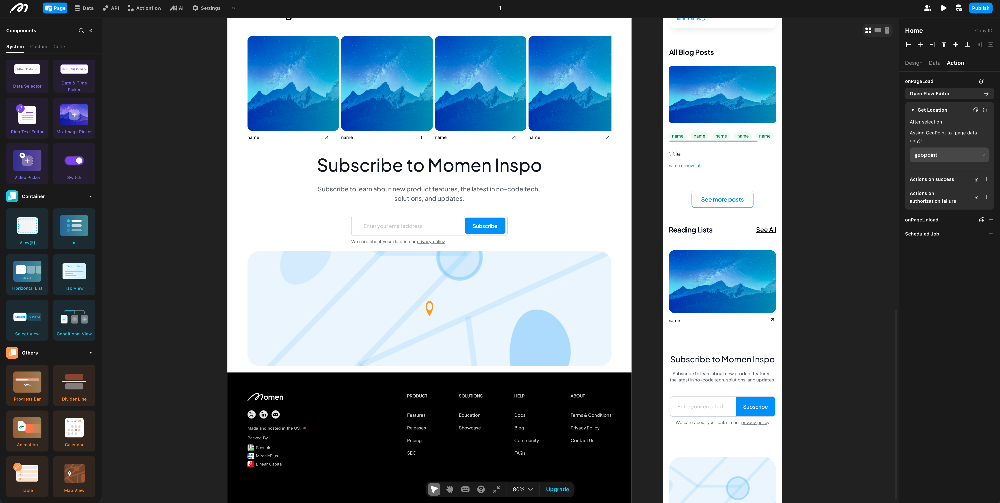<figcaption></figcaption></figure>

3. **Map Configuration**

**Initial zoom**: This controls the map's display range. The default is 11, with values ranging from 1 to 19. The lower the number, the larger the display range (e.g., zoom level 1 shows the entire globe).

<figure>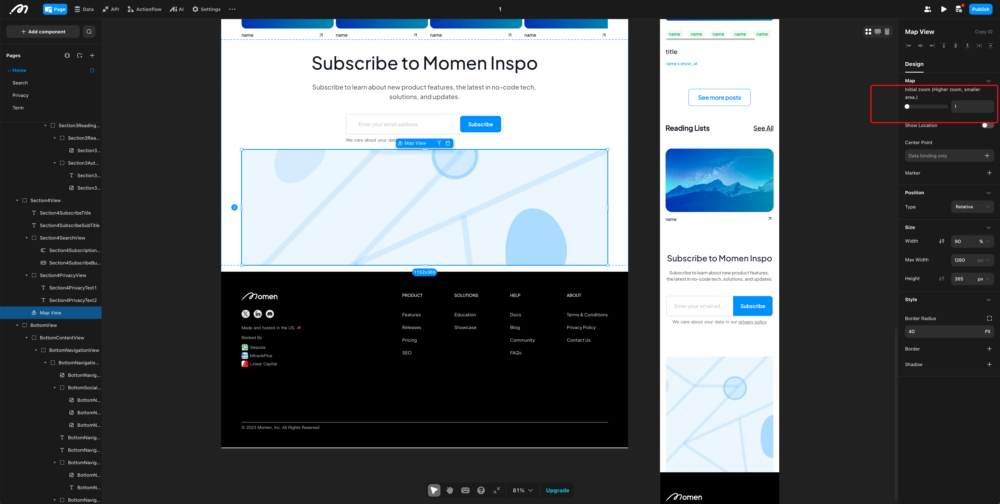<figcaption></figcaption></figure> <figure>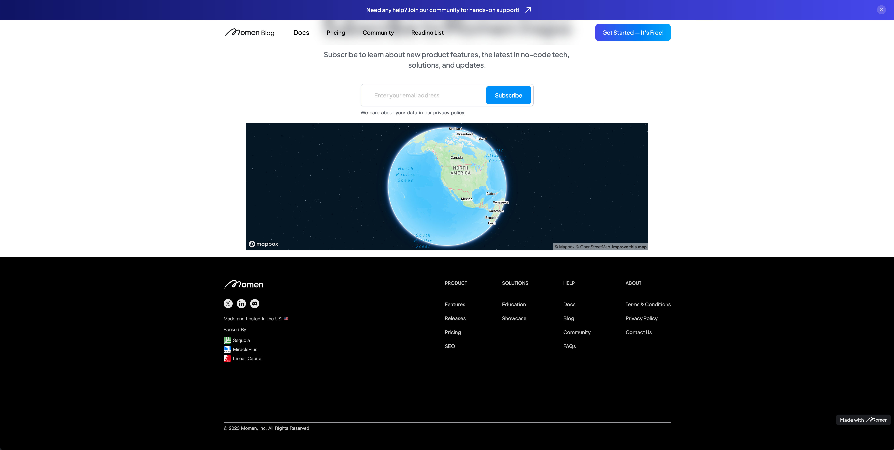<figcaption></figcaption></figure>

**Show Location**: Enabling this will display the user's current location on the map.

<figure>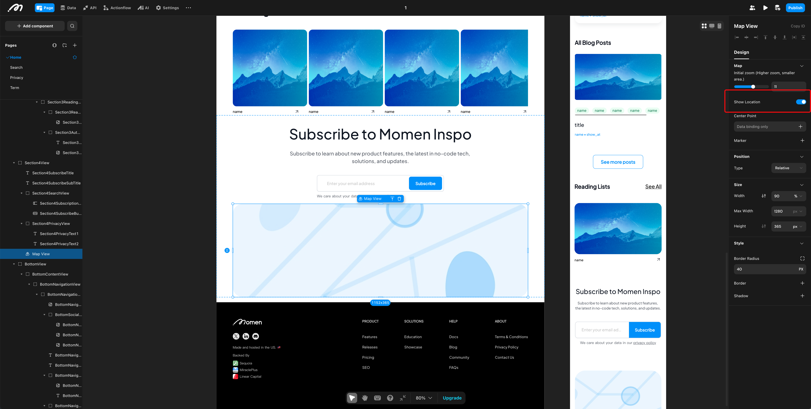<figcaption></figcaption></figure> <figure>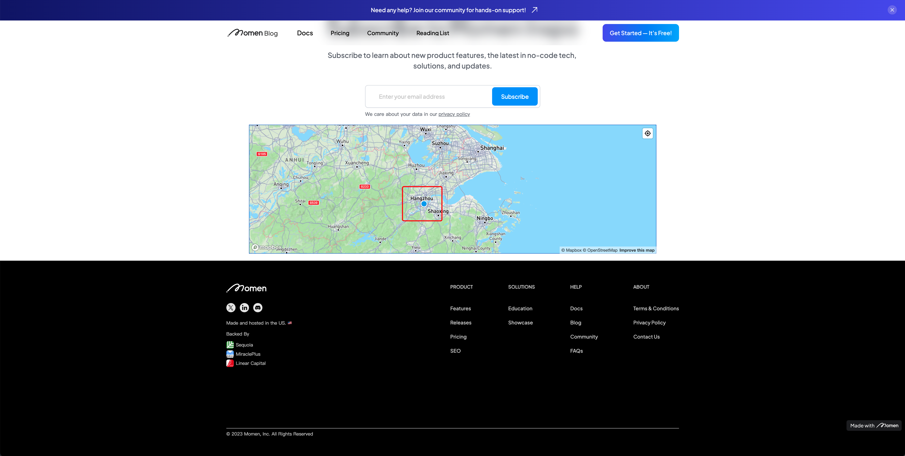<figcaption></figcaption></figure>

**Center Point**: The map will be centered around the configured point. If not configured, the center point of the map defaults to Los Angeles, California, USA.

<figure>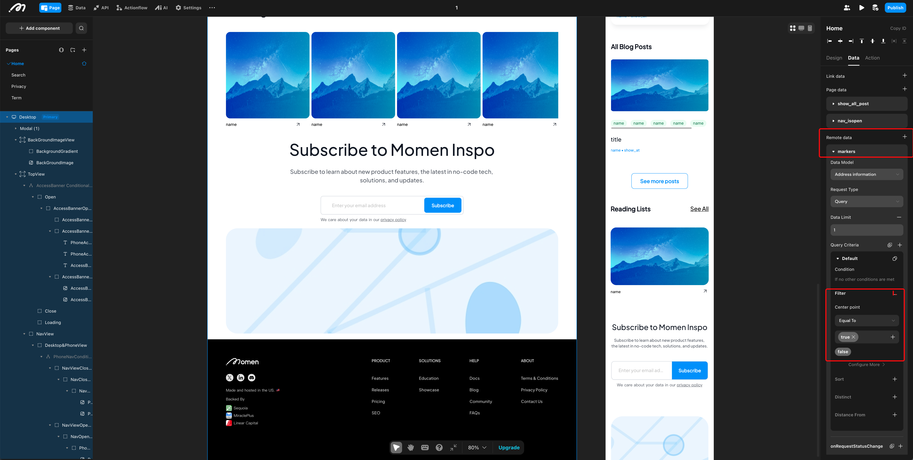<figcaption></figcaption></figure> <figure>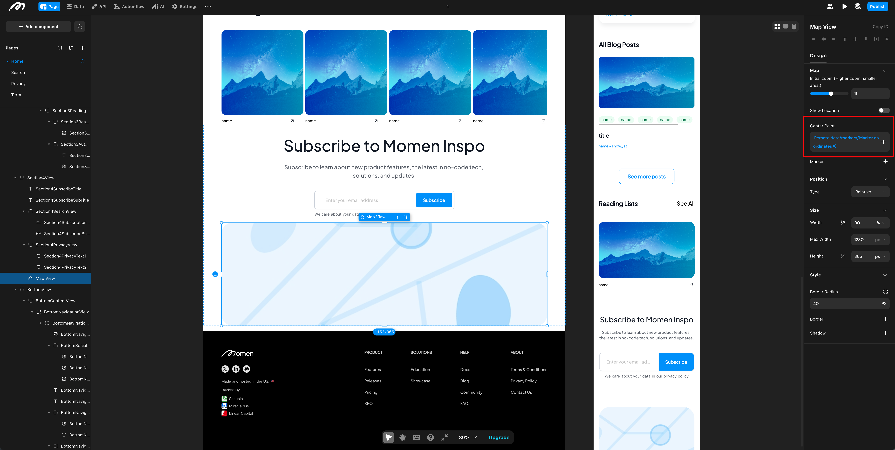<figcaption></figcaption></figure> <figure><figcaption></figcaption></figure>

4. **Marker Configuration**

**Marker Switch**: Toggle the marker switch to the marker configuration panel.

<figure>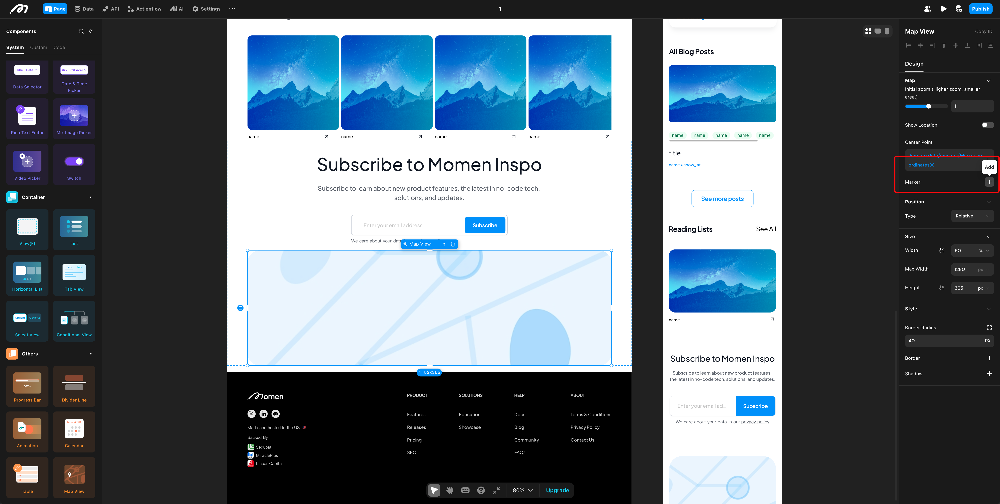<figcaption></figcaption></figure> <figure><figcaption></figcaption></figure>

**Quantity**:

1. **Single Marker**: For a single marker, simply bind the marker coordinates via remote data.

<figure>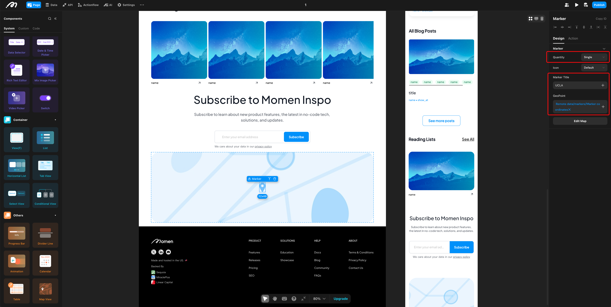<figcaption></figcaption></figure> <figure>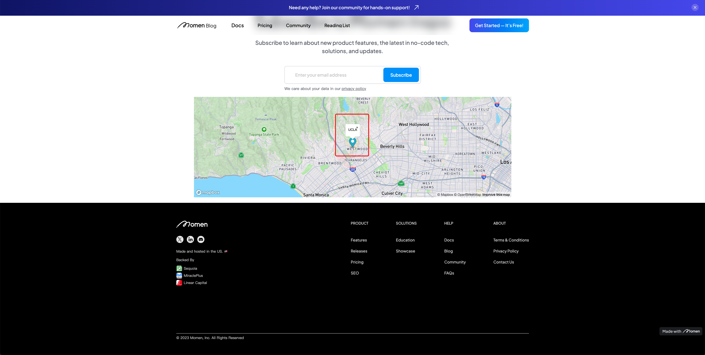<figcaption></figcaption></figure>

2. **Multiple Markers**: For multiple markers, bind a remote data source to provide multiple marker coordinates (be mindful to remove data limit if multiple coordinates shall be retrieved at once), and bind the marker coordinates via in-component data.

<figure>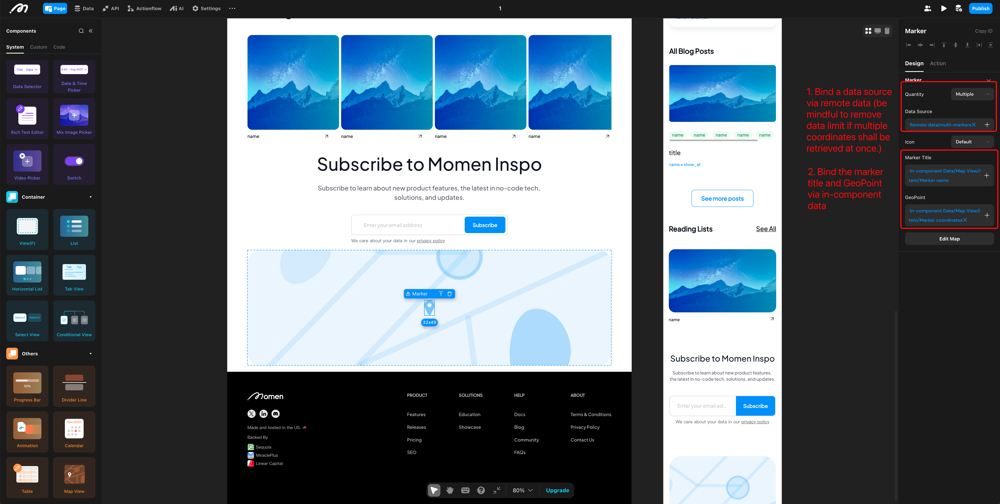<figcaption></figcaption></figure> <figure><figcaption></figcaption></figure>

**Icon Style**: Users can upload or bind a custom icon style for markers and adjust the icon size.

<figure>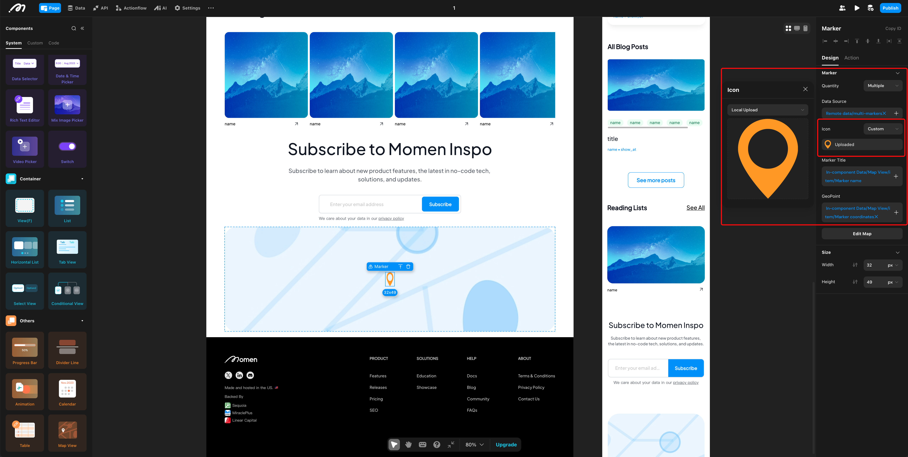<figcaption></figcaption></figure> <figure>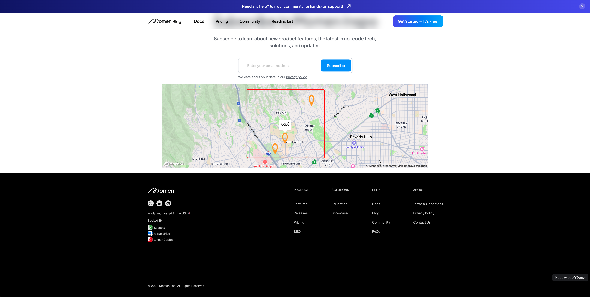<figcaption></figcaption></figure>

**Marker Name**: Users can manually enter or bind the marker name.

<figure><figcaption></figcaption></figure> <figure><figcaption></figcaption></figure>

**Action onClick**: Users can configure actions triggered when clicking on a marker, such as displaying a popup.

#### 5. Functionality Boundaries

1. When the map center point is not set, the map defaults to Los Angeles, California, USA.
2. The map component is only for displaying location information and does not support interactive location retrieval.
