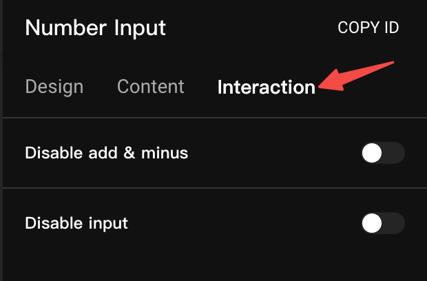
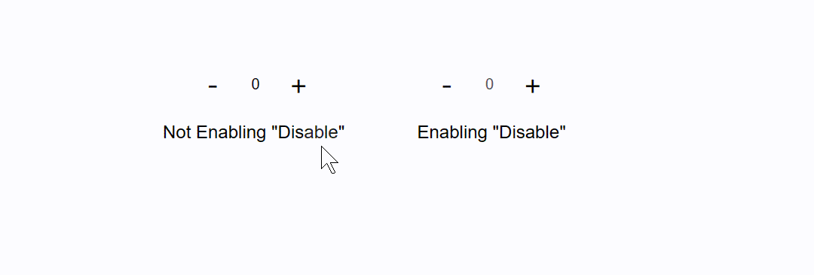
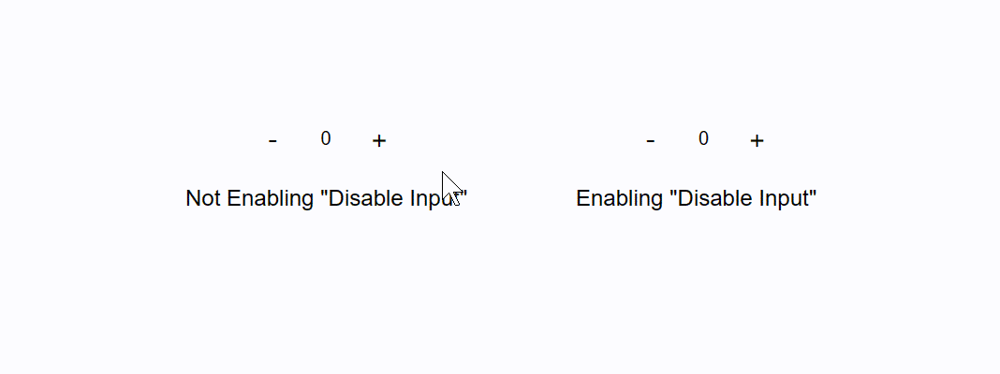
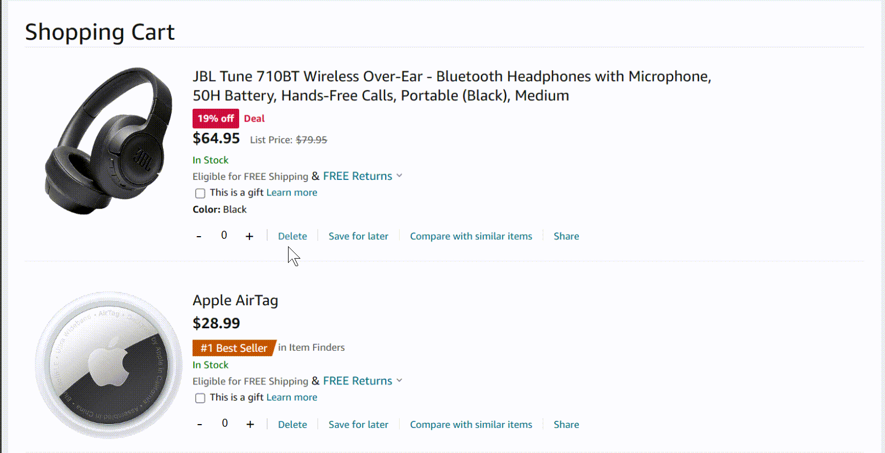
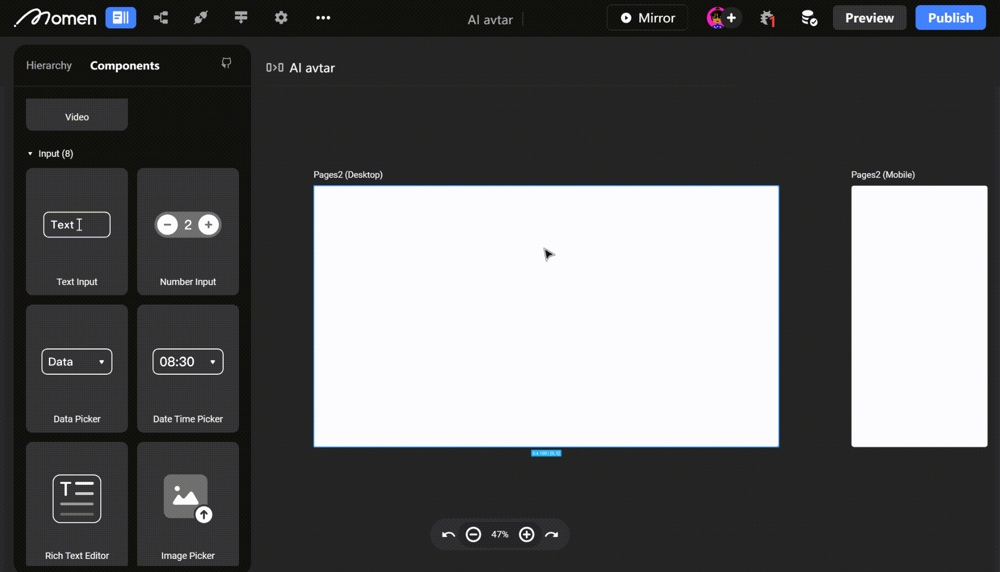

# Number Input

### Introduction

Discover how to efficiently handle numeric data for a variety of applications in web development. From managing quantities in shopping apps to handling special scoring scenarios, you'll gain the skills to make the most of Number Input Components. Let's get started.

### Usage Scenario

Number Input Components in Momen serve the purpose of outputting numeric values. They are handy for scenarios where you need to add quantities or specify numeric ratings. Here are some common use cases:

* Shopping Apps: Use Number Input Components to add the quantity of items to your shopping cart.
* Rental Apps: Incorporate numeric input for adding the number of devices in rental transactions.
* Scoring: Utilize numeric input for scoring within a specific range, such as 1-10, or particular values like multiples of 10 (e.g., 90, 80).

💡Tips:

1. Number Input Components are primarily designed for adding numbers, and their style cannot be customized. For inputting larger numbers, like scores, consider using "[Text Input](https://docs.momen.app/component/text-input)" components.
2. Phone numbers should be entered using the \[Text Input] Component.

### Number Input Content

<figure><figcaption></figcaption></figure>

#### Default Value

With a default of 0, the initial value can be adjusted within the specified minimum and maximum values.💡Tips: Always set a default value for the Number Input Components.

#### Maximum Value

Defines the maximum allowed input value. If the entered value exceeds this limit, the maximum value is displayed.

#### Minimum Value

Specifies the minimum allowed input value. If the entered value is lower than this limit, the minimum value is displayed.

#### Step Value

Determines the increment or decrement value when using the + and - signs.💡Tips: Number inputs have no step value limitation and can be input directly.

### Number Input Interaction 

<figure><figcaption></figcaption></figure>

#### Disable

When this option is enabled, the + and - signs cannot be clicked, and numeric input is restricted. The component displays the default value, which cannot be modified.

💡Tips: Enabling “Disable” makes the numeric input component purely for display, preventing user input.

<figure><figcaption></figcaption></figure>

#### Disable Input

This setting prevents direct number entry or modification but allows changes via the + and - signs.

<figure><figcaption></figcaption></figure>

#### Utilization

#### Add Quantity to Shopping Cart.

To enable users to add quantities to their shopping carts, place a numeric input component within the cart interface. Bind the default value to the relevant data and set the step value to 1.

💡Tips:

&#x20;The Number Input component style cannot be customized. For customization, consider using image + text components. Check out Momen's e-commerce template for shopping cart page configurations.

<figure><figcaption></figcaption></figure>

#### Special Scoring

When you need to input scores that are integer multiples of ten, such as 100, 90, or 80, you can place a numeric input component on the page. Enable "Disable Input" and set the step value to 10.

<figure><figcaption></figcaption></figure>

### About Momen

[Momen](https://momen.app/?channel=blog-about) is a no-code web app builder, allows users to build fully customizable web apps, marketplaces, Social Networks, AI Apps, Enterprise SaaS, and much more. You can iterate and refine your projects in real-time, ensuring a seamless creation process. Meanwhile, Momen offers powerful API integration capabilities, allowing you to connect your projects to any service you need. With Momen, you can bring your ideas to life and build remarkable digital solutions and get your web app products to market faster than ever before.
