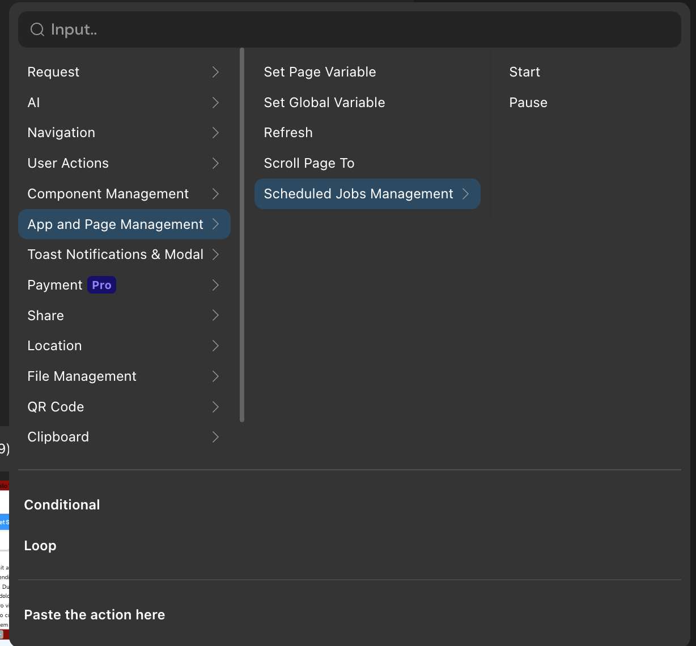

# Introduction and Configuration of Page

A page refers to the various pages of an application, each of which can be configured in terms of design, data, and action.
- In Momen, a page is the smallest unit for retrieving data from the server. By adding a page data source, data can be fetched from the database for use by various components within the page.
- Each application can designate one page as the homepage, which is the first page displayed when the user opens the application.
- Each page can be configured with action for when the page loads, when the page unloads, and scheduled jobs.

## Design Section
After selecting a web page, you can configure whether the page is the initial screen, the Path(URL), HtmlTitle, SEO settings, size, layout, and style in the "Design" section of the right properties panel.
- Path(URL): The title content displayed in the browser tab when entering the webpage, as shown in the image below.
- HtmlTitle: The path appended to the webpage link in the browser address bar when entering the webpage, as shown in the image below.
- SEO Settings: After expanding, you can set the TDK (Title, Description, Keywords) for the webpage and configure the thumbnail displayed when sharing the webpage link.
- The rest of the design is the same as component configuration.

## Data Section

1. Page Data Source (formerly Remote Data): In Momen, a page is the smallest unit for retrieving data from the server. By adding a page data source, data can be fetched from the database for use by various components within the page. For example, if a text component wants to display a user's nickname from the account table, a new page data source needs to be created to fetch a specific piece of data from the account table, and then bind "Page Data Source" - "Name" to the text component.

2. Page Variables (formerly Page Data): After adding a page variable, other components can change the value of the variable by setting page variable action. Page variables are generally used for temporarily storing some data on the page.

3. Page Parameters are a way to pass data between pages (see details: [Parameters](../data/parameters)). There are two types of parameters:
    * Query (formerly Link Data): After adding a query parameter, other pages can pass a specific value when opening this page. For example, a blog detail page can configure a parameter for the blog name to specify which blog to open. It can also be used to record user channels.
    * Path (formerly Path Data): Similar to query parameters, but it changes the page's address, usually used on pages requiring better SEO performance.

## Action Section

### onPageLoad and onPageUnload
The period from when a page starts loading content to when it is closed and unloaded is called the page's active period. During the active period, you can configure the desired action for when the page opens (onPageLoad) and closes (onPageUnload).

> Common configurations for "Page Loaded"
>- When entering a mini program page, a splash screen ad with a countdown can be configured in the lifecycle "Page Loaded" to control the splash screen ad.
>- When entering a mini program page, if you need to set page data to be used by the current page, you can configure the action of [Set Page Data] in the lifecycle "Page Loaded" to achieve this.

### Scheduled Jobs
**Definition:**         
A action at a certain time interval until manually paused or the page is closed.
**Trigger Interval:**          
Measured in milliseconds, the configured action is triggered once every "trigger interval."
**Immediate Trigger:**           
When enabled, the scheduled job will automatically start when entering the page.

**Manually Start/Pause Page Scheduled Jobs:**        
As shown in the image below ⬇️, you can add a "Scheduled Jobs Management" action to a component to start or pause a scheduled job.    

## Loading Order of Data and action in Pages
When a new page is opened, the various contents configured on the page will load in a certain order. Understanding this loading order can help us correctly invoke action and use data. The loading order is as follows, **loaded from top to bottom**.
- If the page is configured with link data, it will first receive the link data passed from other pages.
- If the page is configured with page data, a page data with an empty value will be created, waiting for assignment.
- If the page is configured with action for "Page Loaded," the action will start executing.
- If the page is configured with page data sources, the content of the page data sources will start being read.
- Finally, the local data or default values of each component are displayed.