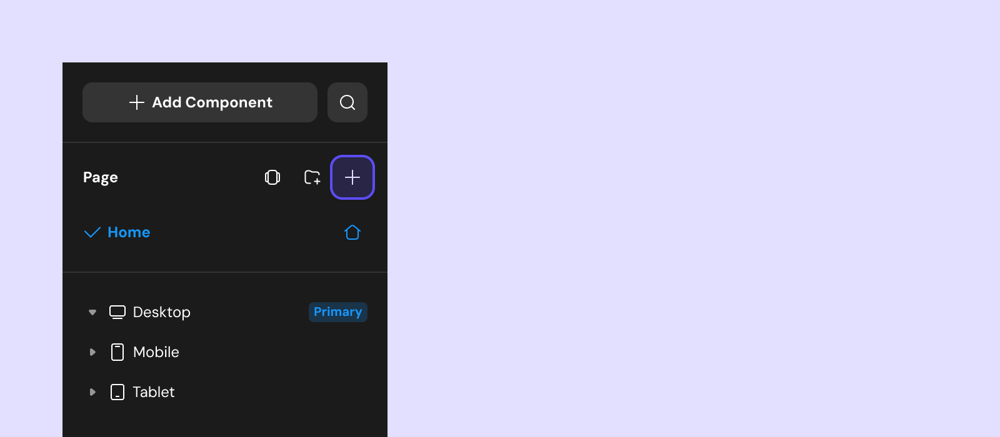
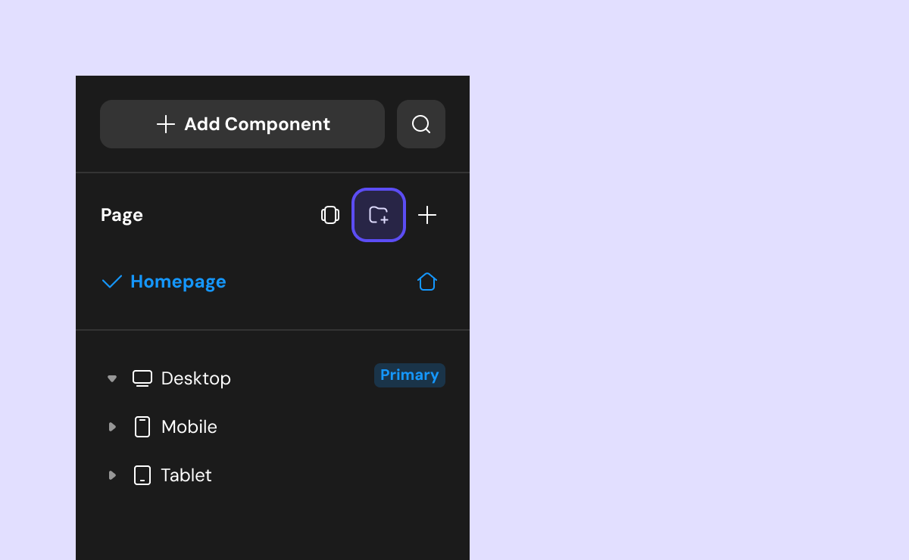
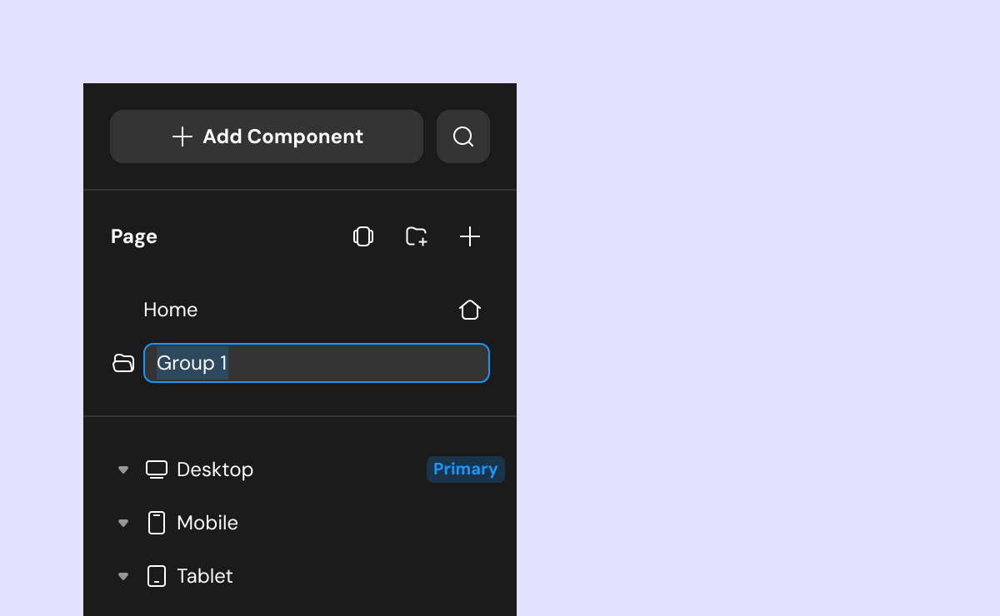
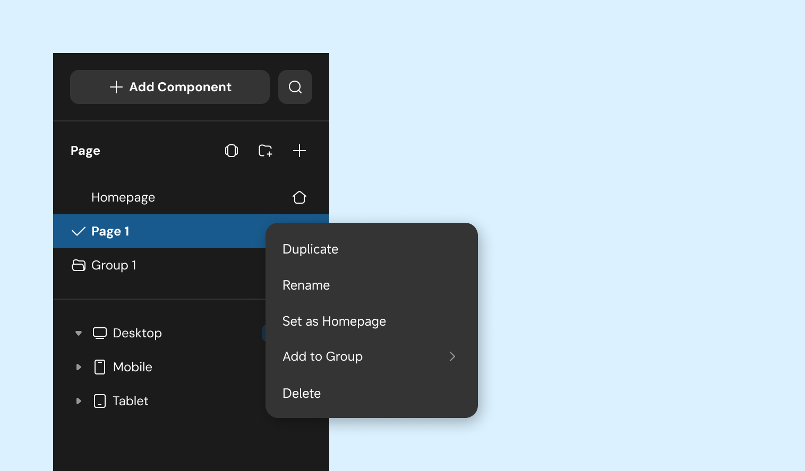
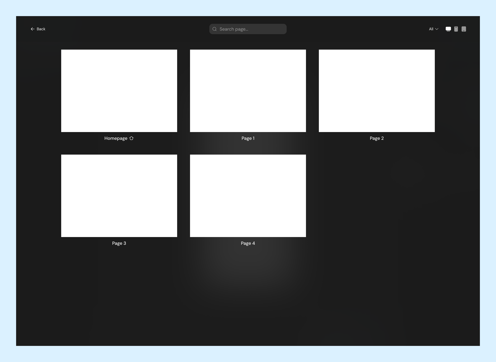
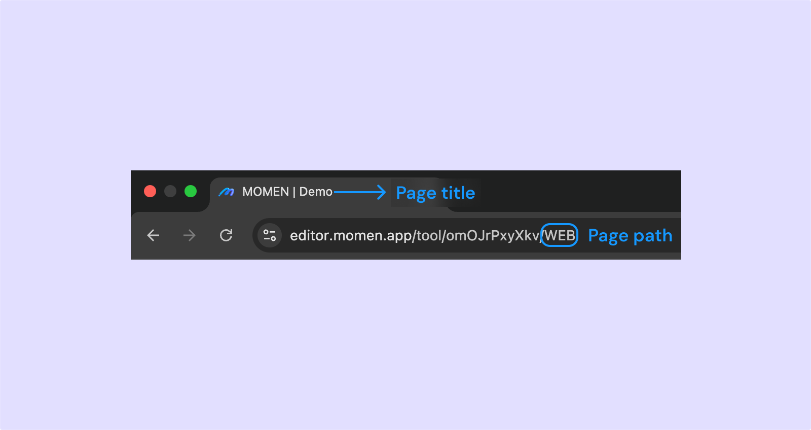
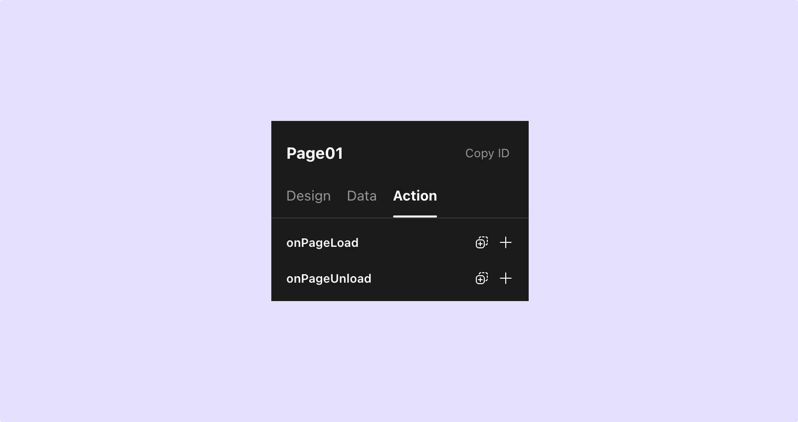
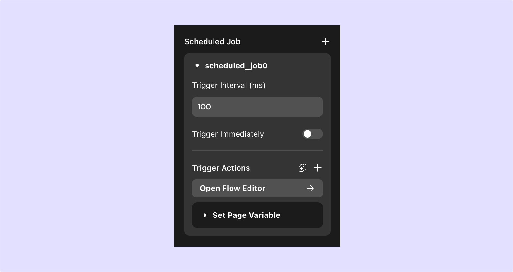
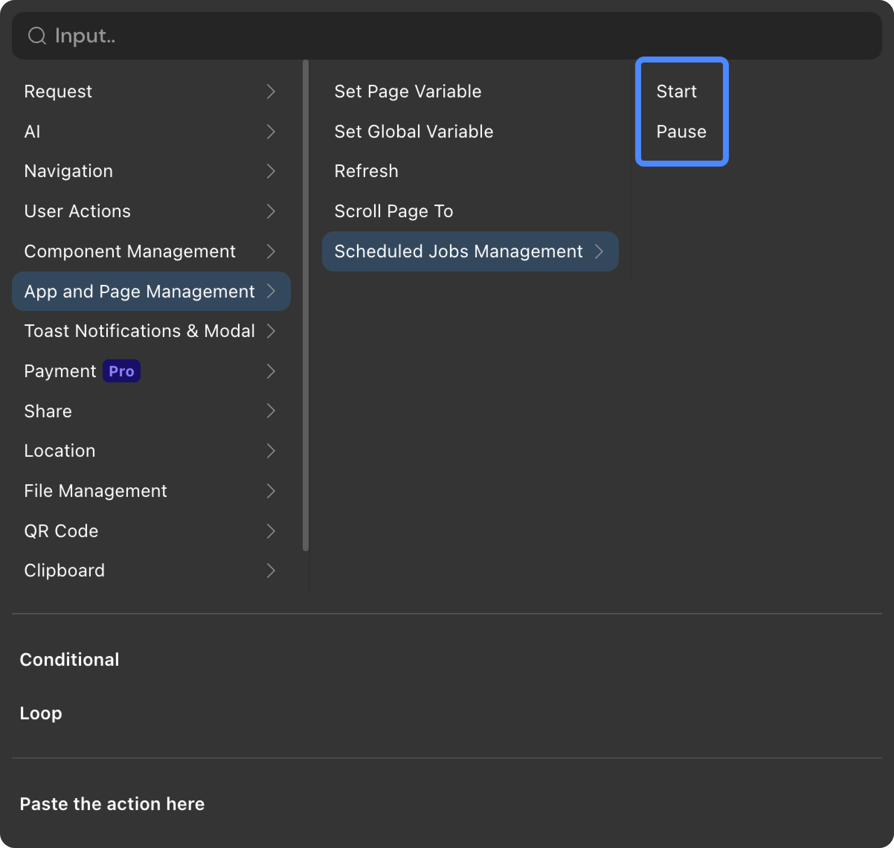
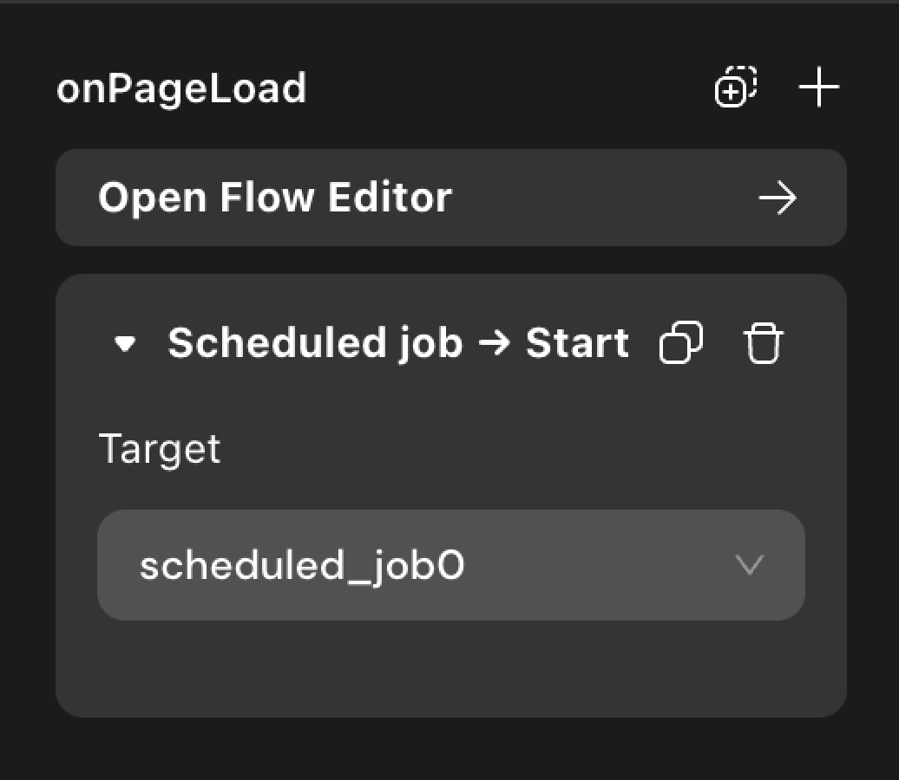

# Add and Configure Pages
A project consists of multiple pages, each of which can be configured for Data, Design, and Action.

* In Momen, a page is the smallest unit to get data from the server side. Adding a page data source can retrieve data from the database for use by various components on the page.
* Each application can select a page setting as the home page.
* Each page can configure the action when the page is loaded, the action when the page is unloaded, and the timed task.

## Adding Pages

To add a new page to your project, click the icon shown in the image below.

### Grouping

To create a group for organizing pages, click the group icon as shown below:

    
    

   

### Page Operations

Right-click a page to open a management menu with the following options:

1. **Copy**: Copy the selected page (including its components).
2. **Rename**: Change the page name (double-clicking the name also allows renaming).
3. **Set as Home Page**: Designate this page as the default opening page for the application or website.
4. **Add to Group**: Move the selected page into an existing group.
5. **Delete**: Remove the page and its contents.

To preview all pages in the project, open the page tiled mode using (**⌘ P** 丨**Ctrl P**).

## Configure Pages - Design

After clicking to select the web page, you can configure whether the page is the initial screen in the "Design" section of the attribute bar on the right. Configure the web page path, web page title, perform SEO configuration, and adjust the size, layout, and style of the web page.

- **Web page path**: As shown in the figure below, this is the path appended to the web page link in the browser address bar.
- **Web page title**: This is the title content displayed in the browser tab bar after entering the web page.
- **SEO settings**: Click to expand and set the TDK of the web page, namely the title, description, and keywords. You can also configure the thumbnail image displayed when sharing the web page link.
- The rest of the design is the same as the component configuration.

## Configure Page - Data

### Data Source (original name - remote data) 
In Momen, a page is the smallest unit that obtains data from the server side. Adding a page data source can retrieve data from the database and is used for referencing by various components within the page. For example, if a text component wants to display the nickname of a certain user in the account table, then a new page data source needs to be created to obtain a specific piece of data in the account table. Then, select "Bind" → "Page data source" → "Name" on the text component.

### Page Variable (original name - page data)
After adding a page variable, other components can change the value of the variable by setting the page variable action. Page variables are generally used for temporarily storing some data on the page.

### Parameters 
A way of transferring data between pages (for details, see: [Parameters](../data/parameter.md)). They include two types of input parameters:
1. **Query (original name - link data)**: After adding a query parameter, when other pages open the page, a specific value can be passed in. For example, a blog details page can configure an input parameter as the blog name, which is used to receive which specific blog to open. It can also be used to record user channels.
2. **Path (original name - path data)**: The usage is similar to query parameters, except that it will change the page address, which is usually used on pages that require better SEO performance.

## Configure Page - Action

### When the Page is Loaded and Unloaded
The period from when the page starts loading content to when the page is closed and unloaded is called the page's active period. During the page's active period, you can configure the action you expect when the page is opened (action when the page loads) and when it is closed (action when the page unloads).

### Scheduled Job
**Definition:**      
Trigger a certain action based on a specific time interval, and it will not stop until it is manually paused or the page is closed.

**Trigger Interval:**    
In milliseconds, each time the "trigger interval" is passed, the configured action will be triggered once.      

**Trigger Immediately:**       
After enabling this configuration, the timing task will automatically start when entering the page.

**Manually Start/Pause Page Scheduled Tasks:**       
As shown in the figure below ⬇️, you can add the "Control Scheduled Task" action to a component to start or pause a scheduled task.

    
    

## Loading Order of Data and Actions on the Page
When a new page is opened, the various contents configured on the page will be loaded in a specific order. Understanding the loading order of these data can help us correctly call actions and use data. The loading order is as follows **(loaded in order from top to bottom)**:
- If the page is configured with link data, it will first receive the link data passed from other pages.
- If the page is configured with page data, an empty page data will be created on the page, waiting for assignment.
- If the page is configured with the action of "page loaded," then the action in it will begin to execute.
- If the page is configured with a page data source, then the content of the page data source will begin to be read.
- Finally, the local data or default value of each component is displayed.