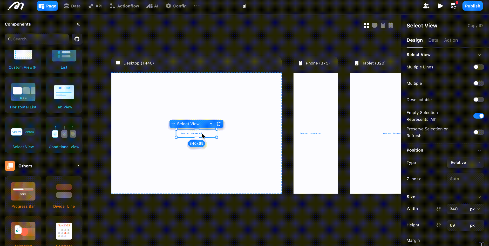
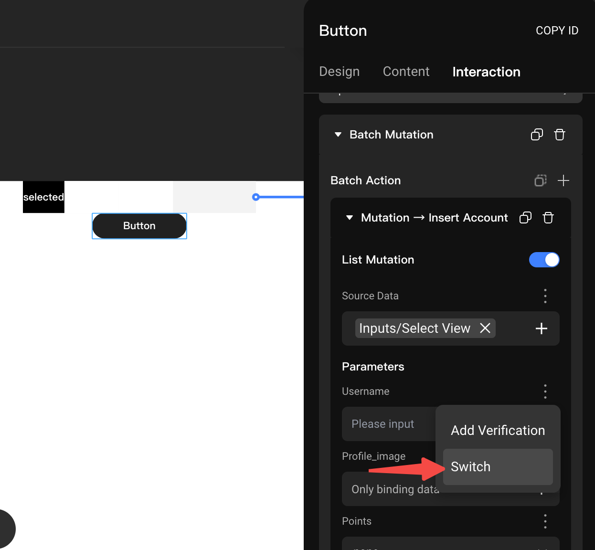
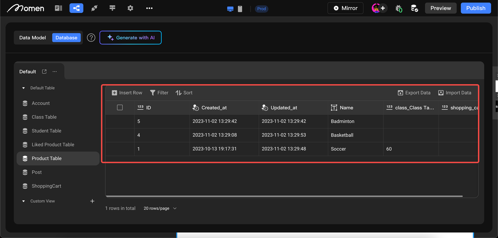
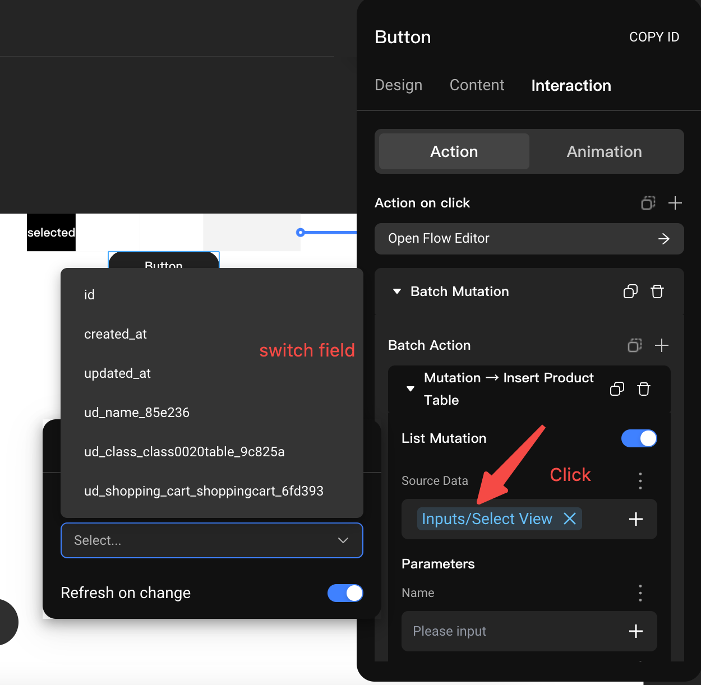
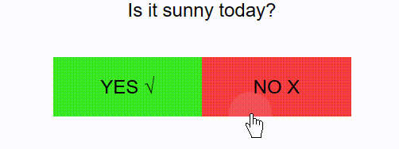
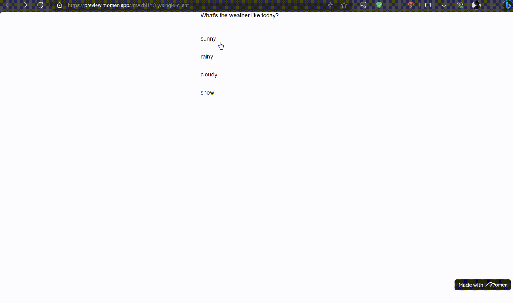
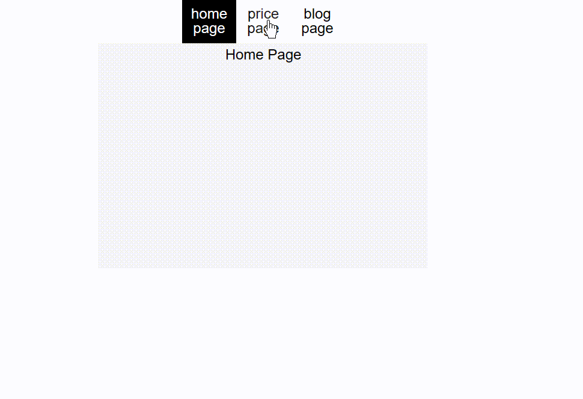

# Select View

Select View is a "list-type" component with many features similar to the [List](./list-view.md) component.

## Usage Scenario

Use the Select View component when you need to provide options for single or multiple selection, such as selecting categories or answers.

.png)

## Configuration Instructions

### Design

Select Views function as lists with selection capabilities. You can set the style of the Select View and edit the selected and unselected subviews.

**Multiple Lines Display Content**

To display the Select View vertically, enable **Multiple Lines** and set the Select View width to match each child component. Set the subview width to 100%.

- **Multiple:** Disabled by default. Enable to allow multiple selections.
- **Deselectable:** Disabled by default. Enable to allow unselecting an already selected option.
- **Preserve Selection on Refresh:** Disabled by default. Enable to retain the selection after the component refreshes.

#### Sub-Container Design

There are two subviews: Selected Area and Unselected Area. Configure the content, size, and style of each.

- **Unselected view:** Appearance when the option is not selected.
- **Selected view:** Appearance when the option is selected.

### Data

The Select View component supports both local and remote data sources.

**Local Data**

- **Add options and default values:** The default value must match one of the available options (e.g., "Basketball," "Soccer," or "Badminton").
- Once a default value is set, that option is selected by default.

💡 **Tip:**  
When displaying options horizontally, the left-to-right order matches the top-to-bottom order in the Select View.

- **Binding Option Content:** Double-click Select View to enter the sub-container, click the [+] next to the input box, and select "Component Data - Select View - item" to bind option content.

**Query Data (Remote Data)**

1. **Prerequisite:** Create an options data table in the data model.
2. **Add option:** Set the data source to "Query Data" and select the data table.
3. **List field & Default value:** Select the field to display as the option and set the default value to match the field's type and content.

   - For example, if the table has fields "ID" and "username":
     - If the list field is "ID," the default value should be an ID.
     - If the list field is "username," the default value should be a username.

- **Bind option content:** Enter the sub-container, click the [+] in the content, and select "Component Data - Select View - Item".

💡 **Tip:**  
Setting the "List Field" ensures the default value's content and type match the selected field.

## Output (Select View Special)

The selection result can be bound to a component for display or used to insert/update a data table. For clarity, rename the Select View component.

### Single Select

**Single Select with Local Data**

If your Select View has three options ("Football," "Basketball," "Badminton"), selecting one will set the value to that option. Referencing the Select View in Inputs will return the selected value.

**Single Select with Remote Data**

When using remote data, specify which field to bind as the option and which field to use for the selection result.

**Example Scenario:**  
Select the category for products to be uploaded

Fields in the Product Category table: ID, Category Name, Category Sort, Status

Fields in the product table: product name, category name, category name ID, product price, etc.

* When you add product data to the product table using the Mutation to fill in the product category name, we bind the "Inputs - Select View - Category Name Field".
* If you are creating a one-to-many relationship between a product category table and a product table, and you need to record the category ID in the product table, the data bound to the corresponding field when you add data is "Inputs - Select View - ID".

<figure><figcaption></figcaption></figure>

### Multiple Select

Multiple Select means the result is an array of selected values, not just a single value.

**Multiple Select with Local Data**

If your Select View has options like "Soccer," "Basketball," and "Badminton," selecting the first two results in an array: `["Soccer", "Basketball"]`.

To add multiple selected values to a data table using Mutation, enable **List Mutation** mode and set the data source to **Inputs - Select View**. For example, when inserting an account, fill the name field with the multi-select result by clicking the Set button next to the name field and then "Switch."

**Multiple Select with Remote Data**

If the remote data comes from the product table, selecting multiple product categories means choosing multiple records.

When adding multiple selected records to a data table using Mutation, enable **List Mutation** mode and set the Source Data to "Inputs - Select View." Since each selected record may have multiple fields, specify which field should receive the selected data.

As shown below, click "Source Data," select the required field in "Array Field Mapping," and close the selection. For example, to input the multi-select results into the "name" field, click the Settings button next to "name" and select "Switch."

## Usage Examples

**Create Option Effects**

**Design Single-Choice Questionnaires**

**Implement Tab Navigation Bars**

## About Momen

[Momen](https://momen.app/?channel=docs) is a no-code web app builder that lets you create fully customizable web apps, marketplaces, social networks, AI tools, enterprise SaaS platforms, and more. Iterate and refine your projects in real time for a smooth, streamlined creation process. Momen also offers powerful API integration, making it easy to connect your app to any service. Bring your ideas to life and launch products faster than ever with Momen.
