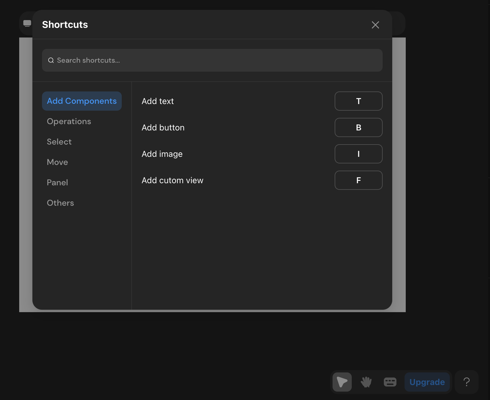
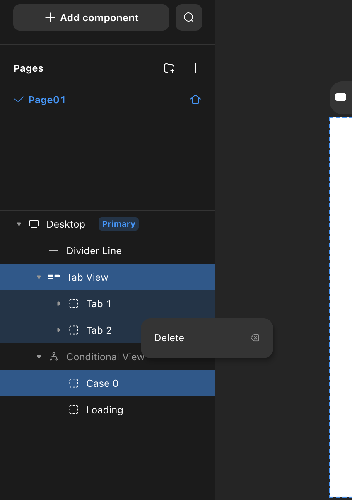
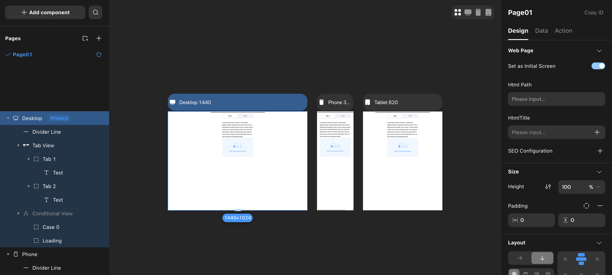
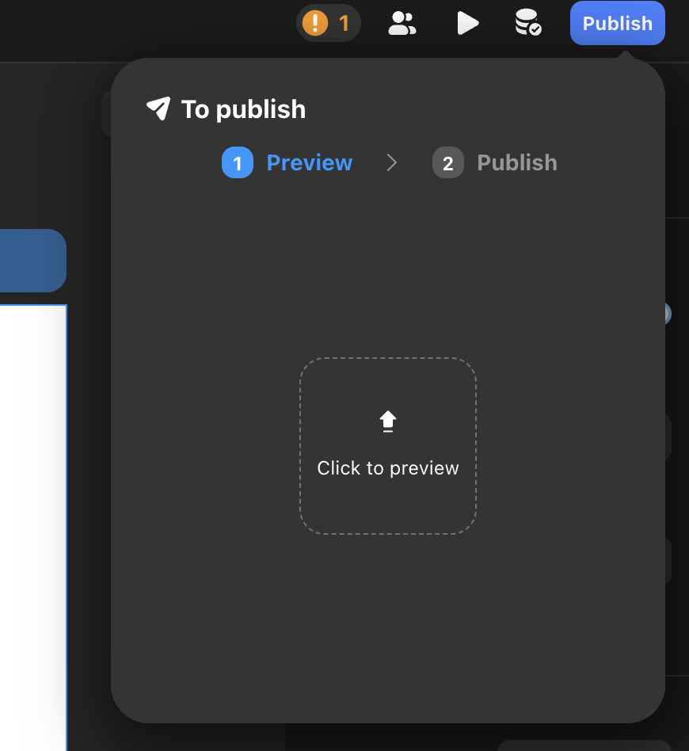
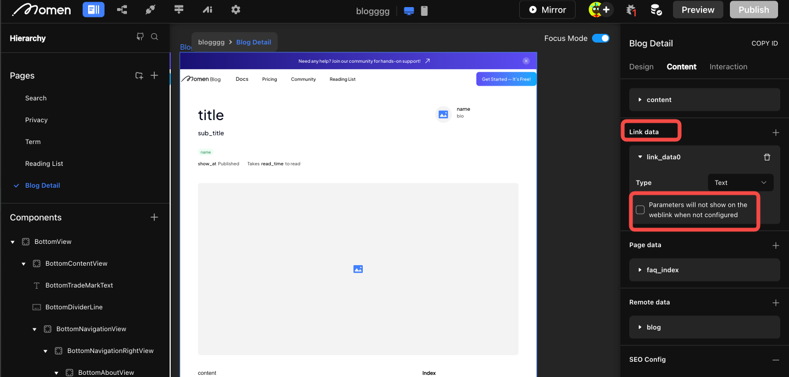
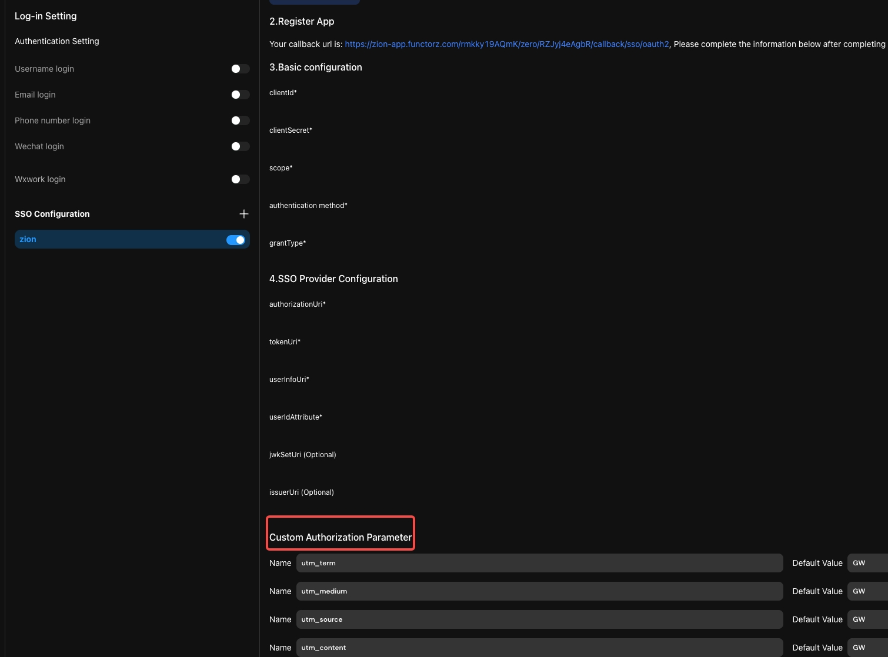

# Latest Product Update

## Collection of Product Update Videos 👉 [YouTube Playlist](https://www.youtube.com/playlist?list=PLvdix_Sk3fBon4bY6PYHbUQrcuv7TmfEz)

## v2.2.6 | June 6, 2025

### 🚀 New Features
- Mirror now includes a Debug Mode, making it easy to inspect the data state of components (Mirror → Click the debugger icon → Enable Debug Mode).
  
- The text component supports rendering Markdown-formatted content.
- Added an option to enable or disable global horizontal and vertical scrollbars (Settings → Theme → Enable Scrollbar).

### ✨ Enhancements
- Standardized list scrolling action.
- Improved field validation interactions in database operations.
  
- Refreshed the HTML component styles in the editor canvas.
- Reduced the minimum interval for scheduled jobs on pages to 1ms.

### 🐞 Bug Fixes
- Fixed issues with image arrays and image uploads after trigger configuration.
- Resolved mismatches between AI table structures and request payloads.
- Fixed bugs with email titles and lost diffs.
- Exposed `id`, `created_at`, and `updated_at` in GraphQL insert/update operations.
- Fixed loading issues in AI debug mode.
- Improved project validation error location display.
- Fixed disabled "Get Verification Code" button when phone number had trailing spaces during domain registration.
- Handled non-object API response bodies correctly.
- Improved database manager selection and AI prompt input field usability.
- Adjusted payment confirmation dialogs and increased AI conversation turns from 30 to 1,000,000.
- Fixed image parameter binding in follow-up AI sessions.
- Ensured downloaded file names match original uploads.
- Fixed API call errors and runtime parsing results.
- Restored third-party shipping dispatch functionality.
- Fixed maximum image count in image selector sidebar.
- Corrected gradient color display and bulk data addition with empty arrays.
- Resolved third-party mini program authorization failures.
- Added toggle to hide sidebar loading animation during async workflows.
- Fixed parameter configuration in audio playback actions.
- Resolved page navigation failures with date-formatted URL parameters in live preview.
- Fixed cross-project copy-paste interactions and file upload type filtering.
- Fixed broken AI assistant link in the editor.
- Fixed page padding display and AI status issues.
- Fixed image file size not changing after enabling compression in image selector.
- Resolved issues retrieving image ID and URL in AI prompts.
- Fixed loop after "refresh" due to "data fluctuation" in payment configuration activation.
- Improved multi-image input for AI and API calls with default values in custom workflows.
- Corrected AI database tool information.
- Fixed exceptions when editing filter conditions in table components.
- Resolved incomplete code block display in custom workflows.
- Fixed child component height setting when parent layout is top-to-bottom.
- Fixed opacity setting in image selector and issues with view height/width.
- Fixed absolute component positioning.
- Resolved GraphQL generation issues when filtering by boolean fields in the database.

## v2.2.5 | April 23, 2025
### 🚀 New Features
- Data  query and operations now support filtering by table fields.
- Lists now support Masonry layout.
- API requests now support setting a specific field as a unique ID.
- Expanded font weight range: Ultra-light and Ultra-bold added.
  
### ✨ Enhancements
- Optimized loading performance of avatars within the editor.
- Modified the display of consumption for AI debugging mode.

### 🐞 Bug Fixes
- Fixed an issue where API runtime parsing results were incorrect.
- \nFixed an issue where lists were not displaying data.
- Fixed an issue where images were not displaying in the web project list.
- Fixed a 500 and 402 error when batch adding data with an empty array ([]).
- Fixed an issue with real-time preview errors.
- Fixed an authorization failure error that occurred when re-authorizing a Mini Program after canceling authorization via the official account.
- Fixed an issue where parameter configuration data for audio playback behavior on Zed would cause an error.
- Fixed an issue where the entry point for transferring project ownership in the free version was not displayed.
- Fixed an issue where selecting Chinese input in the API-Debug-body would delete the entered information.
- Fixed data inconsistency in action flows between latestSchema and lastDeployedSchema.
- Fixed an issue where the WebSocket (ws) did not automatically trigger upon opening a cloned project.
- Fixed an issue with the remaining execution count.
- Fixed an error that occurred when enabling "get more information" in AI tools.
- Fixed an issue where AI points displayed as 0 and data was incorrect for cloned projects.
- Fixed an issue with project server migration failure.
- Fixed an issue where WeChat Pay callbacks for old payment projects were incorrectly routed to the new payment callback flow instead of the old callback address.
- Fixed an issue allowing a promo code to have multiple valid marketRewardRules.
- Fixed an issue where breakpoints for list column numbers were not working.
- Fixed an issue where AI token consumption did not stop even when negative.
- Fixed an issue where AI remained in a STREAMING state.
- Fixed an issue where JSON formatted animations could not be displayed in Mini Programs but worked in real-time preview.
- Fixed an issue where file upload actions had no type filtering or improper type filter configuration.
- Fixed a UI abnormality with the QR code on the successful publishing page.
- Fixed an issue where the ss log interface failed and did not send pagers.
- Fixed an issue where the filter condition icon color for the "Update Data" action flow was incorrect.
- Fixed an issue where the official website project preview did not end after 30 minutes.
- Fixed an issue where the field selection dropdown in the field filter condition pop-up moved with the background.
- Fixed an issue with Actionflow execution failure.
- Fixed errors in documentation text.
- Fixed an issue with erratic copy-pasting behavior in AI configuration data binding.
- Fixed an error that occurred when AI Claude called tools.
- Fixed an issue where the web client of a multi-client project remained in preview mode.
- Fixed an issue where clicking filter in the database opened via a browser resulted in a black screen.
- Fixed an issue with the automatic deletion of partially created Stripe webhooks.
- Fixed recurring deployment failures, including too many Stripe endpoints and subsequent unknown reasons.
- Fixed an issue where data written in the schema did not update when the data source name changed.
- Fixed the reset project failed issue.
- Fixed an issue where preview generation for large web projects was highly problematic.
- Fixed an issue exposing duplicate key deployment errors.
- Fixed an issue where error messages lacked location information if an SSO configuration bound to an action was deleted.
- Fixed an issue where context.getSsoUserInfo() returned null after successful Facebook SSO.
- Fixed an issue where items were identified as fields instead of items when using local data as a list data source.
- Fixed an issue with real-time preview errors.
- Fixed an error when adding SMS templates to a project.
- Fixed an issue where customers selected the wrong order table when configuring WeChat Pay.
- Fixed the lack of mobile verification code registration and login behaviors on the web client.
- Fixed an issue where incomplete data package usage status caused user confusion.
- Fixed an issue where lists using a multi-select choice view as a data source could not display data in the list.
- Fixed issues with viewing and selecting relationship columns for 1-to-1 relationships in the database.
- Fixed a ztype validation error when setting input component values.
- Fixed the Duplicate page fails issue.
- Fixed an issue in remote data deduplication where entering a non-database column field value would show it in the dropdown instead of failing the search because the field does not exist.
- Fixed an issue where default values for date type configurations in choice views were not taking effect.
- Fixed an execution error when callback output parameters used text/plain.
- Fixed an issue where Facebook SSO requests returned unexpected results and it was unclear if it was successful.
- Fixed an error when cloning multi-client projects.
- Fixed an issue where video size upload limits on the Mini Program client did not work on Apple phones but worked on Android.
- Fixed an issue where custom domains were not completely deleted.
- Fixed an issue where iOS video upload limits were ineffective.
- Fixed an issue where custom domains could still be deleted after a project downgrade.
- Fixed an issue where prices were not appearing for Stripe one-time payments.
- Fixed an issue where the image displayed in a pop-up image component was different from the requested image.
- Fixed an issue where the progress bar component's default value could not retrieve the default value of an input component or page data.
- Fixed the missing "Professional Edition" tag for SSO.
- Fixed an issue where using a choice view in the "Search by Hospital" pop-up did not display data, while a list could.
- Fixed an issue where Lottie animations had a 90% chance of not displaying on Mini Programs.
- Fixed an issue where increasing the font size changed the line height multiplier.
- Fixed a diff validation異常 (abnormality) that occurred when selecting all permissions for an account.
- Fixed an issue where AI streaming would freeze.
- Fixed an issue where the update for payment callbacks could be saved and the backend updated even if no filter was configured.
- Fixed an issue where adding a column in a custom view would redirect to the default account table instead of staying in the current view table.
- Fixed an issue with default values when switching a text input box to bigint.
- Fixed issues with Lottie front-end blocking SMS-related behaviors, affecting login and sending SMS verification codes on mobile phones.
- Fixed a bug in the project log service that caused an error after selecting a custom time.
- Fixed an issue requiring project IDs to be passed for both Mini Program project management and Alipay QR code scanning.
- Fixed an issue where AI behaviors with non-streaming output in ZVM should ignore streaming output configurations.
- Fixed an editing abnormality with table component filter conditions on Zed.
- Fixed an issue where page data, if it was the result of AI streaming output, would accumulate after each session.
- Fixed an issue where inputting decimals was not supported when modifying latitude and longitude in the database.
- Fixed an issue with user feedback regarding abnormal data usage.
- Fixed an issue where date-time type linked data on the Mini Program client displayed incorrectly after retrieving the value on a shared page.
- Fixed an error when calling AI after project deployment.
- Fixed an issue where the Data Selector output did not change upon switching.
- Fixed an issue where clicking on fields in the filter for knowledge base data screening in AI would cause a black screen.
- Fixed an issue with default values for date/time types in choice views.
- Fixed an issue where selecting a formula method after selecting the result type in a formula would change the formula's result type.

## v2.2.4 | Apr 28, 2025

### 🚀 New Features
- Added cross-project copy-paste support for users with owner permissions (components, APIs, Actionflows, and AI agents)
- Added a function for extracting weekdays from date expressions
- Enabled AI to auto-fill tool names
- Enabled real-time sync in collaborative editing mode
- Blocked web crawlers via robots.txt for `cave` and `villa` domains

### ✨ Enhancements
- Improved the Mirror interface by allowing user interaction with mock input data
- Enhanced expand/collapse behavior for page structure with keyboard shortcuts
- Improved the project list in the personal dashboard by adding the "Server Upgrade Status" field
- Optimized performance for deeply nested list rendering and scrolling
- Unified system and custom LLM configurations for a more consistent model management experience

### 🐞 Bug Fixes
- Fixed an issue where cloned template projects showed negative SMS balance
- Fixed password reset errors in Momen projects
- Fixed missing non-balance records in the transaction history
- Fixed SMS usage inheritance issues when cloning or referencing projects
- Fixed incorrect context naming in AI database
- Fixed AI error: `Cannot invoke 'FieldDescription.getFields()`
- Fixed SMS verification failure during domain filing
- Fixed delayed updates when modifying properties in the right-hand panel
- Fixed missing gating logic in Actionflow conditional filters
- Fixed table header layout issues in mini program horizontal lists
- Fixed `JSON_EXTRACT_PATH` formula error in Actionflow
- Fixed deduplication failure in `get correct schema` for `pendingActionFlow`
- Fixed default value hint not displaying in unbound data selectors
- Fixed JSON import failure on Momen landing page
- Fixed payment config being enabled in projects without payment functionality
- Fixed broken navigation on circular dependencies in page data sources
- Fixed missing `result data` in async Actionflows within ZType
- Fixed failure in QR code generation when accessing list item values
- Fixed `interpreterSample` hang during Actionflow execution
- Fixed database access failure in multi-client projects
- Fixed blank screen rendering in some web pages
- Fixed data display issue in list components inside popups
- Fixed font weight configuration typo (`700` should be `bold`, not `medium`)
- Fixed lack of user feedback on AI tool invocation failures
- Fixed inconsistent character limits for all AI descriptions (standardized to 10,000)
- Fixed validation errors caused by stale data when switching popup actions
- Fixed select view default value failure when using conditions or formulas
- Fixed data presence in table component not rendering on frontend
- Fixed incorrect prompt about unconfigured pages during submission
- Fixed mismatch between negative AI Point display and database values
- Fixed multiple validation errors when previewing multi-client projects
- Fixed server 500 error in admin console
- Fixed validation error on variable removal from page scope
- Fixed broken routing to `select view` from other pages
- Fixed diff issue when creating new data models
- Fixed sensitive information being exposed in Zeus front-end responses
- Fixed incorrect boolean evaluation of `string_len` in conditional containers
- Fixed schema inconsistency after app cloning
- Fixed input value setting failure before popup opens
- Fixed calendar component sending continuous requests in console
- Fixed issue where AI execution success did not trigger `set_pagedata`
- Fixed publishing freeze in sub-client apps
- Fixed WeChat QR login not matching existing accounts across platforms
- Fixed internal server error during project import
- Fixed crash when using `distinct` with `count` in data queries
- Fixed unclear error message when Stripe refund failed due to insufficient balance

## v2.2.3 | Mar 28, 2025

### 🚀 New Features
- Components support visible/invisible at various breakpoints.
- Support for retrieving the user's permission role list on the frontend page.
- Static SVG supports direct embedding into HTML.
- Agent configuration supports Conditional and Formula.
- Launched our new Education Program: Students and educators can now enjoy 50% off on all plans

### 🐞 Bug Fixes
- Fixed the issue where new API added in the List component could not be used as a Data source.
- Fixed the issue where the cursor automatically jumps to the end when modifying data in the input box on the Mini-Program.
- Fixed the issue of abnormal cursor jumping in the input box.
- Fixed the issue where constraint names could be the same as field names.
- Fixed the issue of abnormal scrolling in the Conditional Editor.
- Fixed the issue where streaming Output to page variables in AI Continue Conversation behavior displayed incorrectly on the page.
- Fixed the issue of UI damage in Callback parameter configuration.
- Fixed the issue where logged-in user data could not be used in AI configuration.
- Fixed the issue where executing the behavior of obtaining a phone number on the first opening of the Mini-Program would report a 401 error.
- Fixed the issue where List item width did not have % configuration.
- Fixed the issue where cloning any Project would report an error.
- Fixed the issue of text disorder in DeepSeek thinking process.
- Fixed the issue where inserting multiple images on the Mini-Program end did not take effect.
- Fixed the issue where backend deployment errors were not reported to the group.
- Fixed the issue where page data configured as List did not support Remove View.
- Fixed the issue where the inclusion judgment of date type fields did not take effect.
- Fixed the issue where Scheduled triggers continued to execute after Actionflow deletion.
- Fixed the issue where components copied within List items could not be pasted onto the page.
- Fixed the issue where the create button should not be clickable during data cloning.
- Fixed the issue where updating table data in Actionflow could not set the date to Null.

## v2.2.2 | Mar 13, 2025

### 🚀 New Features
- File upload action: support for limiting file size.
- SEO: support for Canonical URL

### ✨ Enhancements
- Advanced filtering in permissions supports using Actionflows or AI inputs as conditions for judgment.
- AI prompts support binding constant data, such as current date and time.
- Structured output of AI supports drag-and-drop order adjustment.
- Add a prompt when the source of an AI tool is deleted.

### 🐞 Bug Fixes
- Fix issues such as new diffs failing to access custom domains.
- Fix the issue in conditional containers where, under focus mode, when conditions are configured, the text and background colors are the same, making them illegible.
- Fix the issue where context.log is not working in code blocks within custom behavior flows.
- Fix the issue where permissions are fully open by default. Fix the issue where initiating WeChat authorization login for web fails.
- Fix the issue in multi-client upload verification where clicking the view icon redirects to an incorrect link.
- Fix the issue where an error occurs if two code block nodes under the same branch of a behavior flow declare the same variable.
- Fix the issue where opening and refreshing a list on the mini-program side results in scrolling to the top, but this action is ineffective.
- Fix the issue in multi-client environments where sub-clients may report errors indicating that large models cannot be recognized.
- Fix the issue where array fields in custom objects cannot be bound to multi-select selection views.
- Fix the issue where WeChat login configurations cannot be saved to the database.
- Fix the issue where defining input parameters with the same name in different code blocks causes an error.

## v2.2.1 | Feb 27, 2025

### 🚀 New Features
- Free Trial for Templates: Users can directly try advanced version templates for free for three days.
- Coupon Redemption: Users can redeem coupons directly on the My wallet page using a redemption code.
- Dynamic List Component: Automatically calculates and adjusts the number of columns based on the configured width for a responsive display.

### ✨ Enhancements
- AI Configuration Interaction Updates:
- When an invocation error occurs, specific error details are now displayed.
- "APP Token" renamed to "AI Points," with input and output calculations separated.
- Added a Point Calculator to easily calculate consumption for different models.
- Field description character limit increased from 100 to 10,000 characters.
- Tool names can now be configured.

### 🐞 Bug Fixes
- Fixed an issue where the page icon for custom domains couldn’t be modified.
- Fixed an issue where database trigger behavior couldn’t retrieve associated data from input parameters.
- Fixed an issue where the right sidebar of the conditional container couldn’t rename items.
- Fixed an issue where data concatenation wasn’t working in database trigger conditions.
- Fixed an issue where no prompt was shown when the tool source of an Agent was deleted.
- Fixed an issue where copying global data caused the project to fail to open.
- Fixed an issue where repeated prompts appeared after an import failure.
- Fixed an issue with gradient color display.
- Fixed an issue where the default value of an API in the behavior flow was not working.

## v2.1.3 | Jan 23, 2025

### 🚀 New Features

- Components support visible/invisible at various breakpoints.
- Support for retrieving the user's permission role list on the frontend page.
- Static SVG supports direct embedding into HTML.
- Agent configuration supports Conditional and Formula.
- Launched our new Education Program: Students and educators can now enjoy 50% off on all plans

### 🐞 Bug Fixes

- Fixed the issue where new API added in the List component could not be used as a Data source.
- Fixed the issue where the cursor automatically jumps to the end when modifying data in the input box on the Mini-Program.
- Fixed the issue of abnormal cursor jumping in the input box.
- Fixed the issue where constraint names could be the same as field names.
- Fixed the issue of abnormal scrolling in the Conditional Editor.
- Fixed the issue where streaming Output to page variables in AI Continue Conversation behavior displayed incorrectly on the page.
- Fixed the issue of UI damage in Callback parameter configuration.
- Fixed the issue where logged-in user data could not be used in AI configuration.
- Fixed the issue where executing the behavior of obtaining a phone number on the first opening of the Mini-Program would report a 401 error.
- Fixed the issue where List item width did not have % configuration.
- Fixed the issue where cloning any Project would report an error.
- Fixed the issue of text disorder in DeepSeek thinking process.
- Fixed the issue where inserting multiple images on the Mini-Program end did not take effect.
- Fixed the issue where backend deployment errors were not reported to the group.
- Fixed the issue where page data configured as List did not support Remove View.
- Fixed the issue where the inclusion judgment of date type fields did not take effect.
- Fixed the issue where Scheduled triggers continued to execute after Actionflow deletion.
- Fixed the issue where components copied within List items could not be pasted onto the page.
- Fixed the issue where the create button should not be clickable during data cloning.
- Fixed the issue where updating table data in Actionflow could not set the date to Null.

## v2.1.2 | Dec 12, 2024

### 🚀 New Features
- Hosting files in the Root Directory: Users can now upload verification files to the root directory of the web application. [View details](https://docs.momen.app/community/commission)
- SEO Improvements: Added options for render mode selection, robots file, and other settings.

### ✨ Enhancements
- Commission Dashboard: A new commission panel in the user center, allowing users to share their exclusive referral link, track the number of invites, total commission, and available withdrawal amount. [View details](https://docs.momen.app/community/commission)
- Tab Bar: Users can now drag and reorder tab pages.

### 🐞 Bug Fixes
- Fixed issues with public configuration.
- Fixed backend deployment failure.
- Fixed style issues with the large action popup.
- Fixed image component display issues.
- Fixed payment configuration issues for multi-client projects.

## v2.1.1 | Nov 22, 2024

### 🚀 New Features
- Custom Component: You can now save configured components as Custom Component and apply to different pages within your project.

### ✨ Enhancements
- Actionflow Permission Nodes: Added permission management to Actionflow, enabling users to automatically assign or remove roles in specific scenarios.
- Open Project in New Tab: Projects can now be opened in a new tab by selecting the option in the right-click menu.

### 🐞 Bug Fixes
- Fixed the issue with Actionflow data binding.
- Fixed the issue related to Actionflow database changes configuration.
- Fixed the issue with remote data causing an infinite loop.
- Fixed the issue with template creation.

## v2.1.0 | Oct 31, 2024

### 🚀 New Features
- Log Service: Users can now view project logs, currently focused on gateway-related logs, such as connection attempts and error messages. More types will be added soon.
- Canvas: Users can now select multiple components for uniform adjustments to properties such as positioning, size, and background color. This update also allows users to create a view after making multiple selections.
- My Wallet: Users can purchase plans and computing resources using credits (does not support recharge for now), with a new coupon feature added for discounts.
- Affiliate Program: Users can invite others to use Momen. For every paid referral, they can earn a commission.
- Onboarding: New users can now enter an invitation code during registration.

### ✨ Enhancements
- Data Binding: Visuals and interactions have been optimized, and users can now copy and paste data a set of bindings for improved efficiency.
- Actionflow: Users can now copy and paste a single node each time within Actionflow.

### 🐞 Bug Fixes
- Resolved an issue where errors were not displayed in the condition configuration pop-up, improving troubleshooting.
- Fixed formatting issues in input boxes to enhance usability.
- Addressed anomalies in the usage of the map component, ensuring more reliable functionality.
- Corrected style issues with view component selections for a more consistent user experience.
- Fixed the inability to locate configuration errors in Actionflows, aiding users in error resolution.
- Resolved issues with abnormal Actionflow triggers to ensure smoother operation.

## v2.0.5 | Oct 10, 2024

### 🚀 New Features
- Canvas Optimization: Added right-click operations to the top toolbar, supporting actions such as page copying. Automatically convert units when switching component width and height units.
- Collaborative Experience and Performance: Improved the experience and performance for multi-client collaborative applications.

### 🐞 Bug Fixes
- Fixed an issue where Actionflow filters were failing.
- Fixed the issue where text color settings in the data selector were not applied.
- Fixed styling issues in the tab bar component.
- Fixed an issue where background images were not tiled correctly.
- Fixed the failure to deploy after importing large files via AI.
- Fixed the issue where project activation failed.

## v2.0.4 | Sep 14, 2024

### 🚀 New Features
- UI and Data State Retention for Conditional Containers and Tab Bar: Conditional containers and tab bar components now support preserving their UI and data state after switching.
- All Page Mode: All pages mode has been added to the web, allowing for easier page selection (shortcut: cmd/ctrl + P).
- Actionflow Vector Search: The "Get Data" node in Actionflow now supports vector search for improved data querying.
- Version Switching for Code Components: Code components now support switching between different versions.

### ✨ Enhancements
- Canvas Improvements: The left sidebar automatically scrolls to the selected component (if enough space is available). A new "Paste to Page" option has been added to the right-click menu for pages.

### 🐞 Bug Fixes
- Fixed an issue where the project occasionally failed to open due to the diff save mechanism.
- Fixed an issue where page data couldn't be assigned after enabling the "List" option.
- Fixed an issue with abnormal data display when switching between tab bar views.
- Fixed a crash caused by inputting large numbers into the AI max token limit.
- Fixed an issue where the default condition could be deleted after dragging.
- Fixed a crash caused by incorrect cron expressions in scheduled tasks.
- Fixed an issue where the deployment success prompt persisted after backend deployment succeeded.
- Fixed an issue where the "Hover" switch in the right sidebar wouldn't change state after being turned on.
- Fixed an issue where the order table could incorrectly select the account table in payment configurations.
- Fixed styling issues in the custom domain configuration.
- Fixed an issue where web page paths were not unique after configuring the HTML path.
- Fixed unclear wording in some parts of the AI configuration.
- Fixed an issue where lists would trigger a refresh action, but the view wouldn't refresh.
- Fixed an issue where fields displayed "null" when SEO was enabled but not configured.

## v2.0.3 | Sep 14, 2024

### ✨ Enhancements
- Support for Copying Individual Cases in Conditional Containers: Users can copy specific cases within conditional container to another.
  
- Support for Setting Maximum Lines in Text Components: By enabling multi-line display in text components and setting a line limit, any text that exceeds the fixed height of the text box will be truncated.
  

### 🐞 Bug Fixes
- Resolved an issue where downloaded file names were appearing unreadable.
- Addressed an issue with calculating totals in page data loops on the web.
- Corrected an error occurring when selecting a reference type for linked data.

## v2.0.2 | Aug 15, 2024

### 🚀 New Features
- Enhanced Collaboration Capabilities: Resolved data conflicts during simultaneous operations in the editor by multiple users. Major performance and efficiency improvements.
- Automatically Generate Referral Code During Registration: Users can now share invitation codes to invite new users to register and join the referral program, earning commission.
  

## v2.0.1 | Aug 02, 2024

### Introduction

We've made major updates on canvas, improving the user experience, design consistency and ease of use in our editor.

### Update Summary

#### New Canvas

- Updated the canvas engine for significantly improved performance.
- Adjusted default and selected styles for all components.
- Added top toolbars for pages and components with common operations.

#### Configuration Bar Optimization

- The left sidebar now supports searching component lists, right-click to copy, and delete multi-selection.
- Displays all breakpoints in multi-breakpoint mode.
- When a component has a popup configured, the left sidebar allows selection and editing of the popup.
- The right sidebar hierarchy is optimized to "Design," "Data," and "Interaction".
- Added text paragraph indent, letter spacing, and separate border and corner radius settings.

#### Deployment Optimization

- Moved the original "Preview" entry into "Publish", making it easier to manage your web app's deployment .
- Users can deploy changes immediately after modifying backend configurations, with all changes displayed in the backend update panel.

**Condition Container, and Divider Component Optimization**

- The condition container's now allows direct selection of the child container, separate configuration of size, style, etc. It also supports editing in the focus mode and switching between different child views in the canvas.
- Added "solid line" and "dash line" styles to the divider.

<figure><figcaption></figcaption></figure>

<figure><figcaption></figcaption></figure>

#### Shortcuts

Added 42 shortcuts for general component operations, selection, movement, and canvas panel zooming.

<figure><figcaption></figcaption></figure>

### Detailed Update

#### **Left Sidebar**

**Updates**

- Supports searching component lists.
- Supports locating components by clicking after search.
- Supports right-click to copy/delete after multi-selection on pages.

<figure><figcaption></figcaption></figure>

- Supports dragging and sorting pages.
- Displays all breakpoint content in multi-breakpoint mode.

<figure><figcaption></figcaption></figure>

- When a component has a popup configured, the left sidebar allows selection and editing the popup.
- Distinguishes components positioned as "relative" and "absolute/fixed."

<figure><figcaption></figcaption></figure>

**Adjustments**

- Merged the original switching Tab and clicking Icon entries into one, placed at the top of the left sidebar.

<figure><figcaption></figcaption></figure>

- **Display Sub-containers When Selected**

  When a component with sub-containers is selected, the left sidebar displays the relationship.

<figure><figcaption></figcaption></figure>

- **Code Component Entry Adjustment**

<figure><figcaption></figcaption></figure>

#### **Canvas**

**Updates**

- Supports switching between multi/single breakpoint editing modes.
- Supports dragging and adding components to any position in the target container.
- Supports direct selection and editing of the innermost component at the pointer position.
- Displays more information and shortcut operations when a component is selected.
  - Select the parent, edit variant and delete.
  - Adjust the size of the component

<figure><figcaption></figcaption></figure>

- Displays horizontal, vertical center, and edge alignment guides when dragging components positioned as "absolute."

#### **Right Sidebar**

**Updates**

- Text paragraph indent, letter spacing.
- Separate border settings.

**Adjustments**

- **Labels and Content Adjustments**

  - Added style configuration (named according to the current selection type) at the top under "Design."
  - Renamed the original "Content" label to "Data." This label now only supports configuring declared data-related items, with other configurations moved to "Design" - style configuration."
  - Renamed the original "Interaction" label to "Action." This label now only supports configuring actions, with all content under the original "Component" moved to "Design".

<figure><figcaption></figcaption></figure>

- **Animation Entry Position Adjustment**

  Moved the animation entry from "Interaction" to "Design."

<figure><figcaption></figcaption></figure>

- **State (formerly Variant) Entry Position Adjustment**

  1. Renamed "Variant" to "State."
  2. Entry changes from "Interaction" - "Animation" - "Hover" - "Effect" to "Design" - "Style Configuration."

<figure><figcaption></figcaption></figure>

**Margins and Padding**

- Changed from default display to manual addition or removal.
- Supports simultaneous configuration of left and right, top and bottom margins.

<figure><figcaption></figcaption></figure>

**Max/Min Width Settings**

- Changed from default display to manual addition or removal.

<figure><figcaption></figcaption></figure>

**Layout**

- Combined "Start," "Center," and "End" in distribution with alignment configuration to form one configuration item.
- Rearranged structure.

<figure><figcaption></figcaption></figure>

**Layer Styles**

Renamed "Layer Styles" to "Z Index" and moved to "Position."

<figure><figcaption></figcaption></figure>

**Background Blur**

- Moved the entry to "Style."
- Configuration supports manual addition and removal.

<figure><figcaption></figcaption></figure>

#### **Components**

- Updated default styles for all components.
- Condition Container

  - **Concept Adjustment**

    The parent container is now a concept, unselectable and uneditable.

  <figure><figcaption></figcaption></figure>

  - **Child Container Configuration**

    Supports direct selection of child containers, allowing separate configuration of size, style, etc.

  <figure><figcaption></figcaption></figure>

  - **Focus Mode**

    Supports entering focus mode through toolbar entry or shortcut (Cmd/Ctrl + Return/Enter) for configuration.

  <figure><figcaption></figcaption></figure>

  - **Distinguishing Parent/Child Container Operations**

    Distinguishes copy, cut, copy, delete operations for child and parent containers.

  <figure><figcaption></figcaption></figure>

  - **Adding and Switching Child Containers**

    i. Toolbar ii. Right Sidebar iii. Condition Popup

  <figure><figcaption></figcaption></figure>

  <figure><figcaption></figcaption></figure>

  - **Condition Configuration**

    Supports simultaneous configuration of all child container conditions.

  <figure><figcaption></figcaption></figure>

- Tabs

  * Toolbar

    Supports switching tabs in the toolbar.

  <figure><figcaption></figcaption></figure>

  * **Configuration**

    Supports directly selecting and editing different tab content in the canvas.

  **Focus Mode**

    Supports entering focus mode through toolbar entry or shortcut (Cmd/Ctrl + Return/Enter) for configuration.

  <figure><figcaption></figcaption></figure>

- Select Views

  * Toolbar

    Distinguishes configuration and preview areas, supports direct selection and editing of the "selected" and "unselected" states of the tag.

- Lists/Horizontal Lists

  * Configuration

    Distinguishes configuration and preview areas, supports direct selection and editing of the "selected" and "unselected" states of the tag.

  <figure><figcaption></figcaption></figure>

#### **Navigation Bar**

* Publish

  Moved the original "Preview" entry into "Publish," forming an integrated web process for centralized management.

  <figure><figcaption></figcaption></figure>

* **Entry Adjustment Style Adjustment**
* **Error Reporting**

  Changed from always present to appearing when there is an error.

  <figure><figcaption></figcaption></figure>

**Shortcuts**

- Add Component - Option/Alt + C
- Measure Distance - Option/Alt
- Proportional Scaling - Shift + Drag
- Select Child - Return/Enter; Select Parent - Shift + Return/Enter
- Select the Next Component at the Same Level - Tab; Select the Previous Component at the Same Level - Shift + Tab (according to the left sidebar order)
- Move Component to Top - ]; Move Component to Bottom - \[
- Move Component Up One Layer - Cmd/Ctrl + ]; Move Component Down One Layer - Cmd/Ctrl + \[ (only supports same-level movement)
- Move Component in Any Direction (relative layout adjusts component order according to layout direction) - Arrow Keys

More shortcuts can be viewed or searched in the shortcut popup.

<figure><figcaption></figcaption></figure>

### Future Updates

- Support for Multi-select Editing
- More Powerful Variant Function
- Richer Breakpoint Capabilities

### Feedback Channels;

If you have any questions or suggestions, feel free to provide feedback here. Your report will be immediately get fixed by our team.

<figure><figcaption></figcaption></figure>

### Product update video

Please see more details about our updates in the [video](https://www.youtube.com/watch?v=6mwNcI5YF5g\&list=PLvdix_Sk3fBon4bY6PYHbUQrcuv7TmfEz\&index=7)

## v1.0.9 | Apr 25, 2024

### 🚀 New Features
- Table component: The table component makes it easy to display and manage content, and supports exporting data.
  
- Server activation schedule for plan upgrade: A new server activation process is now available. Following a project upgrade or purchasing of a single-tenant kit, users may activate a migration via the project details page to shift the project to a better server, thus enhancing its operational performance.
  
- Share to X: A new action has been update which allows you to share content to X from your own website.
  

### ✨ Enhancements
- Project details page optimization: Adjust the layout on the detail page based on user feedback, integrate the plan renewal process, and optimize the path to purchase computing power.
  
- Support project reset: Reset project will restore the project to blank. All data, pages, and settings will be deleted. Purchased resources and collaborators will remain unchanged.
  

### 🐞 Bug Fixes
- Fixed an issue where cloned template projects showed negative SMS balance
- Fixed password reset errors in Momen projects
- Fixed missing non-balance records in the transaction history
- Fixed SMS usage inheritance issues when cloning or referencing projects
- Fixed incorrect context naming in AI database
- Fixed AI error: `Cannot invoke 'FieldDescription.getFields()`
- Fixed SMS verification failure during domain filing
- Fixed delayed updates when modifying properties in the right-hand panel
- Fixed missing gating logic in Actionflow conditional filters
- Fixed table header layout issues in mini program horizontal lists
- Fixed `JSON_EXTRACT_PATH` formula error in Actionflow
- Fixed deduplication failure in `get correct schema` for `pendingActionFlow`
- Fixed default value hint not displaying in unbound data selectors
- Fixed JSON import failure on Momen landing page
- Fixed payment config being enabled in projects without payment functionality
- Fixed broken navigation on circular dependencies in page data sources
- Fixed missing `result data` in async Actionflows within ZType
- Fixed failure in QR code generation when accessing list item values
- Fixed `interpreterSample` hang during Actionflow execution
- Fixed database access failure in multi-client projects
- Fixed blank screen rendering in some web pages
- Fixed data display issue in list components inside popups
- Fixed font weight configuration typo (`700` should be `bold`, not `medium`)
- Fixed lack of user feedback on AI tool invocation failures
- Fixed inconsistent character limits for all AI descriptions (standardized to 10,000)
- Fixed validation errors caused by stale data when switching popup actions
- Fixed select view default value failure when using conditions or formulas
- Fixed data presence in table component not rendering on frontend
- Fixed incorrect prompt about unconfigured pages during submission
- Fixed mismatch between negative AI Point display and database values
- Fixed multiple validation errors when previewing multi-client projects
- Fixed server 500 error in admin console
- Fixed validation error on variable removal from page scope
- Fixed broken routing to `select view` from other pages
- Fixed diff issue when creating new data models
- Fixed sensitive information being exposed in Zeus front-end responses
- Fixed incorrect boolean evaluation of `string_len` in conditional containers
- Fixed schema inconsistency after app cloning
- Fixed input value setting failure before popup opens
- Fixed calendar component sending continuous requests in console
- Fixed issue where AI execution success did not trigger `set_pagedata`
- Fixed publishing freeze in sub-client apps
- Fixed WeChat QR login not matching existing accounts across platforms
- Fixed internal server error during project import
- Fixed crash when using `distinct` with `count` in data queries
- Fixed unclear error message when Stripe refund failed due to insufficient balance

## v1.0.8 | Mar 07, 2024

### 🚀 New Features
- Momen Basic Plan supports SEO configuration now.
- Optimization of Link Data configuration.
  - Link Data supports not displaying links when there is no data. This means that Link Data will not be shown in the webpage link when there are no configured parameters, which will help increase SEO weight.
  
- SSO Optimization
  - Optimizing page style and interaction, including support for parameter passing when configuring the target page.
  

### ✨ Enhancements
- When exporting the database, the table names and field names are changed to "display-name".
- Some performance optimizations.

### 🐞 Bug Fixes
- Bugfixes.

## v1.0.7 | Jan 18, 2023

### 🚀 New Features
- Momen AI now supports image input and streaming output.
  
  You can now send multiple images to AI, and this technology can be widely used in different scenarios.
- New custom action: new interface and triggers.
  

### ✨ Enhancements
- The database supports like search. Supports users to perform like searches on default tables and custom views in the editor database, when opening the database on a single page, and when sharing the database.
  
- Project creating optimization.
  - The speed of creating new projects has been drastically improved.
  - Optimized new project creation process. Users can directly create Basic/Pro version projects. Combined with AI, newly created projects can be classified.
- Optimizations for conditional configuration and booleans
  - Added the 'is true' and 'is false' operators
  - optimized the configuration of conditions as well as the UI of pop-up windows.
  
- Multi-client: Reduced the price of new web applications under the multi-client capability to 50% of the corresponding version (from 100%)
- By default, the list components are arranged in reverse order of ID

### 🐞 Bug Fixes
- Fixed some issues in turning off focus mode
- Fixed an issue where the parent view was blocked when clicking on a sub-container
- Fixed the issue that when adding a new component, the component was not displayed in the center of the canvas

## v1.0.6 | Dec 13, 2023

### 🚀 New Features
- Redesigned focus mode with tiled layer display for better component relationship visibility.
  
- Additional optimizations: add components by double-click/shortcut, drag-and-drop sorting, expand all sub levels in complex containers.
  
  - Support for Conditional Data Filtering
  - Enables configuration of multiple data sorting, filtering, and deduplication sets based on different conditions.
  
- API Support for Default Value Configuration
  
- Custom Popup Function: allows users to configure custom popup styles and content.
  
- Momen AI Launch
  - The new AI feature of Momen is now online, enabling users to build their AI applications without any coding.
  
  

### ✨ Enhancements
- Conditional Popup Support for Copy-Paste
  
  
- Update of Default Styles for Sidebar Components
  
- Other Improvements
  
  

### 🐞 Bug Fixes
- Fixed issues with focus mode, sidebar, and image component display.

## v1.0.5 | Oct 09, 2023

### 🚀 New Features
- Sub-database configuration: Create sub-databases by filtering default data tables, supports separate sharing and content permission control.
  
- SEO Search Engine Optimization: H tags, alt text, and sitemaps configuration for better search engine ranking.
  
- Project details page: Access computing resource usage, expiration date, project members, and purchase resource kits.
  
- Gradient color configuration: Configure gradient colors for backgrounds and text.
  

### ✨ Enhancements
- Release Reminders: Added reminders to prevent errors from forgetting backend updates.
- Hover Style Editing: Customize variant styles on hover and adjust variant opacity.

### 🐞 Bug Fixes
- Resolved issues related to canvas centering.

## v1.0.4 | Aug 31, 2023

### 🚀 New Features
- AI vector storage: Text field supports AI vector storage, enabling vector sorting and relevance searches.
- Vertical scrolling carousels for list components: Create vertical scrolling carousels and full-screen vertical scrolling effects.
  
- Z-index configuration: Modify stacking order of components for easier layout adjustments.
  
- Setting default values for page data and global data: Initiate page/global data with default values for improved efficiency.
  
- Paste text onto the canvas: Paste text directly into the editor to auto-convert to text component.
- Custom components with data binding: Bind data in the right-side component bar and transmit to custom components.
  

### ✨ Enhancements
- Improved list component, custom component data binding, and paste-to-canvas experience.

### 🐞 Bug Fixes
- Resolved issues related to subscription.

## v1.0.3 | Aug 16, 2023

### 🚀 New Features
- Motion & Effects: Configure dynamic effects and animations on components with four triggering options.
  <video width="640" height="360" controls>
    <source src="https://files.gitbook.com/v0/b/gitbook-x-prod.appspot.com/o/spaces%2FNNm75vAys0CMwBUdWsgC%2Fuploads%2Fm7YFHGRCbZw3j46Uns3X%2Fmotion.mp4?alt=media&token=eed4e229-c4ba-4ec0-95b9-7e7f6bfc6ba3" type="video/mp4">
    Your browser does not support the video tag.
  </video>

### ✨ Enhancements
- Sharing and permissions: New manager role, expiration periods for shared links, participant limits, and email search.
  
- Mobile user center: Improved design, preview, and drawer-style menu for mobile access.
  

### 🐞 Bug Fixes
- Resolved issues related to the support service deployment.

## v1.0.2 | Jul 24, 2023

### 🚀 New Features
- Multi-Frontends Feature: Build multiple front-end applications based on a single PRO project's backend.
  
- Free Trial for Basic and Pro Projects: Explore advanced paid features during a free trial period.
  
- Introducing Action Map View: Visualize and navigate complex project logic and actions using a hierarchical map view.
  

### ✨ Enhancements
- Enhanced Image Upload: Support for WebP Format.
- SEO Enhancements: Alt Text and Header Tags.
  
- Momen Templates: Website Landing Page, Blog, and Community.
  

### 🐞 Bug Fixes
- Resolved issues related to the Mirror feature.
- Fixed bugs causing unexpected action during project interactions.

## v1.0.1 | May 25, 2023

### 🚀 New Features
- AI Data Model Generation: Effortlessly convert Product Requirement Documents (PRDs) into accurate and comprehensive data models using Momen AI.

### ✨ Enhancements
- Launched three new features for building custom and beautiful UIs.
- Automated conversion of PRDs to Momen Data Models through Momen AI.

### 🐞 Bug Fixes
- Fixed an issue preventing support service deployment.