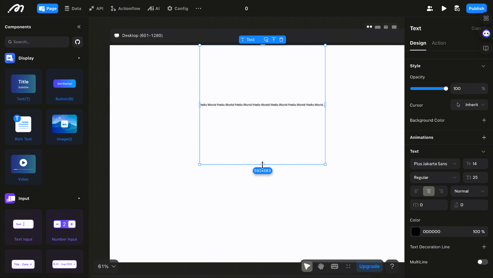

# Latest Product Update

---
description: >-
  Announcing the latest Momen product update
---
## V2.1.2 - 2024.12.12

### New Features

1. Hosting files in the Root Directory: Users can now upload verification files to the root directory of the web application.[View details](https://docs.momen.app/community/commission)
2. SEO Improvements: Added options for render mode selection, robots file, and other settings.
### Feature Enhancements

1. Commission Dashboard: A new commission panel in the user center, allowing users to share their exclusive referral link, track the number of invites, total commission, and available withdrawal amount. [View details](https://docs.momen.app/community/commission)
2. Tab Bar: Users can now drag and reorder tab pages.

### Bug Fixes

1. Fixed issues with public configuration.
2. Fixed backend deployment failure.
3. Fixed style issues with the large action popup.
4. Fixed image component display issues.
5. Fixed payment configuration issues for multi-client projects.

## V2.1.1 - 2024.11.22

### New Features

1. Custom Component: You can now save configured components as Custom Component and apply to different pages within your project.

### Feature Enhancements

1. Actionflow Permission Nodes: Added permission management to Actionflow, enabling users to automatically assign or remove roles in specific scenarios.
2. Open Project in New Tab: Projects can now be opened in a new tab by selecting the option in the right-click menu.

### Bug Fixes

1. Fixed the issue with Actionflow data binding.
2. Fixed the issue related to Actionflow database changes configuration.
3. Fixed the issue with remote data causing an infinite loop.
4. Fixed the issue with template creation.

## V2.1.0 - 2024.10.31

### New Features

1. Log Service: Users can now view project logs, currently focused on gateway-related logs, such as connection attempts and error messages. More types will be added soon.
2. Canvas: Users can now select multiple components for uniform adjustments to properties such as positioning, size, and background color. This update also allows users to create a view after making multiple selections.
3. My Wallet: Users can purchase plans and computing resources using credits (does not support recharge for now), with a new coupon feature added for discounts.
4. Affiliate Program: Users can invite others to use Momen. For every paid referral, they can earn a commission.
5. Onboarding: New users can now enter an invitation code during registration.

### Feature Enhancements

1. Data Binding: Visuals and interactions have been optimized, and users can now copy and paste data a set of bindings for improved efficiency.
2. Actionflow: Users can now copy and paste a single node each time within Actionflow.

### Bug Fixes

1. Resolved an issue where errors were not displayed in the condition configuration pop-up, improving troubleshooting.
2. Fixed formatting issues in input boxes to enhance usability.
3. Addressed anomalies in the usage of the map component, ensuring more reliable functionality.
4. Corrected style issues with view component selections for a more consistent user experience.
5. Fixed the inability to locate configuration errors in Actionflows, aiding users in error resolution.
6. Resolved issues with abnormal Actionflow triggers to ensure smoother operation.

## V2.0.5 - 2024.10.10

### Introduction

In this update, we enhanced our conditional containers and canvas.

### Feature Enhancements

1\. **Canvas Optimization**

* &#x20;Added right-click operations to the top toolbar, supporting actions such as page copying.
* Automatically convert units when switching component width and height units.

2\. **Collaborative Experience and Performance:**&#x20;

* Improved the experience and performance for multi-client collaborative applications.

### Bug Fixes

1\. Fixed an issue where Actionflow filters were failing.

2\. Fixed the issue where text color settings in the data selector were not applied.

3\. Fixed styling issues in the tab bar component.

4\. Fixed an issue where background images were not tiled correctly.

5\. Fixed the failure to deploy after importing large files via AI.

6\. Fixed the issue where project activation failed.\

## V2.0.4 - 2024.09.14

### Introduction

In this update, we enhanced our conditional containers and canvas.

### New Features

1. **UI and Data State Retention for Conditional Containers and Tab Bar** Conditional containers and tab bar components now support preserving their UI and data state after switching, enhancing the user experience when toggling between views.
2. **All Page Mode** All pages mode has been added to the web, allowing for easier page selection (shortcut: cmd/ctrl + P).
3. **Actionflow Vector Search** The "Get Data" node in Actionflow now supports vector search for improved data querying.
4. **Version Switching for Code Components** Code components now support switching between different versions.

### Feature Optimizations

1. **Canvas Improvements**
   * The left sidebar automatically scrolls to the selected component (if enough space is available).
   * A new "Paste to Page" option has been added to the right-click menu for pages.

### Bug Fixes

1. Fixed an issue where the project occasionally failed to open due to the diff save mechanism.
2. Fixed an issue where page data couldn't be assigned after enabling the "List" option.
3. Fixed an issue with abnormal data display when switching between tab bar views.
4. Fixed a crash caused by inputting large numbers into the AI max token limit.
5. Fixed an issue where the default condition could be deleted after dragging.
6. Fixed a crash caused by incorrect cron expressions in scheduled tasks.
7. Fixed an issue where the deployment success prompt persisted after backend deployment succeeded.
8. Fixed an issue where the "Hover" switch in the right sidebar wouldn't change state after being turned on.
9. Fixed an issue where the order table could incorrectly select the account table in payment configurations.
10. Fixed styling issues in the custom domain configuration.
11. Fixed an issue where web page paths were not unique after configuring the HTML path.
12. Fixed unclear wording in some parts of the AI configuration.
13. Fixed an issue where lists would trigger a refresh action, but the view wouldn't refresh.
14. Fixed an issue where fields displayed "null" when SEO was enabled but not configured.

Please see more details about our updates in the [video](https://www.youtube.com/watch?v=4HGdbwdMOJc\&list=PLvdix\_Sk3fBon4bY6PYHbUQrcuv7TmfEz\&index=4)

## V2.0.3 - 2024.09.14

### Introduction
In this update, we enhanced our conditiopnal containers and text component.

### Feature Optimizations

1. **Support for Copying Individual Cases in Conditional Containers**
   - This feature allows users to copy specific cases within conditional container to another.
   <figure><figcaption></figcaption></figure>

   
2. **Support for Setting Maximum Lines in Text Components**
   - By enabling multi-line display in text components and setting a line limit, any text that exceeds the fixed height of the text box will be truncated.
  <figure><figcaption></figcaption></figure>

 
### Bug Fixes

1. Resolved an issue where downloaded file names were appearing unreadable.

2. Addressed an issue with calculating totals in page data loops on the web.

3. Corrected an error occurring when selecting a reference type for linked data.

## V2.0.2 - 2024.08.15

### **Introduction**
In this update, we enhanced our collaboration capability, and update invite codes generation.

### Enhanced Collaboration Capabilities
1. Resolved data conflicts during simultaneous operations in the editor by multiple users.
2. Major performance and efficiency improvements.
   

### Automatically Generate Referral Code During Registration
1. Users can now share invitation codes to invite new users to register and join the referral program, earning commission.
<figure><figcaption></figcaption></figure>

## V2.0.1 - 2024.08.02

### **Introduction**

We've made major updates on canvas, improving the user experience, design consistency and ease of use in our editor.&#x20;

### **Update Summary**&#x20;

#### **New Canvas**

1. Updated the canvas engine for significantly improved performance.
2. Adjusted default and selected styles for all components.
3. Added top toolbars for pages and components with common operations.

#### **Configuration Bar Optimization**

1. The left sidebar now supports searching component lists, right-click to copy, and delete multi-selection.
2. Displays all breakpoints in multi-breakpoint mode.
3. When a component has a popup configured, the left sidebar allows selection and editing of the popup.
4. The right sidebar hierarchy is optimized to "Design," "Data," and "Interaction".&#x20;
5. Added text paragraph indent, letter spacing, and separate border and corner radius settings.

#### **Deployment Optimization**

1. Moved the original "Preview" entry into "Publish", making it easier to manage your web app's deployment .
2. Users can deploy changes immediately after modifying backend configurations, with all changes displayed in the backend update panel.

**Condition Container, and Divider Component Optimization**

1. The condition container's now allows direct selection of the child container, separate configuration of size, style, etc. It also supports editing in the focus mode and switching between different child views in the canvas.
2. Added "solid line" and "dash line" styles to the divider.

<figure><figcaption></figcaption></figure>

<figure><figcaption></figcaption></figure>

#### **Shortcuts**&#x20;

Added 42 shortcuts for general component operations, selection, movement, and canvas panel zooming.

<figure><figcaption></figcaption></figure>

### **Detailed Update**&#x20;

#### **Left Sidebar**

**Updates**

1. Supports searching component lists.
2. Supports locating components by clicking after search.
3. Supports right-click to copy/delete after multi-selection on pages.

<figure><figcaption></figcaption></figure>

4. Supports dragging and sorting pages.
5. Displays all breakpoint content in multi-breakpoint mode.

<figure><figcaption></figcaption></figure>

6. When a component has a popup configured, the left sidebar allows selection and editing the popup.
7. Distinguishes components positioned as "relative" and "absolute/fixed."

<figure><figcaption></figcaption></figure>

**Adjustments**

* Merged the original switching Tab and clicking Icon entries into one, placed at the top of the left sidebar.

<figure><figcaption></figcaption></figure>

* **Display Sub-containers When Selected**&#x20;

When a component with sub-containers is selected, the left sidebar displays the relationship.

<figure><figcaption></figcaption></figure>

* **Code Component Entry Adjustment**

<figure><figcaption></figcaption></figure>

#### **Canvas**

**Updates**

1. Supports switching between multi/single breakpoint editing modes.
2. Supports dragging and adding components to any position in the target container.
3. Supports direct selection and editing of the innermost component at the pointer position.
4. Displays more information and shortcut operations when a component is selected.&#x20;
   1. Select the parent, edit variant and delete.
   2. Adjust the size of the component

<figure><figcaption></figcaption></figure>

5. Displays horizontal, vertical center, and edge alignment guides when dragging components positioned as "absolute."

#### **Right Sidebar**

**Updates**

1. Text paragraph indent, letter spacing.
2. Separate border settings.

**Adjustments**&#x20;

* **Labels and Content Adjustments**

1. Added style configuration (named according to the current selection type) at the top under "Design."
2. Renamed the original "Content" label to "Data." This label now only supports configuring declared data-related items, with other configurations moved to "Design" - style configuration."
3. Renamed the original "Interaction" label to "Action." This label now only supports configuring actions, with all content under the original "Component" moved to "Design".&#x20;

<figure><figcaption></figcaption></figure>

* **Animation Entry Position Adjustment**&#x20;

Moved the animation entry from "Interaction" to "Design."

<figure><figcaption></figcaption></figure>

* **State (formerly Variant) Entry Position Adjustment**

1. Renamed "Variant" to "State."
2. Entry changes from "Interaction" - "Animation" - "Hover" - "Effect" to "Design" - "Style Configuration."

<figure><figcaption></figcaption></figure>

**Margins and Padding**

1. Changed from default display to manual addition or removal.
2. Supports simultaneous configuration of left and right, top and bottom margins.

<figure><figcaption></figcaption></figure>

**Max/Min Width Settings**

1. Changed from default display to manual addition or removal.

<figure><figcaption></figcaption></figure>

**Layout**

1. Combined "Start," "Center," and "End" in distribution with alignment configuration to form one configuration item.
2. Rearranged structure.

<figure><figcaption></figcaption></figure>

**Layer Styles**&#x20;

Renamed "Layer Styles" to "Z Index" and moved to "Position."

<figure><figcaption></figcaption></figure>

**Background Blur**

1. Moved the entry to "Style."
2. Configuration supports manual addition and removal.

<figure><figcaption></figcaption></figure>

#### **Components**

1. Updated default styles for all components.

2. Condition Container&#x20;

* **Concept Adjustment**&#x20;

The parent container is now a concept, unselectable and uneditable.

<figure><figcaption></figcaption></figure>

* **Child Container Configuration**&#x20;

Supports direct selection of child containers, allowing separate configuration of size, style, etc.

<figure><figcaption></figcaption></figure>

* **Focus Mode**&#x20;

Supports entering focus mode through toolbar entry or shortcut (Cmd/Ctrl + Return/Enter) for configuration.

<figure><figcaption></figcaption></figure>

* **Distinguishing Parent/Child Container Operations**&#x20;

Distinguishes copy, cut, copy, delete operations for child and parent containers.

<figure><figcaption></figcaption></figure>

* **Adding and Switching Child Containers**&#x20;

i. Toolbar ii. Right Sidebar iii. Condition Popup

<figure><figcaption></figcaption></figure>

<figure><figcaption></figcaption></figure>

* **Condition Configuration**&#x20;

Supports simultaneous configuration of all child container conditions.

<figure><figcaption></figcaption></figure>

3. Tabs&#x20;

* Toolbar&#x20;

Supports switching tabs in the toolbar.

<figure><figcaption></figcaption></figure>

* **Configuration**&#x20;

Supports directly selecting and editing different tab content in the canvas.&#x20;

**Focus Mode**&#x20;

Supports entering focus mode through toolbar entry or shortcut (Cmd/Ctrl + Return/Enter) for configuration.

<figure><figcaption></figcaption></figure>

4. Select Views&#x20;

* Toolbar&#x20;

Distinguishes configuration and preview areas, supports direct selection and editing of the "selected" and "unselected" states of the tag.

5. Lists/Horizontal Lists&#x20;

* Configuration&#x20;

Distinguishes configuration and preview areas, supports direct selection and editing of the "selected" and "unselected" states of the tag.

<figure><figcaption></figcaption></figure>

#### **Navigation Bar** &#x20;

* Publish

Moved the original "Preview" entry into "Publish," forming an integrated web process for centralized management.

<figure><figcaption></figcaption></figure>

* **Entry Adjustment Style Adjustment**
* **Error Reporting**&#x20;

Changed from always present to appearing when there is an error.

<figure><figcaption></figcaption></figure>

**Shortcuts**

1. Add Component - Option/Alt + C
2. Measure Distance - Option/Alt
3. Proportional Scaling - Shift + Drag
4. Select Child - Return/Enter; Select Parent - Shift + Return/Enter
5. Select the Next Component at the Same Level - Tab; Select the Previous Component at the Same Level - Shift + Tab (according to the left sidebar order)
6. Move Component to Top - ]; Move Component to Bottom - \[
7. Move Component Up One Layer - Cmd/Ctrl + ]; Move Component Down One Layer - Cmd/Ctrl + \[ (only supports same-level movement)
8. Move Component in Any Direction (relative layout adjusts component order according to layout direction) - Arrow Keys

More shortcuts can be viewed or searched in the shortcut popup.

<figure><figcaption></figcaption></figure>

### **Future Updates**

1. Support for Multi-select Editing&#x20;
2. More Powerful Variant Function
3. Richer Breakpoint Capabilities

### **Feedback Channels**&#x20;

If you have any questions or suggestions, feel free to provide feedback here. Your report will be immediately get fixed by our team.&#x20;

<figure><figcaption></figcaption></figure>

## V1.0.9 - 2024.04.25

### **I. Introduction**

Momen's latest update, version 1.0.9, is here! Packed with exciting new features and enhancements. This release is aimed at enhancing your development experience. Let's explore the highlights!

### **II. New features**

1. Table component: The table component makes it easy to display and manage content, and supports exporting data.

.png>)

2. Server activation schedule for plan upgrade: A new server activation process is now available. Following a project upgrade or purchasing of a single-tenant kit, users may activate a migration via the project details page to shift the project to a better server, thus enhancing its operational performance.

.png>)

3. Share to X: A new action has been update which allows you to share content to X from your own website.

.png>)

### **III. Improvements**

Project details page optimization: Adjust the layout on the detail page based on user feedback, integrate the plan renewal process, and optimize the path to purchase computing power.

.png>)

Support project reset: Reset project will restore the project to blank. All data, pages, and settings will be deleted. Purchased resources and collaboraters will remain unchanged.

.png>)

## V1.0.8 - 2024.3.07

### I. Introduction

Momen's latest update, version 1.0.8, is here! Packed with exciting new features and enhancements. This release is aimed at enhancing your development experience. Let's explore the highlights!\

### II. New features

1. Momen Basic Plan supports SEO configuration now.
2. Optimization of Link Data configuration.
   1. Link Data supports not displaying links when there is no data. This means that Link Data will not be shown in the webpage link when there are no configured parameters, which will help increase SEO weight.

<figure><figcaption></figcaption></figure>

3. SSO Optimization
   1. Optimizing page style and interaction, including support for parameter passing when configuring the target page.

<figure><figcaption></figcaption></figure>

### III. Improvements

1. When exporting the database, the table names and field names are changed to "display-name".
2. Some performance optimizations.
3. Bugfixes.

## V1.0.7 - 2023.1.18

### I. Introduction

Momen's latest update, version 1.0.7, is here! Packed with exciting new features and enhancements. This release is aimed at enhancing your development experience. Let's explore the highlights!\

### II. New features

1. Momen AI now supports image input and streaming output.

<figure><figcaption></figcaption></figure>

You can now send multiple images to AI, and this technology can be widely used in different scenarios.

2. New custom action: new interface and triggers.

<figure><figcaption></figcaption></figure>

### III. Improvements

1. The database supports like search. Supports users to perform like searches on default tables and custom views in the editor database, when opening the database on a single page, and when sharing the database.

<figure><figcaption></figcaption></figure>

2. Project creating optimization.

* The speed of creating new projects has been drastically improved.
* Optimized new project creation process. Users can directly create Basic/Pro version projects. Combined with AI, newly created projects can be classified.

3. Optimizations for conditional configuration and booleans

* Added the 'is true' and 'is false' operators
* optimized the configuration of conditions as well as the UI of pop-up windows.

<figure><figcaption></figcaption></figure>

4. Multi-client: Reduced the price of new web applications under the multi-client capability to 50% of the corresponding version (from 100%)

5. By default, the list components are arranged in reverse order of ID

### IV. Bugfixes

1. Fixed some issues in turning off focus mode
2. Fixed an issue where the parent view was blocked when clicking on a sub-container
3. Fixed the issue that when adding a new component, the component was not displayed in the center of the canvas

## V1.0.6 - 2023.12.13

### I. Introduction

Momen's latest update, version 1.0.6, is here! Packed with exciting new features and enhancements. This release is aimed at enhancing your development experience. Let's explore the highlights!\

### II. New features

1. Focus Mode Update and Optimization

* Previously, entering focus mode on a component was done by double-clicking it, and double-clicking on a blank space returned to the previous layer. While this was simple to use, it wasn't clear where the user was positioned.
* Therefore, we've designed a new focus mode, where layers are displayed in a tiled format. This allows users to intuitively see the relationships between components and understand their current position, significantly reducing mouse clicks and lessening fatigue.

<figure><figcaption></figcaption></figure>

If you need to return to the old focus mode, it can be disabled in the global settings.

<figure><figcaption></figcaption></figure>

Additionally, we've made the following optimizations to the new focus mode:

* Support for adding components to a selected container using double-click or shortcuts (f: custom view, b: button, i: image, t: text)
* Direct dragging and dropping of components into various container components
* Support for dragging and dropping components within containers and pages for sorting
* In complex conditional containers, support for expanding all sub levels to the right

<figure><figcaption></figcaption></figure>

2. Support for Conditional Data Filtering

Enables configuration of multiple data sorting, filtering, and deduplication sets based on different conditions.

<figure><figcaption></figcaption></figure>

3. API Support for Default Value Configuration

* In previous designs, calling the same API multiple times with identical parameters meant repeatedly entering the same information. Hence, this version introduces the configuration of API default values, requiring only a single setting of default values, eliminating the need for repeated parameter entry. This reduces unnecessary repetitive operations.
* Additionally, default values are stored on the backend, ensuring sensitive information (like keys, tokens, etc.) is not exposed on the front end, significantly enhancing security.

<figure><figcaption></figcaption></figure>

4. New Filter - Blur

Introducing a new filter, blur, for display and view components.

<figure><figcaption></figcaption></figure>

5. Custom Popup Function

New popup function that allows users to configure custom popup styles and content.

<figure><figcaption></figcaption></figure>

6. Momen AI Launch

The new AI feature of Momen is now online, enabling users to build their AI applications without any coding. Momen developers can integrate AI into their applications easily through visual configuration, reducing the cost and complexity of using AI. Momen AI enables everyone to effortlessly build their AI functionalities, supporting interactive scenarios like intelligent customer service, smart recommendations, intelligent knowledge bases, copy generation, and intelligent relevance searches.

<figure><figcaption></figcaption></figure>

<figure><figcaption></figcaption></figure>

For more feature introductions, please see: https://docs.momen.app/advanced-competence/momen-ai/ai-natural-language-processing

### III. Improvements

1. Conditional Popup Support for Copy-Paste

<figure><figcaption></figcaption></figure>

<figure><figcaption></figcaption></figure>

2. Update of Default Styles for Sidebar Components

Updated the component library styles and adjusted all component columns to be open by default, reducing user clicks; &#x20;

Fixed the issue where the section of adding components would not display when a page was not selected.

<figure><figcaption></figcaption></figure>

3. Other Improvements

Optimized the bottom capsule to support canvas size adjustment via shortcuts. &#x20;

<figure><figcaption></figcaption></figure>

Image components now support adaptive width and height.

<figure><figcaption></figcaption></figure>

### IV. What We Are Currently Working On

1. AI template (premium version required)

We're currently working on the Momen AI Knowledge Base template, with built-in AI functionality configuration. This template will enable users to create their own knowledge base with ease.

## V1.0.5 - 2023.10.9

### I. Introduction

Momen's latest update, version 1.0.5, is here! Packed with exciting new features, enhancements, and bug fixes, this release is aimed at enhancing your development experience. Let's explore the highlights!\

### II. New Features

1. Sub-database configuration coming on October 11th

* We've introduced a new sub-database feature that allows users to create sub-databases by filtering the default data tables. It also supports separate sharing and content permission control.

<figure><figcaption></figcaption></figure>

2. SEO Search Engine Optimization feature coming on October 11th

* Your project will soon support SEO Search Engine Optimization functionality, scheduled for release on October 11th. With features like H tags, alt text, and sitemaps configuration, this update will significantly boost your project's search engine ranking, attract targeted traffic, and create potential business opportunities.

<figure><figcaption></figcaption></figure>

3. The project details page has been launched

* On this page, users can access information about computing resource usage and basic project details such as the expiration date and project members. Additionally, users can now purchase computing resource kits directly from this page.

<figure><figcaption></figcaption></figure>

4. Gradient color configuration is now available.

* Projects now support configuring gradient colors for backgrounds and text.

<figure><figcaption></figcaption></figure>

### III. Improvements

1. Introducing Release Reminders

* We've added release reminders to prevent unnecessary errors resulting from forgetting to update the backend. This feature is now available in data models, third-party APIs, and the permission system.

2. Hover Style Editing Capability

* The new web framework allows for customizing variant styles on hover and includes the ability to adjust variant opacity.

### IV. Bugfixes

1. Resolved issues related to canvas centering.

### VI. What We Are Currently Working On

1. Working on users' feedback

We're thrilled to see our users engaging and providing valuable feedback that propels Momen to new heights. We've received over 100 comments and posts from various channels, including emails and Discord. In the upcoming month, our focus will be on addressing user feedback and enhancing the Momen editor based on your valuable input!

## V1.0.4 - 2023.8.31

### I. Introduction

Introducing Momen's newest update, version 1.0.4! Bursting with thrilling new features, improvements, and bug fixes, this release is designed to elevate your development experience. Let's delve into the key highlights!\

### II. New Features

1. AI vector storage

The text field has been enhanced with AI vector storage capability, enabling vector sorting and facilitating relevance searches using this field. AI-related functionalities are available for projects with Basic projects and higher.\

### III. Improvements

1. Vertical scrolling carousels for list components.

The list component has been enhanced with the ability to create vertical scrolling carousels and full-screen vertical scrolling effects through configuration.

<figure><figcaption></figcaption></figure>

2. Z-index configuration

We are introducing Z-index configuration, which enables you to modify the stacking order of components, making layout adjustments more convenient.

<figure><figcaption></figcaption></figure>

3. Setting default values for page data and global data

Through the use of default values, you can initiate page data or global data without requiring additional actions, thereby improving development efficiency. Presently, this feature supports four types: strings, integers, floating-point numbers, and boolean values.

<figure><figcaption></figcaption></figure>

4. Paste text onto the canvas

Now you can paste text directly into the editor, and they will automatically convert to text component.\

5. Custom components with data binding capabilities

Custom components now offer data binding capabilities, enabling you to bind data in the right-side component bar and transmit it to custom components. Currently, supported data types include TEXT, FLOAT8, INTEGER, BOOLEAN, OBJECT, ARRAY, and IMAGE.

<figure><figcaption></figcaption></figure>

### IV. Bugfixes

1. Resolved issues related to subscription.

### VI. What We Are Currently Working On

1. Permission control v1.1

We are engaged in a comprehensive effort to refine and optimize our permission control system. Our primary goal is to make it not only more intuitive and user-friendly. This refinement encompasses a deep evaluation of the existing user interface, with a strong focus on simplifying complex processes, streamlining navigation, and ensuring seamless interactions.\

## V1.0.3 - 2023.8.16

### I. Introduction

Introducing Momen's latest update, version 1.0.3! Packed with exciting new features, improvements, and bug fixes, this release is set to enhance your development journey. Let's explore the highlights!\

### II. New Features

1. Motion & Effects

We now offer the ability to configure dynamic effects and animations on components, with four triggering options: on hover, on click, when scrolling into view, and while scrolling. Once a triggering method is selected, you can customize the effect that will be triggered.

<figure><figcaption></figcaption></figure>

{% embed url="https://files.gitbook.com/v0/b/gitbook-x-prod.appspot.com/o/spaces%2FNNm75vAys0CMwBUdWsgC%2Fuploads%2Fm7YFHGRCbZw3j46Uns3X%2Fmotion.mp4?alt=media&token=eed4e229-c4ba-4ec0-95b9-7e7f6bfc6ba3" %}

### III. Improvements

1. Sharing and permissions

We've introduced a new manager role with comprehensive content and editing control within the shared scope. Additionally, we've included expiration periods for shared links, limits on the number of participants for shared links, and the capability to search for Momen members by email address.

<figure><figcaption></figcaption></figure>

2. Mobile user center

Following our revised product's visual guidelines, we've elevated the design of the mobile user center, allowing users to seamlessly preview their projects. Furthermore, we've introduced a convenient drawer-style menu that offers effortless mobile access to browse blogs, check pricing, and join our Discord community.

<figure><figcaption></figcaption></figure>

### IV. Bugfixes

Resolved issues related to the support service deployment.

### VI. What We Are Currently Working On

**Development environment**Our ongoing focus is on developing a feature that empowers users to iterate on specific parts of their projects without affecting other sections. The Development environment provides a platform for project building, reflecting the final deployed appearance. Once everything is locked and loaded, merging the testing branch to the main development environment and pushing it to live is just one click away. Stay tuned for this exciting development!

## V1.0.2 - 2023.7.24

### I. Introduction

We are thrilled to announce the latest update to Momen, version 1.0.2, bringing you an array of new features, improvements, and bug fixes that will elevate your development experience. Let's dive into the details!

### II. New Features

1. Multi-Frontends Feature

Build multiple front-end applications based on a single PRO project's backend. Tailor interfaces to different users while sharing data, enabling diverse user experiences and enhancing efficiency.

<figure><figcaption></figcaption></figure>

2. Free Trial for Basic and Pro Projects

Explore advanced paid features, including Custom Domain, SEO TDK, and Permission Control, during a free trial period.

<figure><figcaption></figcaption></figure>

3. Introducing Action Map View

Visualize and navigate complex project logic and actions using a hierarchical map view. Gain a clearer understanding of your project's structure for improved development efficiency.

<figure><figcaption></figcaption></figure>

### III. Improvements

1. Enhanced Image Upload: Support for WebP Format

Optimize image performance and improve website load times by uploading images in the modern WebP format.

2. SEO Enhancements: Alt Text and Header Tags

Boost your website's search engine visibility and accessibility by providing alt text for images and using appropriate header tags.

<figure><figcaption></figcaption></figure>

<figure><figcaption></figcaption></figure>

3. Momen Templates: Website Landing Page, Blog, and Community

Kickstart your projects with professionally designed templates for website landing pages, blogs, and communities. Accelerate development while maintaining customization flexibility.

<figure><figcaption></figcaption></figure>

### IV. Bugfixes

1. Resolved issues related to the Mirror feature.
2. Fixed bugs causing unexpected action during project interactions.

### VI. What We Are Currently Working On

1. Management Console v1.1

With the introduction of multi-frontends, we are developing Management Console v1.1, which allows you to create sub-management consoles for your sub-projects. This feature will provide better data management and enable you to build multiple front-end applications based on a single PRO project's backend.

2. New Focus Mode

We are revamping the Focus Mode to enhance your interface-building experience. The restructured Focus Mode will enable you to locate layers more easily and gain clearer insights into the flow of conditional logic. Expect an improved interface construction process with increased efficiency and precision.

## V1.0.1 - 2023.5.25

### I. Introduction

This week we launched three new features for building custom and beautiful UIs.

Other than that, over the past two weeks, we've been working on a new feature that enables automated conversion of Product Requirement Documents (PRDs) to Momen Data Models through Momen AI. Such a feature can help our users quickly get started with Momen and reduce the time to build data models.\

### II. New Features

#### AI Data Model Generation

1. We are thrilled to announce the launch of a new feature that significantly simplified the process of designing data models. With the power of Momen AI, users can now effortlessly convert Product Requirement Documents (PRDs) into accurate and comprehensive data models.
2. AI Data Model Generation empowers both technical and non-technical users to quickly grasp and work with data structures, accelerating project development and enhancing overall productivity.

<figure><figcaption></figcaption></figure>

#### Margin, Padding, and Overflow

The introduction of margin, padding, and overflow features significantly expands the range of possibilities for designers and developers. It facilitates precise control over spacing, alignment, and content display, leading to more visually appealing and functional designs.

1. Margin: With margin, users can now adjust the spacing around components, precisely controlling the distance between components and their surrounding content.

<figure><figcaption></figcaption></figure>

2. Padding: The padding feature allows users to define the internal spacing within components, enabling them to create sufficient space between the content and the element's boundaries. It is often used to enhance the readability of texts and maintain visual balance with a group of elements.

<figure><figcaption></figcaption></figure>

3. Overflow: Our new overflow feature allows users to handle content that exceeds the available space within a component. With options such as scroll, visible, and hidden, users can determine how overflowing content should be displayed or hidden.

<figure><figcaption></figcaption></figure>

### III. Improvements

#### Alternative Email Providers Supported

Users can now sign up for Momen using alternative email providers instead of being limited to Gmail accounts. We understand that not everyone uses Gmail, and we want to ensure that our platform is accessible to users regardless of their preferred email service.

<figure><figcaption></figcaption></figure>

#### Batch Insertion of Images

Batch insertion of images while performing a mutation is now supported in Momen. With the new batch insertion feature, users can select and upload multiple images simultaneously, eliminating the need for repetitive manual actions and significantly reducing the time and effort required for image handling.

<figure><figcaption></figcaption></figure>

### IV. Bugfixes

1. Fixed an issue preventing project creation.
2. Fixed an issue causing incorrect display when setting the height of the list cell view.
3. Fixed an issue causing editor blackout when clicking on the fix button on the error collector.
4. Fixed an issue preventing support service deployment

### VI. What We Are Currently Working On

1. We understand that getting started with a new tool can be daunting. To address this, our onboarding project will provide detailed instructions and interactive tips on how to drag and drop components onto the canvas, allowing users to quickly create visually appealing layouts without any guesswork, and providing enough guidance for users to conduct data manipulation.
2. We are excited to introduce a powerful feature in Momen called "Share the Backend," which enables users to build multiple frontend applications based on a single PRO project's backend. This means multiple frontend applications in momen can now interact with the same set of data while presenting tailored interfaces to different users. A good example where this power can be put to use is a food ordering app, where customers and kitchen staff expect vastly different UI.
