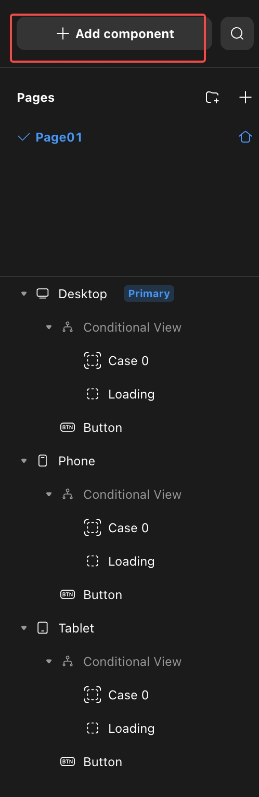
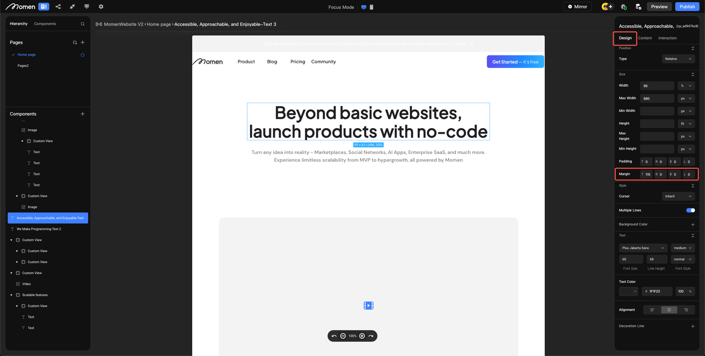

# V1.0.1 - 2023.5.25

### I. Introduction

This week we launched three new features for building custom and beautiful UIs.

Other than that, over the past two weeks, we've been working on a new feature that enables automated conversion of Product Requirement Documents (PRDs) to Momen Data Models through Momen AI. Such a feature can help our users quickly get started with Momen and reduce the time to build data models.\

### II. New Features

#### AI Data Model Generation

1. We are thrilled to announce the launch of a new feature that significantly simplified the process of designing data models. With the power of Momen AI, users can now effortlessly convert Product Requirement Documents (PRDs) into accurate and comprehensive data models.
2. AI Data Model Generation empowers both technical and non-technical users to quickly grasp and work with data structures, accelerating project development and enhancing overall productivity.

<figure><figcaption></figcaption></figure>

#### Margin, Padding, and Overflow

The introduction of margin, padding, and overflow features significantly expands the range of possibilities for designers and developers. It facilitates precise control over spacing, alignment, and content display, leading to more visually appealing and functional designs.

1. Margin: With margin, users can now adjust the spacing around components, precisely controlling the distance between components and their surrounding content.

<figure><figcaption></figcaption></figure>

2. Padding: The padding feature allows users to define the internal spacing within components, enabling them to create sufficient space between the content and the element's boundaries. It is often used to enhance the readability of texts and maintain visual balance with a group of elements.

<figure><figcaption></figcaption></figure>

3. Overflow: Our new overflow feature allows users to handle content that exceeds the available space within a component. With options such as scroll, visible, and hidden, users can determine how overflowing content should be displayed or hidden.

<figure><figcaption></figcaption></figure>

### III. Improvements

#### Alternative Email Providers Supported

Users can now sign up for Momen using alternative email providers instead of being limited to Gmail accounts. We understand that not everyone uses Gmail, and we want to ensure that our platform is accessible to users regardless of their preferred email service.

<figure><figcaption></figcaption></figure>

#### Batch Insertion of Images

Batch insertion of images while performing a mutation is now supported in Momen. With the new batch insertion feature, users can select and upload multiple images simultaneously, eliminating the need for repetitive manual actions and significantly reducing the time and effort required for image handling.

<figure><figcaption></figcaption></figure>

### IV. Bugfixes

1. Fixed an issue preventing project creation.
2. Fixed an issue causing incorrect display when setting the height of the list cell view.
3. Fixed an issue causing editor blackout when clicking on the fix button on the error collector.
4. Fixed an issue preventing support service deployment

### VI. What We Are Currently Working On

1. We understand that getting started with a new tool can be daunting. To address this, our onboarding project will provide detailed instructions and interactive tips on how to drag and drop components onto the canvas, allowing users to quickly create visually appealing layouts without any guesswork, and providing enough guidance for users to conduct data manipulation.
2. We are excited to introduce a powerful feature in Momen called "Share the Backend," which enables users to build multiple frontend applications based on a single PRO project's backend. This means multiple frontend applications in momen can now interact with the same set of data while presenting tailored interfaces to different users. A good example where this power can be put to use is a food ordering app, where customers and kitchen staff expect vastly different UI.

### About Momen

[Momen](https://momen.app/?channel=blog-about) is a no-code web app builder, allows users to build fully customizable web apps, marketplaces, Social Networks, AI Apps, Enterprise SaaS, and much more. You can iterate and refine your projects in real-time, ensuring a seamless creation process. Meanwhile, Momen offers powerful API integration capabilities, allowing you to connect your projects to any service you need. With Momen, you can bring your ideas to life and build remarkable digital solutions and get your web app products to market faster than ever before.
