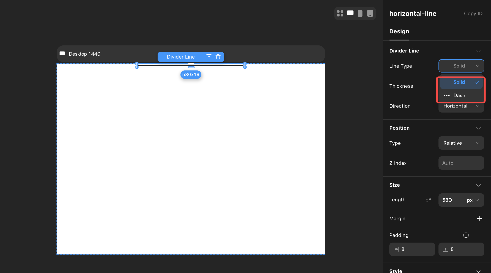
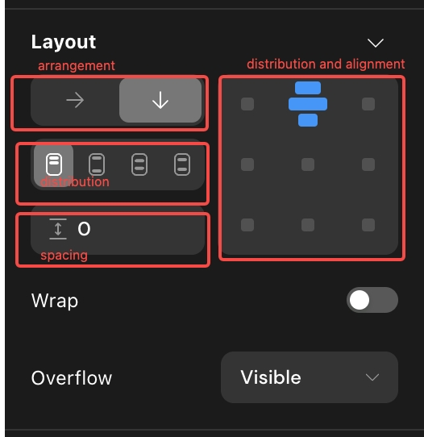
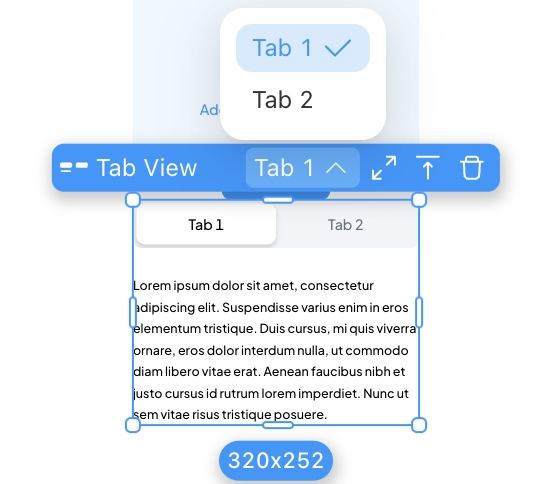
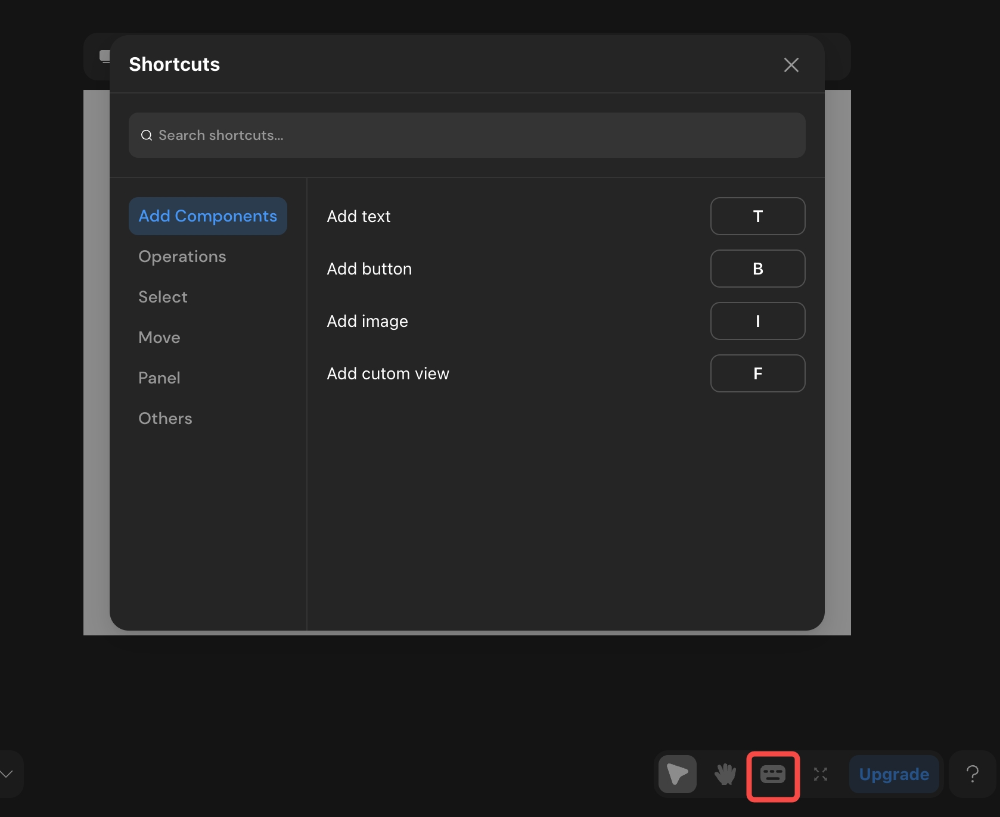

# V1.1.1 - 2024.08.02

### **Introduction**

We've made major updates on canvas, improving the user experience, design consistency and ease of use in our editor.&#x20;

### **Update Summary**&#x20;

#### **New Canvas**

1. Updated the canvas engine for significantly improved performance.
2. Adjusted default and selected styles for all components.
3. Added top toolbars for pages and components with common operations.

#### **Configuration Bar Optimization**

1. The left sidebar now supports searching component lists, right-click to copy, and delete multi-selection.
2. Displays all breakpoints in multi-breakpoint mode.
3. When a component has a popup configured, the left sidebar allows selection and editing of the popup.
4. The right sidebar hierarchy is optimized to "Design," "Data," and "Interaction".&#x20;
5. Added text paragraph indent, letter spacing, and separate border and corner radius settings.

#### **Deployment Optimization**

1. Moved the original "Preview" entry into "Publish", making it easier to manage your web app's deployment .
2. Users can deploy changes immediately after modifying backend configurations, with all changes displayed in the backend update panel.

**Condition Container, and Divider Component Optimization**

1. The condition container's now allows direct selection of the child container, separate configuration of size, style, etc. It also supports editing in the focus mode and switching between different child views in the canvas.
2. Added "solid line" and "dash line" styles to the divider.

<figure><figcaption></figcaption></figure>

<figure><figcaption></figcaption></figure>

#### **Shortcuts**&#x20;

Added 42 shortcuts for general component operations, selection, movement, and canvas panel zooming.

<figure><figcaption></figcaption></figure>

### **Detailed Update**&#x20;

#### **Left Sidebar**

**Updates**

1. Supports searching component lists.
2. Supports locating components by clicking after search.
3. Supports right-click to copy/delete after multi-selection on pages.

<figure><figcaption></figcaption></figure>

4. Supports dragging and sorting pages.
5. Displays all breakpoint content in multi-breakpoint mode.

<figure><figcaption></figcaption></figure>

6. When a component has a popup configured, the left sidebar allows selection and editing the popup.
7. Distinguishes components positioned as "relative" and "absolute/fixed."

<figure><figcaption></figcaption></figure>

**Adjustments**

* Merged the original switching Tab and clicking Icon entries into one, placed at the top of the left sidebar.

<figure><figcaption></figcaption></figure>

* **Display Sub-containers When Selected**&#x20;

When a component with sub-containers is selected, the left sidebar displays the relationship.

<figure><figcaption></figcaption></figure>

* **Code Component Entry Adjustment**

<figure><figcaption></figcaption></figure>

#### **Canvas**

**Updates**

1. Supports switching between multi/single breakpoint editing modes.
2. Supports dragging and adding components to any position in the target container.
3. Supports direct selection and editing of the innermost component at the pointer position.
4. Displays more information and shortcut operations when a component is selected.&#x20;
   1. Select the parent, edit variant and delete.
   2. Adjust the size of the component

<figure><figcaption></figcaption></figure>

5. Displays horizontal, vertical center, and edge alignment guides when dragging components positioned as "absolute."

#### **Right Sidebar**

**Updates**

1. Text paragraph indent, letter spacing.
2. Separate border settings.

**Adjustments**&#x20;

* **Labels and Content Adjustments**

1. Added style configuration (named according to the current selection type) at the top under "Design."
2. Renamed the original "Content" label to "Data." This label now only supports configuring declared data-related items, with other configurations moved to "Design" - style configuration."
3. Renamed the original "Interaction" label to "Action." This label now only supports configuring actions, with all content under the original "Component" moved to "Design".&#x20;

<figure><figcaption></figcaption></figure>

* **Animation Entry Position Adjustment**&#x20;

Moved the animation entry from "Interaction" to "Design."

<figure><figcaption></figcaption></figure>

* **State (formerly Variant) Entry Position Adjustment**

1. Renamed "Variant" to "State."
2. Entry changes from "Interaction" - "Animation" - "Hover" - "Effect" to "Design" - "Style Configuration."

<figure><figcaption></figcaption></figure>

**Margins and Padding**

1. Changed from default display to manual addition or removal.
2. Supports simultaneous configuration of left and right, top and bottom margins.

<figure><figcaption></figcaption></figure>

**Max/Min Width Settings**

1. Changed from default display to manual addition or removal.

<figure><figcaption></figcaption></figure>

**Layout**

1. Combined "Start," "Center," and "End" in distribution with alignment configuration to form one configuration item.
2. Rearranged structure.

<figure><figcaption></figcaption></figure>

**Layer Styles**&#x20;

Renamed "Layer Styles" to "Z Index" and moved to "Position."

<figure><figcaption></figcaption></figure>

**Background Blur**

1. Moved the entry to "Style."
2. Configuration supports manual addition and removal.

<figure><figcaption></figcaption></figure>

#### **Components**

1. Updated default styles for all components.

2. Condition Container&#x20;

* **Concept Adjustment**&#x20;

The parent container is now a concept, unselectable and uneditable.

<figure><figcaption></figcaption></figure>

* **Child Container Configuration**&#x20;

Supports direct selection of child containers, allowing separate configuration of size, style, etc.

<figure><figcaption></figcaption></figure>

* **Focus Mode**&#x20;

Supports entering focus mode through toolbar entry or shortcut (Cmd/Ctrl + Return/Enter) for configuration.

<figure><figcaption></figcaption></figure>

* **Distinguishing Parent/Child Container Operations**&#x20;

Distinguishes copy, cut, copy, delete operations for child and parent containers.

<figure><figcaption></figcaption></figure>

* **Adding and Switching Child Containers**&#x20;

i. Toolbar ii. Right Sidebar iii. Condition Popup

<figure><figcaption></figcaption></figure>

<figure><figcaption></figcaption></figure>

* **Condition Configuration**&#x20;

Supports simultaneous configuration of all child container conditions.

<figure><figcaption></figcaption></figure>

3. Tabs&#x20;

* Toolbar&#x20;

Supports switching tabs in the toolbar.

<figure><figcaption></figcaption></figure>

* **Configuration**&#x20;

Supports directly selecting and editing different tab content in the canvas.&#x20;

**Focus Mode**&#x20;

Supports entering focus mode through toolbar entry or shortcut (Cmd/Ctrl + Return/Enter) for configuration.

<figure><figcaption></figcaption></figure>

4. Select Views&#x20;

* Toolbar&#x20;

Distinguishes configuration and preview areas, supports direct selection and editing of the "selected" and "unselected" states of the tag.

5. Lists/Horizontal Lists&#x20;

* Configuration&#x20;

Distinguishes configuration and preview areas, supports direct selection and editing of the "selected" and "unselected" states of the tag.

<figure><figcaption></figcaption></figure>

#### **Navigation Bar** &#x20;

* Publish

Moved the original "Preview" entry into "Publish," forming an integrated web process for centralized management.

<figure><figcaption></figcaption></figure>

* **Entry Adjustment Style Adjustment**
* **Error Reporting**&#x20;

Changed from always present to appearing when there is an error.

<figure><figcaption></figcaption></figure>

**Shortcuts**

1. Add Component - Option/Alt + C
2. Measure Distance - Option/Alt
3. Proportional Scaling - Shift + Drag
4. Select Child - Return/Enter; Select Parent - Shift + Return/Enter
5. Select the Next Component at the Same Level - Tab; Select the Previous Component at the Same Level - Shift + Tab (according to the left sidebar order)
6. Move Component to Top - ]; Move Component to Bottom - \[
7. Move Component Up One Layer - Cmd/Ctrl + ]; Move Component Down One Layer - Cmd/Ctrl + \[ (only supports same-level movement)
8. Move Component in Any Direction (relative layout adjusts component order according to layout direction) - Arrow Keys

More shortcuts can be viewed or searched in the shortcut popup.

<figure><figcaption></figcaption></figure>

### **Future Updates**

1. Support for Multi-select Editing&#x20;
2. More Powerful Variant Function
3. Richer Breakpoint Capabilities

### **Feedback Channels**&#x20;

If you have any questions or suggestions, feel free to provide feedback here. Your report will be immediately get fixed by our team.&#x20;

<figure><figcaption></figcaption></figure>

### **About Momen**

[Momen](https://momen.app/?channel=blog-about) is a no-code web app builder, allows users to build fully customizable web apps, marketplaces, Social Networks, AI Apps, Enterprise SaaS, and much more. You can iterate and refine your projects in real-time, ensuring a seamless creation process. Meanwhile, Momen offers powerful API integration capabilities, allowing you to connect your projects to any service you need. With Momen, you can bring your ideas to life and build remarkable digital solutions and get your web app products to market faster than ever before.
