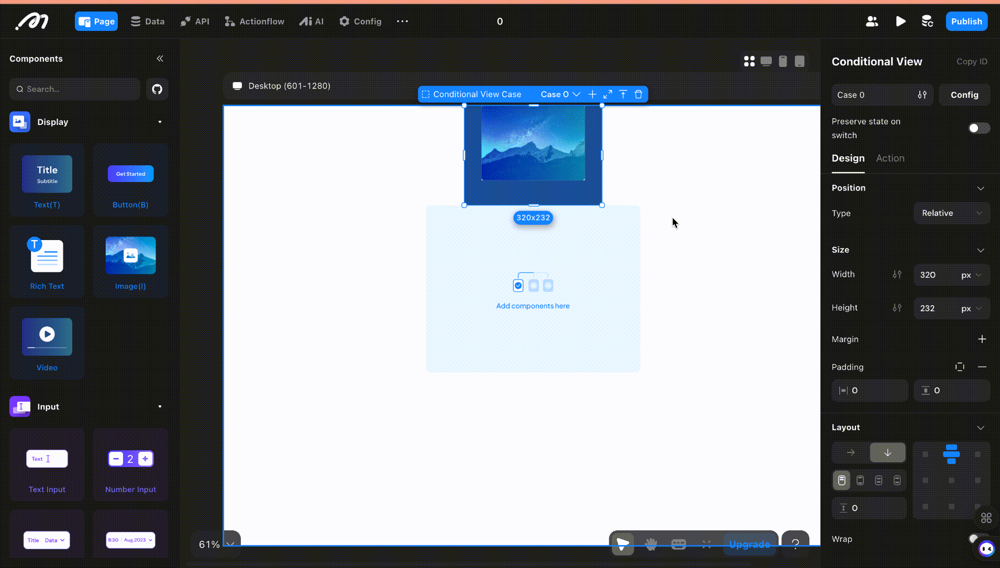

## Introduction
In this update, we enhanced our conditiopnal containers and text component.

## Feature Optimizations

1. **Support for Copying Individual Cases in Conditional Containers**
   - This feature allows users to copy specific cases within conditional container to another.
   <figure><figcaption></figcaption></figure>

   
2. **Support for Setting Maximum Lines in Text Components**
   - By enabling multi-line display in text components and setting a line limit, any text that exceeds the fixed height of the text box will be truncated.
  <figure><figcaption></figcaption></figure>

 
## Bug Fixes

1. Resolved an issue where downloaded file names were appearing unreadable.

2. Addressed an issue with calculating totals in page data loops on the web.

3. Corrected an error occurring when selecting a reference type for linked data.

### **About Momen**

[Momen](https://momen.app/?channel=blog-about) is a no-code web app builder, allows users to build fully customizable web apps, marketplaces, Social Networks, AI Apps, Enterprise SaaS, and much more. You can iterate and refine your projects in real-time, ensuring a seamless creation process. Meanwhile, Momen offers powerful API integration capabilities, allowing you to connect your projects to any service you need. With Momen, you can bring your ideas to life and build remarkable digital solutions and get your web app products to market faster than ever before.
