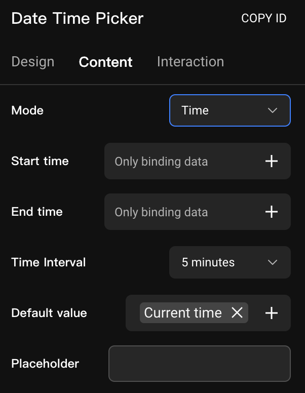
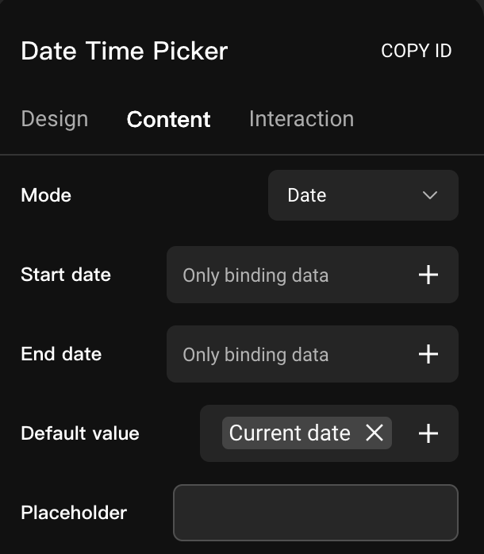
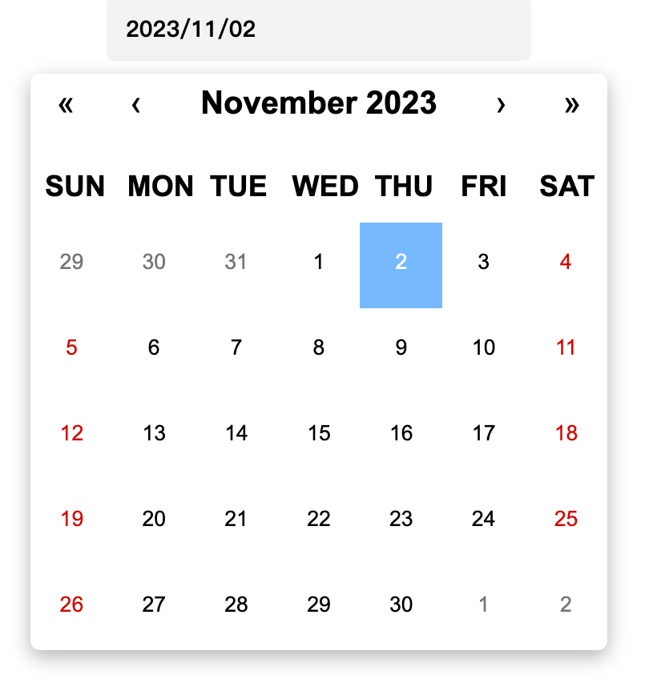

# Data Picker / Time Picker

### Introduction

In this tutorial, we'll explore the functionality of the Data Picker and Time Picker components in Momen, designed to enhance live user interactions and data selection in web applications. Whether you're filling in shipping details, selecting dates, or custom data, these tools simplify your user experience.

### Usage Scenario

When using the Data Picker and Time Picker components, you can streamline user interactions by allowing them to easily select data like receipt dates, gender, classes, and departments, eliminating the need for manual entry.

<figure><figcaption></figcaption></figure>

### Data Picker Content

The \[Data Picker] content comprises three key elements: "Placeholder", "Content", and "Limit".

<figure><figcaption></figcaption></figure>

**Prompt Text:** This is not required but serves as a placeholder when no default value is available. It is displayed as a guide to users.&#x20;

<figure><figcaption></figcaption></figure>

 

<figure><figcaption></figcaption></figure>

 

<figure><figcaption></figcaption></figure>

**Content:** This represents the selectable options and must be \[Remote Data]. You can choose to create your own options data table or the default state, city, or region table and set the "limit number" (how many options to request) to meet the needs of filtering, filtering, sorting, and other content like the " [List](https://docs.momen.app/component/list)". List Fields: It's worth noting that it's important to identify the "list fields" because the remote data has more than one field, and it needs to be clear which field's content is to be displayed.

\
💡Tips:

1. 1\. To display all states or cities, adjust the "limit" to ensure all contents are available.
2. When you need a relationship between data options, configure separate \[Data Picker] components for "state" and "city" to establish the desired connection.

\
💡Tips:

\[Data Picker] The selected data can be found under "Input Box" data when you need to use it, so it is recommended to rename the component in order to find its data accurately.

#### Interaction

**Only the data picker has a Deselectable option.**

<figure><figcaption></figcaption></figure>

**Deselectable**: the selected option can be deleted by clicking the Delete button, and the value of \[Data Picker Input Box] will be null after deletion.

<figure><figcaption></figcaption></figure>

### Time/Date Picker Content

#### Time PIck

<figure><figcaption></figcaption></figure>

* Set the start time and end time, only support data binding, are not required, generally do not set.

💡Tips:

When the start time and end time are not set, the default time selection range is 00:00 - 23:59.

* Configure the time interval, with a default selection of 1 minute. You can choose from predefined intervals of 5, 10, 15, 30, or 60 minutes, but manual input is not supported.

<figure><figcaption></figcaption></figure>

 

<figure><figcaption></figcaption></figure>

* Setting a default value is optional, and it's used for data binding. When a default value is set, placeholders will not be displayed.

💡Tips:

Once a default value is set, the selector automatically positions itself at the specified default value, as shown below.

<figure><figcaption></figcaption></figure>

Configure the prompt text, not required, when there is no default value, the content of the "prompt text" will be displayed.

#### Date Pick

<figure><figcaption></figcaption></figure>

* Setting the start and end dates is only supported for data binding; neither is mandatory.

💡Tips:

When the start date and end date are not set, the default date selection range is January 1, 1901 - December 30, 2901, and the current date is selected by default.

* Set default value, non-required, only support data binding. When there is binding, the prompt text is not displayed.

💡Tips:

After setting the default value, the selector is automatically positioned at the default value, as shown below.

<figure><figcaption></figcaption></figure>

* Configure the prompt text, not required, when there is no default value, the content of the "prompt text" will be displayed.

\

### About Momen

[Momen](https://momen.app/?channel=blog-about) is a no-code web app builder, allows users to build fully customizable web apps, marketplaces, Social Networks, AI Apps, Enterprise SaaS, and much more. You can iterate and refine your projects in real-time, ensuring a seamless creation process. Meanwhile, Momen offers powerful API integration capabilities, allowing you to connect your projects to any service you need. With Momen, you can bring your ideas to life and build remarkable digital solutions and get your web app products to market faster than ever before.
