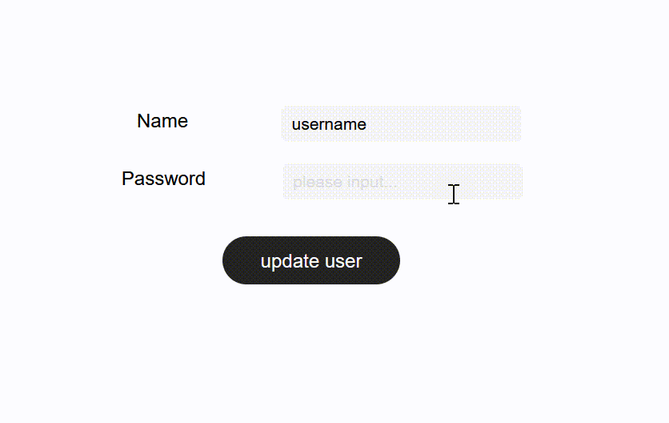

# Text Input

### Introduction

Discover the power of the Text Input component, a versatile tool for web app development. This guide explores its attributes, actions, and real-world use cases, providing clear insights for both beginners and experienced developers. Find the potential of this component in just a few scrolls.

### Usage Scenarios

The Text Input component serves as the input for text or numeric content. You can use it in various scenarios:

* Fill in/Complete Contents
* Password Field
* Numeric Entry Box
* Search Box

### Attributes

#### Style

1. Password Input

The content is encrypted when you enter it, usually used in password login systems.

<figure><figcaption></figcaption></figure>

<figure><figcaption></figcaption></figure>

2. Multiple Lines

With Multiple Lines enabled, if the entered text exceeds the input box width, the remaining text wraps to new lines.

<figure><figcaption></figcaption></figure>


Tips:

When using Multiple Lines with Vertical Layout Mode set to Adapt to Content, the minimum value may not take effect.


#### Content

1. Placeholder

Displayed when the Text Input component is empty; placeholders can be left empty.

<figure><figcaption></figcaption></figure>


Tips:

Placeholders cannot be bound to data, only entered directly.


2. Data Type

By default, the Text Input component's data type is text for both input and output. You can modify it to numeric, with both input and output as integers.


Tips:

When changing to numeric, the default value is automatically set to 0. To use the page's numeric type as the default value, assign it accordingly.\



3. Default Value

This value is displayed before user input and behaves the same as user input; it can be linked to data.

<figure><figcaption></figcaption></figure>


Tips:

* If both placeholder and default value are set, the default value is displayed first.
* Modifying the default value after user input won't affect the input or display.
* Disallowing the default value of a text input component to select itself will result in an infinite loop that will report errors.


#### Interact

1. Behavior When Changing

Triggered when the input content of the Text Input component changes.


Tips:

No configuration is needed when applying list filter conditions to the input box value. Configuration updates automatically with real-time input changes.


2. Loss of Focus Behavior

Triggered when the input box loses focus, e.g., when the user clicks elsewhere or finishes typing.\

3. Distance Between Cursor and Keyboard

Adjust the distance between the cursor and the keyboard, controlling the space between the keyboard and the input box that appears upon focus.\

4. Focus View

When enabled, the keyboard pops up automatically upon entering the page with the Text Input component, facilitating direct content entry.\

### Utilization


Tips:

It is recommended to rename the components when there are multiple text input components on the page. This way, when using the resultant content, it is clear which component was used to enter the content.


#### Fill in/Complete Contents

Example:

1. When you want your live users to fill in/complete their information, you need to put a text input component on the pages so that your live users can enter their info into the input box.

<figure><figcaption></figcaption></figure>

<figure><figcaption></figcaption></figure>

2. Text input components also need to be placed on the page when your live users need to edit their information. However, for user experience, etc., the current information is usually configured at the default value so the user can refer to and modify it.

<figure><figcaption></figcaption></figure>

<figure><figcaption></figcaption></figure>

#### Password Input

Example:

1. Securely encrypt the user account password by enabling the \[Password Input] button in the Text Input component's style settings.

<figure><figcaption></figcaption></figure>

<figure><figcaption></figcaption></figure>

#### Numeric Entry Box

Example:

1. Allow users to enter numeric content like reimbursement amounts or item quantities. Place the Text Input component on the page, change its data type to numeric, and set a default value.


Tips:

Directly use the numeric input component to implement add and reduce buttons on a shopping cart.


#### Search Text

Example:

1. The search function is used to find content and help your live users find what they need. Please refer to the documentation of the search function in \[Help Center] for specific configuration.

<figure><figcaption></figcaption></figure>

<figure><figcaption></figcaption></figure>

### About Momen

[Momen](https://momen.app/?channel=blog-about) is a no-code web app builder, allows users to build fully customizable web apps, marketplaces, Social Networks, AI Apps, Enterprise SaaS, and much more. You can iterate and refine your projects in real-time, ensuring a seamless creation process. Meanwhile, Momen offers powerful API integration capabilities, allowing you to connect your projects to any service you need. With Momen, you can bring your ideas to life and build remarkable digital solutions and get your web app products to market faster than ever before.
