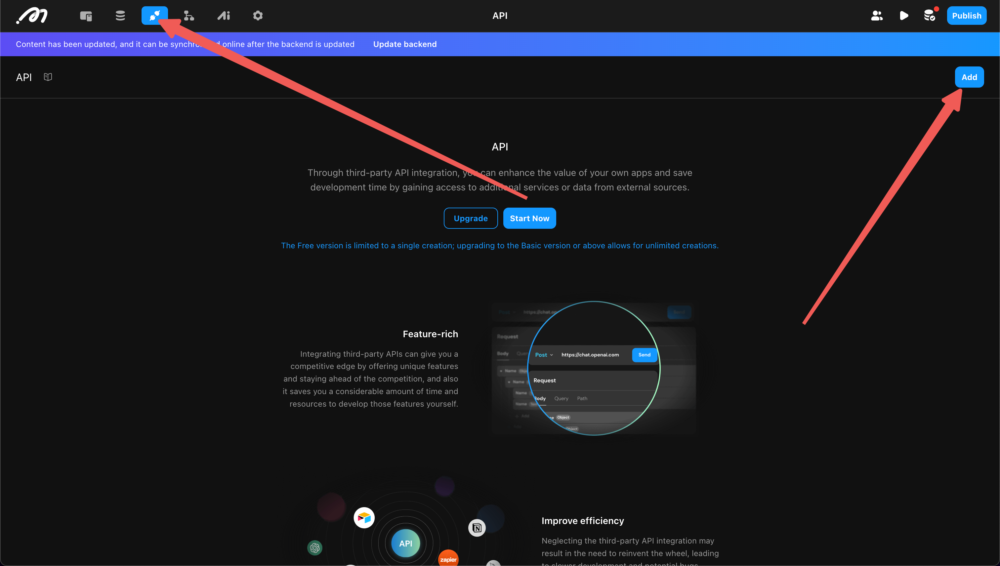
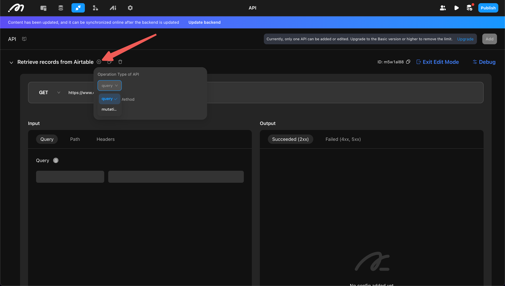
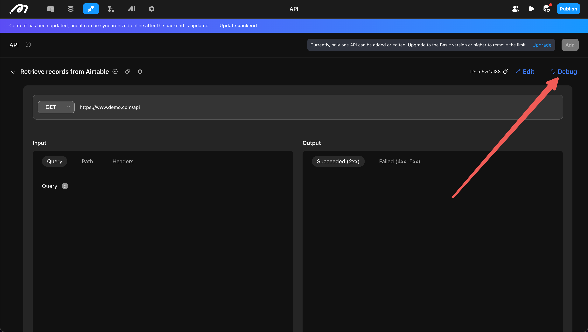
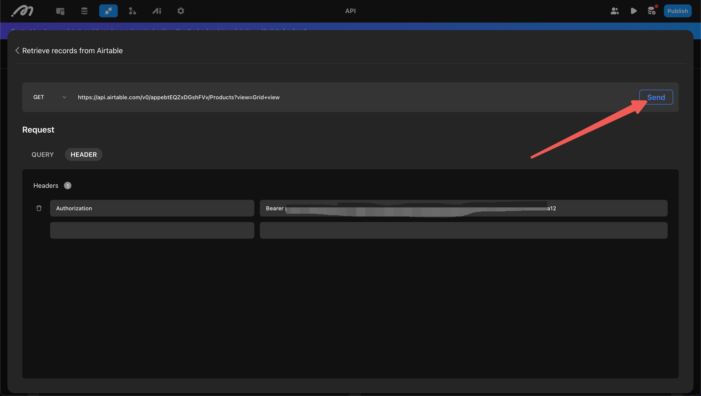
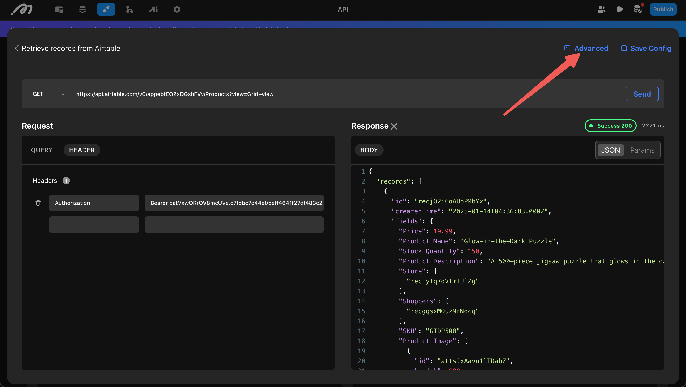
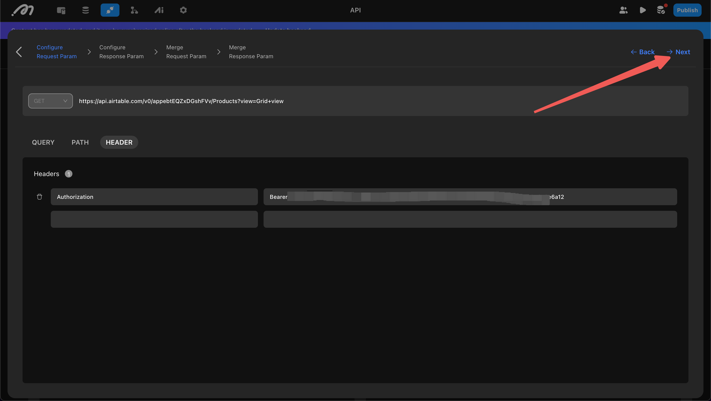
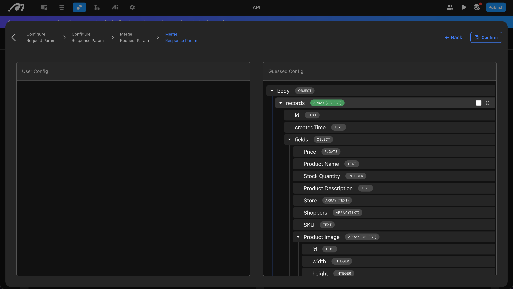
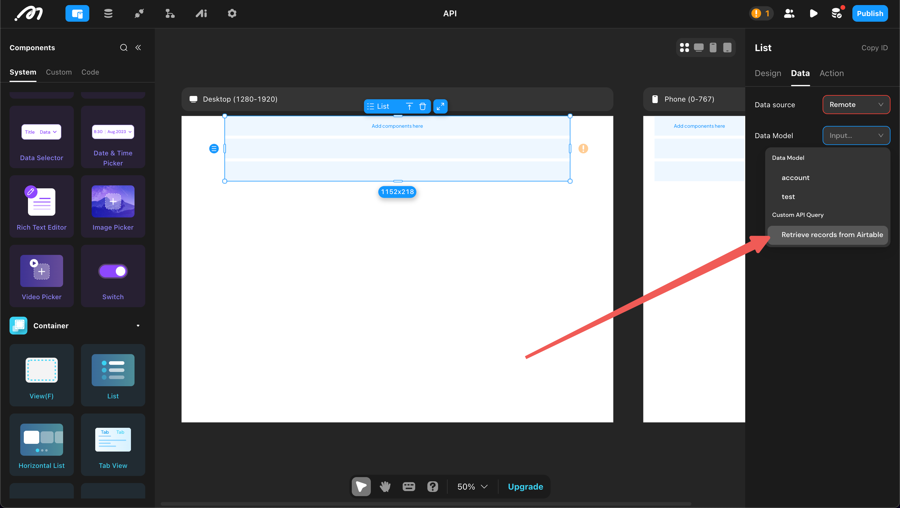
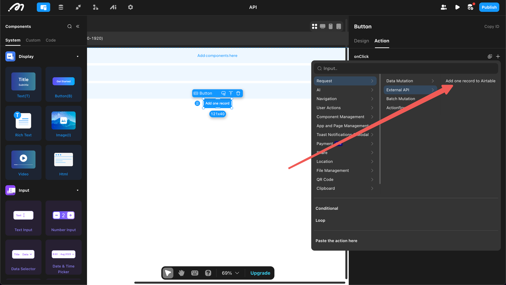

# API

An API is a bridge between different applications. When an application needs to connect with external data, it is typically achieved through an API.

Before configuring APIs in Momen, ensure you understand the basic components of an API: Method, Domain, Path, Headers, Query Parameters, and Body. For more details about APIs, refer to online resources.

This guide uses "retrieving data from Airtable" as an example to introduce the complete configuration process.

## Add API

Open the "API" section at the top left of the Editor and click "Add".

## Edit API

### 1. Select "Operation Type"

This step determines whether the API is used as a data source or an action:

- **Query:** Use the API as a **data source** for components (List, Page, etc.).
- **Mutation:** Use the API as an **action**.

In this example, the API is used as a data source for a list, so "Query" is selected.

### 2. Set the Request Format

Determine the format of the API request and response. Momen provides two configuration methods:

- Automatically parse the format by successfully sending a request (recommended)
- Manually configure all content

#### Automatically Parse the Format

First, open debug mode.

Then, complete the request method, domain, path, body, etc., and click "Send".

After a successful send, click "Advanced" to confirm whether the format is correct.

Confirm the "Request Parameters" and "Response Parameters" in sequence. If you are updating the API configuration, both new and old configurations may exist, requiring a merge.

Once confirmed, you will have the request and response format of the API and can proceed to use it.

### Setting Default Values

After determining the structure of the request and response, you can set default values for certain fields. These fields will not require values when sending requests, simplifying subsequent configurations.

Since default values are stored on the backend, they are secure and suitable for sensitive information, such as `Authorization` in this example.

.png)

## Use API

### Use as a Data Source

In the data source settings for List, Select View, and Page, you can select an API as the data source.

During configuration, specify which field in the API response is a list type and the required input parameters. Since `Authorization` has a default value, it does not need to be filled in.

.png)

### Use as an Action

If you have configured a "Mutation" type API, you can find it under the "Request" category in the action list under "API".

