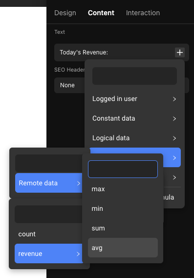
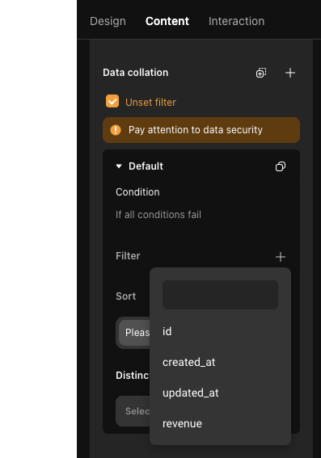

# Remote Data

### Introduction

Before reading this, it is recommended to familiarize yourself with the [Data Retrieval and Display](https://docs.momen.app/data/data-retrieval-and-display).

### **Concept of Remote Data**

Remote data: data stored in a database

💡 Tips: &#x20;

This database can be Momen's own database or a third-party database; third-party databases need to be connected through an API.

### **Why Use Remote Data**

To read out the data stored in the database and use it or display it on the page.

### **Where to configure remote data**

#### **On the Page**

After selecting a page, you can add remote data to its "Content".

.png>)

### **In Components**

Select a list class component to add remote data to its "content".

.png>)

### **Configuration Item Definition for Remote Data**

#### **Name**

Defaults to remote\_data, which indicates the name of this remote data. You can change this name by clicking on it, which determines the name under which this data will be called when data binding is performed.

.png>)

#### **Data List**

Specifies which data list to request data from

#### **Request Type**

'Query' means that a query request is executed to the server whenever the page is loaded/refreshed;

"Subscription" means that when the data in the data model changes, the latest value is returned in real time, but subscription is not available for types of data such as media and files.

**Data limits**

Limit whether to request single or multiple data from this data table when initiating a request, unchecking the limit means selecting all the filtered data.

**When reading a single item**

When the limit = 1, it means that you want to request a specific piece of data from a table, and when you call remote data for data binding, you can directly select a field of this data for binding.

|  |  |
| ----------------------------------------------------------------------- | ----------------------------------------------------------------------- |

**When reading multiple pieces of data**

When the limit is greater than 1

* Generally, what you want to get is the number of qualified data in a table in the database, i.e., count, and then use it to display or make a conditional judgment.

.png>)

.png>)

* Perform calculations of integer field data from a table in a database

1. sum: the sum of a field of a certain numeric type;
2. avg: the average value of a field of a particular numeric type;
3. max: the maximum value of a field of a numeric type;
4. min: the minimum value of a numeric field.

For example: there is a revenue table in the database, and there is a field named "Today's Revenue" with the type of "Infinite Precision Decimal" in the revenue table. If you want to display someone's total revenue, average daily revenue, and the highest revenue of the day, you can configure the remote data on the page, cancel the limit, and read all the revenue data of the user, and then you can bind the remote data on the page by binding the remote data of Then you can calculate and display the total return, average daily return and maximum daily return on the page by binding the remote data of sum, avg and max.

#### **Data Filtering**

According to different conditions to configure different data filtering rules, as shown in the figure below, for the same remote data, you can configure when a certain condition is met, configure specific filtering, sorting and de-duplication rules.

#### **Filtering**

Filter the data that meets the conditions by setting the filter conditions, similar to filtering based on the content of a column in an Excel table, generally when requesting data will be configured filter conditions, but if you confirm that you do not need to configure, then you can click to abandon the filter, otherwise it will report an error.

For example: to filter out the students whose gender is male in the student table, the filter condition is: gender = 'male', then the remote data will request all the students whose gender is male.

💡 Important Tips:

1. When the condition is equal to the value does not exist (i.e., no data), it will return arbitrary data.  &#x20;

For example: set the filter conditions for id = "link data", but at this time "link data" has not been assigned a value, then this is equivalent to not set the conditions, it will return any data. If the number of single requests is set to 1, then the corresponding data will be returned. 2.

2. When you expect the remote data to not request any data under certain conditions, you can set the filter condition to ID = -1.

For example: publish activity page and update activity page in most cases the layout and the use of components are the same, only the last button is a release, an update. We only need to configure the page conditional container to determine the user's current operation is to update or publish, then the conditional subcontainer to render the corresponding button can be.

Generally we will add an integer type of link data on the publish/update activity page, for the publish page, when the user clicks on the publish button on other pages, then it passes -1 to the publish page through the jump action, on the publish page, the remote data can not be taken by filtering the conditional id = -1 to get any piece of data, then the components on the page, although they are bound to the remote data, but there is no value, and the The conditional container can also decide to display the publish button by determining that the linked data is equal to -1, and clicking the button performs the publish operation.

For the update page, the link data receives the id of the activity data to be updated, and this id can be given to the remote data to filter and read the specific activity data, so that this data can be bound to the page's components to be displayed. At the same time, the conditional container determines that the link data is not equal to -1, then the update button is displayed, and clicking on the button performs the update operation.

#### **Sorting**

After determining the sort fields, you can further decide whether to sort in ascending or descending order.

#### **De-duplication**

Remove duplicates from the requested data according to a certain field and keep only one of the duplicates, the de-duplicated field should be the same as the sorted field!

#### **Request Status Change**

action triggered when the status of the request changes.

💡 Tips:

There are 5 statuses: normal, loading, error, success, message error, and business error.

Generally not commonly used, but will be used if you need to give the user a hint when the status of the request changes. Calculate when the request will succeed and how long it will take for the request to succeed.

#### **On Success**

The action added here is triggered when the remote data data is read successfully.

It is easy to interpret this as meaning that the data must be read to be considered successful. In fact, as long as the action of reading is normal regardless of whether the data is read or not, even if no data is read, it is still a success.

For example, for remote data for the student table, set the condition for the name = 'Paul'; the result of the data table does not have the name of the student Paul, then it will return null, which is also successful.

💡 Tips:

Success is very important, often need to add action in this position, because need to make sure that this step has got the data or has been carried out. For example, the use of filtering to determine whether the user's account exists, if the success of the result found that the data is empty, proving that there is no account can be triggered to set their own other action.

If you encounter any issues during the process, feel free to join our [Discord community](https://discord.com/invite/UCyhySSXfz) for assistance.

### **About Momen​​**

[Momen](https://momen.app/?channel=blog-about) is a no-code web app builder, allows users to build fully customizable web apps, marketplaces, Social Networks, AI Apps, Enterprise SaaS, and much more. You can iterate and refine your projects in real-time, ensuring a seamless creation process. Meanwhile, Momen offers powerful API integration capabilities, allowing you to connect your projects to any service you need. With Momen, you can bring your ideas to life and build remarkable digital solutions and get your web app products to market faster than ever before.​​
