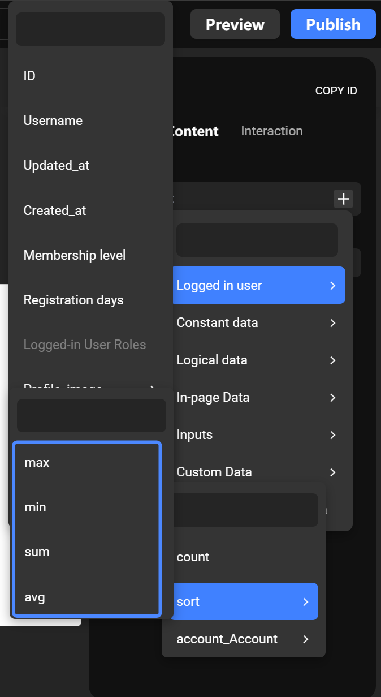

# Data Model Configuration


Before reading this tutorial, it's recommended to familiarize yourself with "[Data Model Fundamental](https://docs.momen.app/data/data-model/data-model-fundamental)" and "[Data Model Design](https://docs.momen.app/data/data-model/data-model-design)". When developing software, designing a sound data model in advance can greatly enhance development efficiency!

In Momen, after creating or updating a data model, it is necessary to update the backend for the changes to take effect.


### Introduction:

In this tutorial, we explore the functionalities and intricacies of accessing and modifying the Data Model within Momen. We will provide an overview of table creation, establishing inter-table relationships, and implementing data constraints to maintain data integrity. Whether you're a novice or an experienced developer, this article aims to offer valuable insights and best practices for a deeper understanding of Momen's data model design capabilities.

### Accessing the Data Model

* Click on the \[Data Model] button located in the top-left corner of the editor to enter the data model design interface.
* Within this interface, you can add, delete, or modify tables, as well as their fields. You can also establish relationships between tables and define data constraints.

<figure><figcaption></figcaption></figure>

### Adding a Table

After clicking \[Creat Model] in the data model interface, a window for table information settings will appear as described below:

<figure><figcaption></figcaption></figure>

#### Table Name

Set the name for the table. When reading or updating table data, it allows you to specify which table you're referring to. It's recommended to follow these rules:

1. Start with a lowercase letter.
2. Avoid using uppercase letters, spaces, and database-related keywords such as "like", "index", and words starting with "fz".
3. Numbers are allowed.
4. Separate words with an underscore ("\_").
5. Ensure a unique name within the same data model.
6. Use the descriptive name that indicates its content, and distinguish it from other tables.
7. Use singular nouns: Even though a table contains multiple data entries (making it a collection), its primary role is to describe data structure. Hence, we use singular nouns. Similarly, we typically don't add "list" to the table name.

#### Publicly Accessible

By default, the \[Publicly Accessible] option is enabled, allowing querying and content modification.

<figure><figcaption></figcaption></figure>

Disabling it restricts data access and modification after table creation.

<figure><figcaption></figcaption></figure>

### Adding Data Fields

To add data fields to a table, select the table and click the \[Add Column] button. A pop-up interface will appear, allowing you to add data fields. Think of this as adding a new column header to an Excel spreadsheet.

<figure><figcaption></figcaption></figure>

#### Name

It's recommended that words in field names be separated by underscores ('\_'). For instance, a data column storing users' profile images could be named "profile\_image".\

#### Field Data Types

This refers to the type of data stored in a particular column within a database table. The specific types are as follows:\

1. **Text (TEXT)**: Used when storing textual data such as names, personal profiles, phone numbers, etc. There's no length limit for this type.
2. **Image (IMAGE)**: Used when storing image data.
3. **Integer (INTEGER)**: Used for numeric data. Its range is from -2,147,483,648 to +2,147,483,647.
4. **Infinite Precision Decimal (DECIMAL)**: Used for monetary numbers. This type supports up to 28 digits after the decimal point.
5. **Date (DATE)**: Used for dates, for example, "2021-07-03".
6. **Time with Timezone (TIMEZ)**: Used for storing time with its associated timezone, e.g., "12:00:00+08".
7. **Boolean (BOOLEAN)**: The stored data can only be "true" or "false". This can be interpreted as a "yes or no" condition.
8. **Geographic Point (GEO\_POINT)**: Refers to a geographical location, storing the latitude and longitude, typically used for navigation purposes. The longitude range spans from 0° to 180° as well as from 0° to -180°, while the latitude range encompasses 0° to 90° and 0° to -90°.
9. **Timestamp with Timezone (TIMESTAMPTZ)**: Represents the number of seconds elapsed since January 1, 1970 (excluding leap seconds). It's suggested for time calculations like countdowns. Timestamps can be converted to date and time for display.
10. **Video (VIDEO)**: Used when storing video files, such as those ending in ".mp4".
11. **File (FILE)**: Used for storing files, like Word documents, PDFs, etc.
12. **JSONB**: Currently not supported.

#### Required

This indicates that the field is mandatory. If there's no data for this field when inserting new records, the insertion will fail. By default, this is not enabled.\

#### Unique

This implies that the data stored in this field must be unique across the entire table. If data being inserted into this field matches existing data in the table, the insertion will fail. By default, this is not enabled.\

#### Publicly Accessible

<figure><figcaption></figcaption></figure>

This setting determines the access permissions for this particular column. By default, it's enabled. When turned on, users can query, add, and modify the data in this field. Otherwise, they can not query, add, or modify the content of this field.

#### Vector Storage

When adding a new data field, if the field type is set to text, the \[Vector Storage] option can be enabled. This allows the data under this field to be stored as \[vector data]. Content saved as \[vector data] can utilize the \[AI Semantic Sorting] feature.

Activating the \[Vector Storage] option will consume more database storage resources and will also use up AI Tokens.

<figure><figcaption></figcaption></figure>

### Establishing Data Relationships

Establish a special relationship between Table A and Table B, enabling data communication between the two.

<figure><figcaption></figcaption></figure>

#### **Target Table**

The data table with which a relationship is intended to be established. It can be the table itself or another table.\

#### Relationship Types

1. **One-to-One Relationship**

Assuming Table A is the current table and Table B is the target table, upon establishing a one-to-one relationship, a unique data field (of integer type) will be added to the target table. This field is used to store the ID of a specific row in the current table. When accessing a record from Table B, you can directly reference data from Table A using this relational field, and vice versa.

Example: By default, there's a one-to-one relationship between the Account table and the Personal Info table. When accessing "current user data," an option for "Personal Info" is visible. Clicking on this option allows you to select and bind data from the Personal Info table.

<figure><figcaption></figcaption></figure>

2. **One-to-Many Relationship**

**Referencing from the 'many' side to the 'one' side**: Assuming Table A is the current table and Table B is the target table, once a one-to-many relationship is established, a unique data field will be added to the target table to store the ID of a specific row in the current table. Thus, when accessing a record in Table B, you can directly reference data from Table A.

<figure><figcaption></figcaption></figure>

**Referencing from the 'one' side to the 'many' side**: Given the nature of the one-to-many relationship, multiple records in Table B can relate to a single record in Table A. Therefore, when accessing a specific record from Table A, you can only obtain the count of related records in Table B or aggregate data from an integer field in Table B (such as sum, average, minimum, or maximum).

<figure><figcaption></figcaption></figure>

<figure><figcaption></figcaption></figure>

#### Relationship Name (in the Target Table)

It's crucial to name the relationship between two tables according to business logic. This ensures clear comprehension of the data's significance when referenced. The \[Relationship Name (in the Target Table)]pertains to the new field's name created in the target table after establishing the relationship.

For example:

* If the current table is the \[Event Table] and the target table is the \[Event Registration Table], and a one-to-many relationship has been established between them, a new field will be added to the target table. This field will store the ID of a particular entry in the current table. Typically, we would name this \[Relationship Name (in the Target Table)] as \[CurrentTableName+ID].
* However, the actual relationship field name generated in the target table would be \[CurrentTableName+ ID + \_CurrentTableName]. The rationale behind this convention is that the name we define is what precedes the underscore, while the segment following the underscore specifies the associated table.

<figure><figcaption></figcaption></figure>

<figure><figcaption></figcaption></figure>

#### Relationship Name (in the Current Table)

The\[Relationship Name (in the Current Table)] refers to the name of the relationship in the relationship view of the current table after the relationship has been established.

For example:

* In the scenario involving the \[Event Table] and the \[Event Registration Table], upon creating a one-to-many relationship, an additional relationship name will appear in the relationship view of the current table. This is the \[Relationship Name (in the Current Table)].
* In the context of an event and its registrations, a single event may have multiple registration records in the \[Event Registration Table]. The \[Relationship Name (in the Current Table)] references these multiple entries for the event in the registration table. Hence, we usually name this \[Relationship Name (in the Current Table)] as \[Registrations for the Event].

<figure><figcaption></figcaption></figure>

### Data Constraint

<mark style="color:red;">Once a constraint is established, it can not be removed unless the entire table is deleted!!!</mark>

**Definition of Data Constraint:** Within a data table, the data of a particular field or a set of fields must only appear once and can not be duplicated.

* In Momen, the default account table and every new table created in the future have a unique constraint automatically applied to the ID field. This means that the ID of any table is unique and can not be duplicated.
* After establishing a 1:1 relationship between two tables, a data constraint will be automatically created. For example, when a 1:1 relationship is established between the account table and the personal information table, a new constraint is automatically added to the personal information table. The purpose of this constraint is to ensure the unique existence of the account table's ID within the personal information table.


**Note:** If there is already duplicate data within the table, you can not add a relevant constraint to it.

**Example:** In the registration table, an individual with the account ID of 1 has registered for the event with the ID of 2 twice. Without constraints, the registration table will show two entries with both the account ID of 1 and the event ID of 2. If you try to add a unique constraint on both the account ID and event ID, the addition will fail.


#### How to Add a Data Constraint:

Select a data table within the data model. Click on the settings button to the right of the table, select \[Edit Constraint], then click the \[Add] button. Enter the constraint name and select the field name(s) you want to apply the constraint to from the \[Unique Constraint Column Set].

<figure><figcaption></figcaption></figure>

#### Constraint Naming

When naming a constraint, it must begin with a lowercase letter. Words should be separated by underscores, e.g., 'profile\_image'. The use of Chinese characters and uppercase letters is prohibited.\

#### Unique Constraint Column Set

Choose fields from the data table to add to the set. The model will no longer allow entries with completely identical set fields. You can select a single field or multiple fields.

**Example:** In the class information table, there are fields "Class Name" and "Class Teacher." Typically, a class will only have one teacher. To ensure that there's only one entry with the "Class Name" as "Third Year, Class 2" and the "Class Teacher" as "Teacher Liu," you can add a unique constraint on both these fields.\

#### Practical Use

When modifying table data, either by \[Add] or \[Updat] entries, you can select a previously added constraint condition from the \[On Conflict] dropdown menu. This way, if the data cannot be inserted/modified due to a constraint, you can select the desired \[Action Type]. The available \[Action Types] are \[None] and \[Update]. \[None] means that if there's a conflict while inserting/modifying, no action will be taken. \[Update] means that if there's a conflict, the existing data will be updated.

<figure><figcaption></figcaption></figure>

### About Momen

[Momen](https://momen.app/?channel=blog-about) is a no-code web app builder, allows users to build fully customizable web apps, marketplaces, Social Networks, AI Apps, Enterprise SaaS, and much more. You can iterate and refine your projects in real-time, ensuring a seamless creation process. Meanwhile, Momen offers powerful API integration capabilities, allowing you to connect your projects to any service you need. With Momen, you can bring your ideas to life and build remarkable digital solutions and get your web app products to market faster than ever before.

