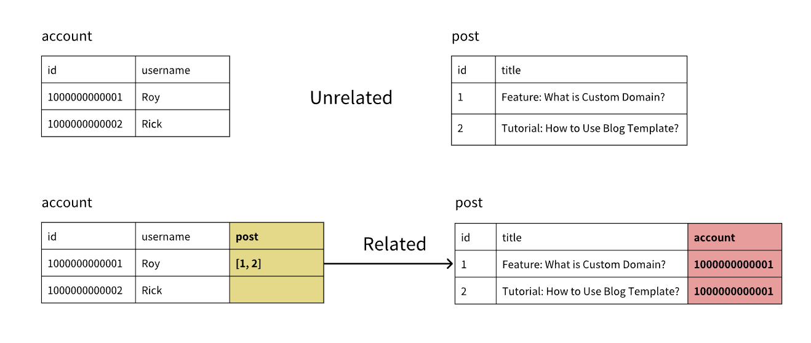

# Data Model and Database

## Getting Started

Open the "Data" section at the top left of the Editor.

- **Data Model:** Manage tables, including creating tables, adding columns, establishing relationships, etc.
- **Database:** Manage data records.

## Table Management

Tables are the core of the data model, where structured data is stored. Managing tables in Momen is straightforward.

### 1. Create a Table

Click "Add" and define the table's properties:

- **Name:** Cannot use reserved words like "log","column","index".
- **Description:** Optional table description.
- **Turn on permissions for all roles:** Table permission management. When enabled, all roles have permission to add, delete, modify, and query. For details, see: [Permissions](https://docs.momen.app/release-and-growth/permissions).

Example: Create a "post" table.

### 2. Add Columns

Each table is created with three default columns: `id`, `created_at`, and `updated_at`. These cannot be modified or deleted, and data is written by the system. The `id` is a unique identifier for each row, used to locate records and establish relationships between tables.

When adding columns, confirm the following properties:

- **Column Name:** Cannot use reserved words like "column."
- **Type:** Supports types such as Text, Integer, Image, etc. Momen enforces strict type validation. For example, "Date," "Zoned time," and "Zoned datetime" are all time-related but cannot be mixed. The data table is foundational, so choose types carefully.
- **Required:** Indicates whether the field can be empty when adding or modifying data. Generally turned off.
- **Unique:** Indicates whether this column's data must be unique (e.g., username in an Account table).
- **Turn on permissions for all roles:** Permission management for the column. For details, see: [Permissions](https://docs.momen.app/release-and-growth/permissions).

> In the post table, add `title` (Text), `content` (Text), `cover` (Image), and `show_at` (Zoned datetime).

### 3. Add Relations

Tables can establish relationships through `id`. For example, after the Account table establishes a relation with the post table, a new column is added to the post table to store the Account's `id`. Both blog posts below belong to "Roy."

When establishing relationships, consider:

1. **Relation Direction:** Which table establishes the relation with which (e.g., Account to post).
2. **Relation Type:**
   - **One-to-many:** One record in Table A can be associated with multiple records in Table B.
   - **One-to-one:** One record in Table A can be associated with only one record in Table B.

Example: A user can have multiple posts (One-to-many) but only one wallet (One-to-one).

Add the relation in the starting table (Account in this example), then set:

- **Target Table:** The table to associate with (post in this example).
- **Relation Type:** One-to-one or one-to-many.
- **Relation Name (in target table):** Name of the new column in the associated table (e.g., "Author").
- **Relation Name (in current table):** Name of the new column in the starting table (e.g., "Post").
- **Turn on permissions for all roles:** Table permission management. For details, see: [Permissions](https://docs.momen.app/release-and-growth/permissions).

### 4. Constraints

Currently, only "unique constraint" is supported, specifying that certain columns' data cannot be duplicated.

Each table has a default unique constraint on `id`.

Developers can add custom constraints. When adding, confirm:

1. **Constraint Name:** Must be unique and use only lowercase letters.
2. **Set of Columns:** Select one or more columns. Selecting one means the column's data must be unique; selecting multiple means the combination must be unique. **To delete a constraint, remove one of the columns from the set.**

Example: A unique constraint on "title" and "author" means the same author cannot use a duplicate title.

### 5. Vector Storage and Sort

Vector storage means vectorizing a column's data using a large model and storing the result in the database (invisible to developers).

After vectorization, you can use vector sort. Traditional sorting uses clear rules (e.g., numeric size, alphabetical order), but cannot handle similarity. Vector sort converts objects into vectors and sorts by similarity.

Example: By vectorizing the "Content" column in the "post" table, you can implement "Article Recommendation":

1. User inputs the content they want to read.
2. Calculate vector distance between input and posts, sort by distance.
3. Select articles with the closest distance.

Momen currently supports vector storage for Text types only.

After configuring vector storage, you can enable vector sort when retrieving data.

Momen provides two vector distance calculation methods: COSINE and EUCLIDEAN.

- **EUCLIDEAN:** Measures absolute differences, suitable for scenarios like navigation, logistics, or physiological parameter comparison.
- **COSINE:** Measures direction similarity, suitable for search engines, text classification, and recommendation systems.

### 6. Synchronize Modifications to Online

All modifications to tables and columns are synchronized online after updating the backend. **If your project is published and in use, modifying tables may cause some online requests to fail.**

## Permissions

Data is the most important asset of an application. Permission settings specify user access to data, preventing unauthorized access and data leakage.

Momen provides a permission management system combining role-based access control (RBAC) and attribute-based access control (ABAC). For details, see: [Permissions](https://docs.momen.app/release-and-growth/permissions).

## Data Usage

Once tables are created, they can be referenced or modified elsewhere. The following uses a blog website as an example to illustrate CRUD operations.

First, create a "Blog" table in the Data model to store articles, including:

- show_at (Publication date)
- title
- sub_title
- cover_image
- content
- published_status
- authors_author (Author's account ID)

<figure><figcaption>Blog table fields example</figcaption></figure>

#### 1. Create Data

Create a blog upload page and add components: inputs, Image Picker, subtext Editor, Date & Time Picker, and button.  
Bind the "add post" action to the button and bind field values to the corresponding components.

<figure><figcaption>Blog upload page example</figcaption></figure>

#### 2. Read Data

Display blog articles in a List format, showing cover image, title, author, publication date, etc.

Add a List component, select "Blog" as the data source, enable Load more, set limit to 3, and sort by show_at descending.

<figure><figcaption>Blog list display example</figcaption></figure>

Components within the List item also need to bind data. The data selection path is: In-component data -> post_list (List component name) -> item. "Item" represents each entry's data.

<figure><figcaption>List item data binding example</figcaption></figure>

#### 3. Update Data

To update blogs, support changes to title, subtitle, cover, and content.  
Create a blog modification page and add components: inputs, Image Picker, subtext Editor, and button.  
Add a Data source to the page, select "Blog", set limit to 1, and add a filter: ID equals the Query parameter blog_id.

<figure><figcaption>Blog update page data source configuration</figcaption></figure>

Once the article is loaded, bind its data to the components for display. For example, set the default value of the title input to the article's title.

.png)

Bind the "Update post" action to the modification button, bind fields to components, and add a filter: ID equals the blog's ID in the Data source.

**When modifying or deleting, always check and confirm filter conditions to avoid updating or deleting all data.**

.png)

#### 4. Delete Data

To delete articles, add the "Delete blog" action to the delete button, and set the filter: ID equals the blog's ID in the Data source.

.png)

## Data Import

Click the data model at the top left of the Editor to enter the database, then click the import button.

### 1. Select the Data Source to Import

- Only Excel files with UTF-8 encoding (`.xls`, `.xlsx`) are supported. Otherwise, you may encounter garbled text or upload failure. Use a recent version of Excel and avoid WPS.
- The first row of the Excel file is used as the header.
- Avoid extra data or spaces in unused columns, and do not include multiple worksheets in one file.
- Ensure at least one data record exists, or a format error will occur.

### 2. Set Table Mapping

Associate the Excel file with the data table created in Momen.

### 3. Set Field Mapping

Map the Excel file header to the fields of the data table. For fields you do not want to upload, as well as default creation and update time, select **[Null]**.

### 4. Set Relation Mapping

For a single unassociated data table, choose to ignore.

### 5. Upload Images, Videos, Files

If there are no media files, skip this step. If needed:

- For images, save files in a folder named `image` and compress to `image.zip`.
- For videos, use a folder named `video` and compress to `video.zip`.
- For Excel, doc, pdf, and audio files, use a folder named `file` and compress to `file.zip`.

**Only one media type can be imported at a time. For example, you cannot batch import images and videos together. If your data contains both, store them in different tables and establish relationships before importing separately.**

### 6. Preview

Preview the uploaded data.

- If you see garbled text, your file encoding is incorrect—convert to UTF-8.
- If the import button is gray, your file is still uploading—please wait.

### 7. Complete Import

**After switching data tables, the latest data will be shown.**

### 8. Common Self-check Methods for Import Failure

If you encounter an import failure, your **import content does not conform to the system's format requirements.**

- Open the browser console:
  - Mac: "option+command+j", "option+command+c", or "option+command+i"
  - Windows: "F12"
- Check the console for error messages after a failed import.

Check **linenumber**: `linenumber` does not directly match the data row number, but is the data row number +2 (system index starts at 0, table index at 1, and the first row is the header).

Common error types include:

- **MISMATCHED_DATA_TYPE:** Data type mismatch. For example, passing a Text value like "three hundred dollars" to a price field of type Infinite precision decimal.
- **NO_MATCHING_MEDIA:** No corresponding media file found. The file name in Excel must exactly match the media file name. Folder and file names must strictly follow requirements:
  1. Folder name must be exactly as required (e.g., `image`, not `images`).
  2. File name and Excel content must match, including suffix.
  3. Delete empty columns in Excel to avoid errors.
  4. If the folder is named `images` and compressed as `images.zip`, simply renaming to `image.zip` is not enough. Rename the folder before compressing.
  5. If the Excel file lists `image/cover1.png` but the archive contains `cover` or a different extension, update the Excel entry to match the actual file name and extension.
- **INTERNAL_ERROR:** Caused by using Windows' built-in compression software, which may not use UTF-8 encoding. It is recommended to use Bandizip with the following settings:
  - Compression format: `zip`
  - Compression level: `Normal`
  - Dictionary size: `Auto`
  - Word size: `Auto`
  - File name encoding: `UTF-8`
- **unique_constraint_violation:** The imported data contains duplicates in fields that require unique values. Check the import content for uniqueness in constrained fields.
