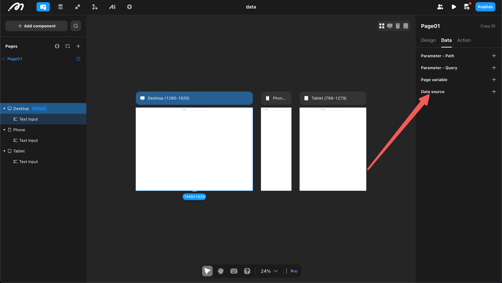
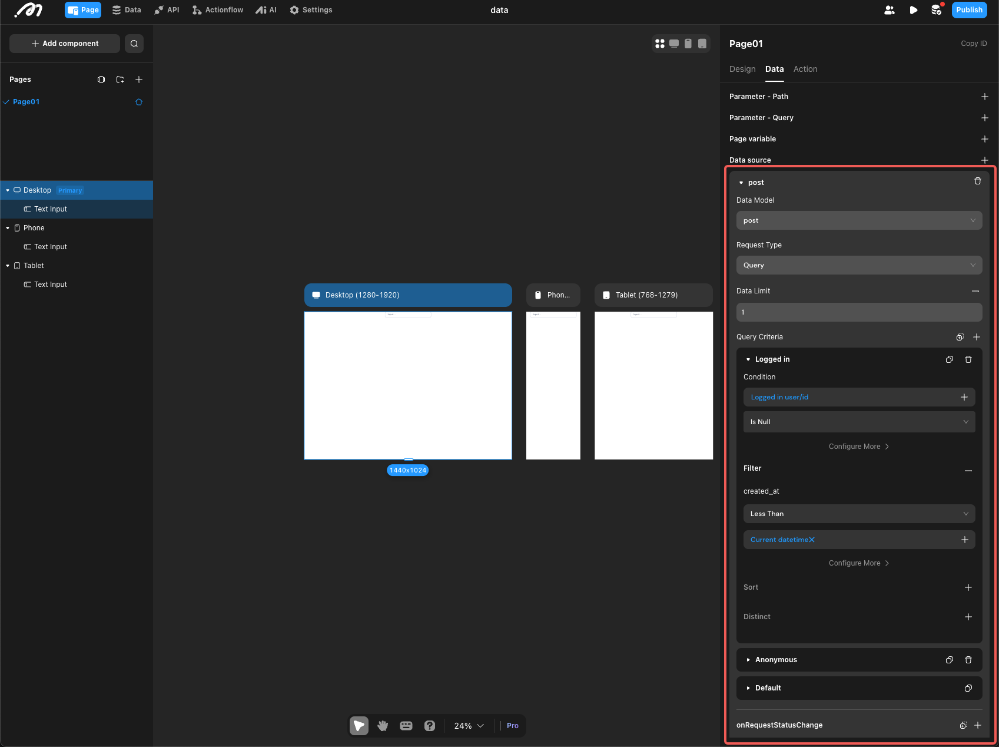
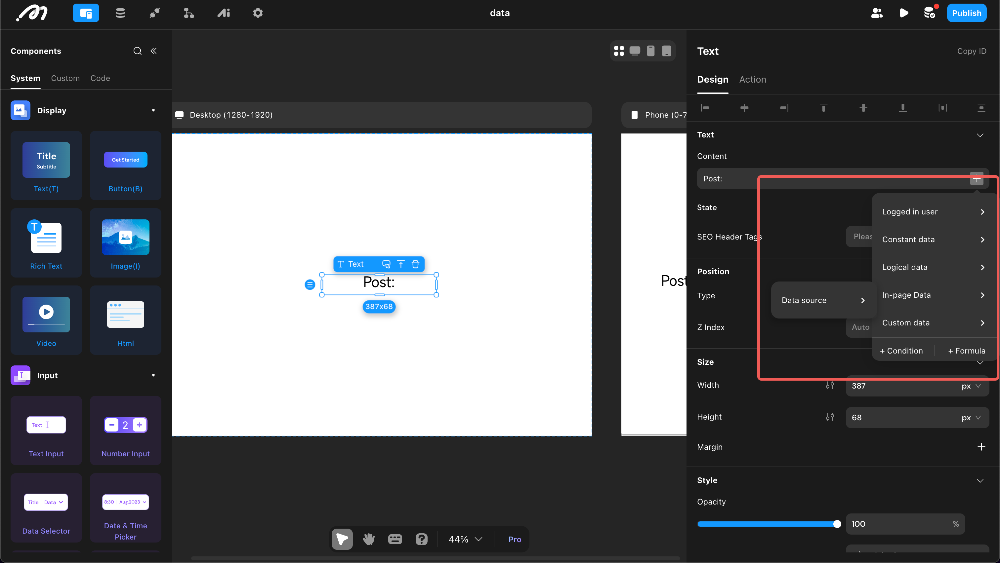
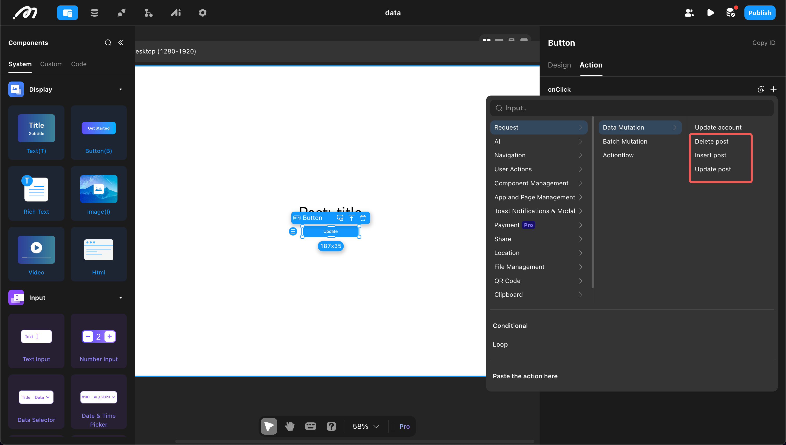
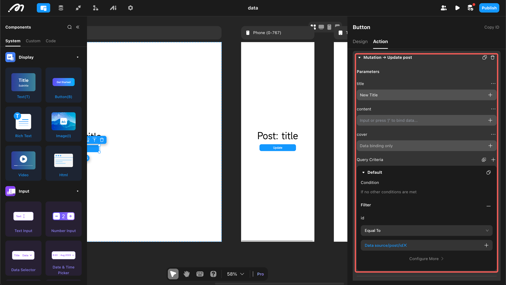

# Data Query and Modification

In the [Data Source](https://docs.momen.com/data/data_source.html) section, the origins of data are introduced in detail. This document will explore how to fully utilize data sources through query and modification (focusing on databases and APIs).

## Data Query
On pages and components, you can query database data or obtain external data through APIs. The following example of a **page data source** explains how to query and use data (for component data sources, please refer to [List](https://docs.momen.com/components-pages/custom-list.html), [Select View](https://docs.momen.com/components-pages/select-view.html), and other documents).

### 1. Add Data Source
Open a page, go to "Data," and "Add Data Source."

### 2. Set Filters
If obtaining data from a database, you need to determine the following:
* Tables: You can select all system tables and developer-created tables.
* Request Type: Two types are available.
  * Query: Obtain data once when the page loads (suitable for most scenarios).
  * Subscription: Obtain data once when the page loads, and when data in the database meeting the condition changes, it will be automatically pushed to the page (suitable for automatically obtaining the latest chat records and other specific scenarios).
* Data Limit: Refers to the maximum number of data entries to obtain, ranging from 1 to unlimited.
  * **If it is 1, a single data entry is returned.**
  * **If it is greater than 1, an array is returned. To retrieve a specific data entry, you can use the GET_ITEM formula (see details: [Formula](https://docs.momen.com/data/formula.html)).**
* Data Filters: Multiple filters can be configured.
  * Conditional: The condition for filtering; the filter that meets the condition will take effect.
  * Filter: Refers to obtaining data that meets the filter condition when extracting data from the database.
  * Sort: Choose to sort based on a specific field. If vector storage is enabled for the field, vector sorting can be performed (see details: [Database](https://docs.momen.com/data/datamodel.html)).
  * Deduplication: Remove duplicate data; multiple deduplication fields can be selected.

### 3. Use Queried Data
The queried data can be used in the "Page Data" and "Data Source" sections of the data selection menu.

## Data Modification
The system provides comprehensive operations for data addition, deletion, and modification. Before performing these operations, please carefully check and confirm the filter conditions to avoid unexpected situations (e.g., deleting all data, updating all data to the same entry, etc.).

