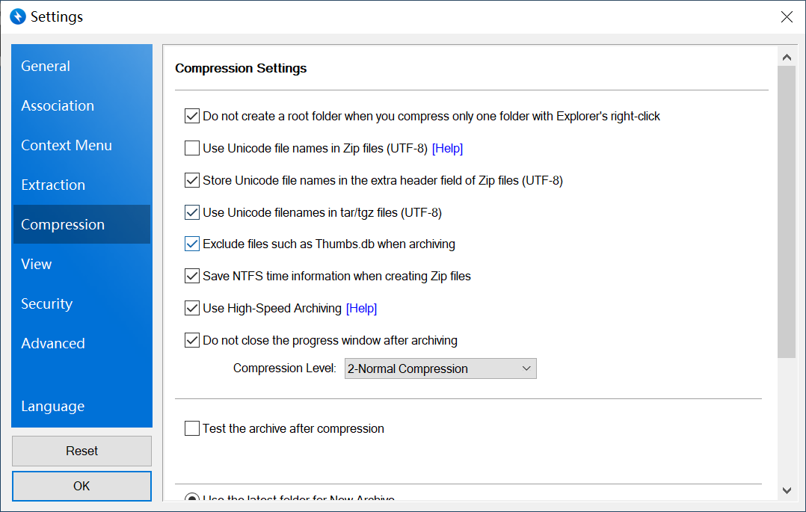

# Database Operation

### Introduction

This tutorial is about database settings. In this guide, you'll navigate the fundamental tasks essential for setting up and managing databases\

The database is where we view and manage (add, modify, import, export) data.\

### Update Database

Once you create or modify a data table, update permissions, establish relationships or add constraints, click the \[deploy] button to update. The updated table and fields will be visible in the \[Database] once it's done.

<figure><figcaption></figcaption></figure>

### View Your Data in the Table

#### View the Data Within the Table

To access the data within the table, click the \[Data Model] button at the upper left corner of the editor. Then, click the \[Database] button, and choose a data table to view its contents.\
If the table contains numerous data fields that cannot be fully displayed on the current screen:

* For Mac, you can view all the data on the Mac computer by directly swiping left and right on the touchpad.
* For Windows, press Shift + scroll the mouse wheel to scroll left and right in the data table.

#### View the Data in the Associated table

\
When Table A and Table B have a one-to-one relationship, the IDs of\ the other table will be visible in the associated fields of the two tables.

<figure><figcaption></figcaption></figure>

In the case of a one-to-many relationship between Table A and Table B:\

* Simply hover the mouse over the relationship field, you'll see a button that allows expansion of the associated data.

<figure><figcaption></figcaption></figure>

* The associated field in Table B will display the ID of the data in table A that's associated with Table B.

### Insert Data

Select the data table that you want to insert data. Then click \[Insert Row] and enter the corresponding data in the popup window.

<figure><figcaption></figcaption></figure>

#### Insert Related Field

If the field in the inserted data is generated through association, the data for that field cannot be directly inserted. Instead, you need to click on the selection button next to the input box, which will pop up the associated data table. From the associated data table, you can choose the corresponding data, and the ID of this data will be automatically filled into the corresponding input box.

### Modify Data

Method 1: Click on the field and modify directly.

<figure><figcaption></figcaption></figure>

Method 2: Hover your mouse over the data you need to change, click the expand icon to open the update panel, fill in the data, and save.

<figure><figcaption></figcaption></figure>

<figure><figcaption></figcaption></figure>

### Delete Data

Data deletion supports single and batch deletion.

<figure><figcaption></figcaption></figure>

### Custom View

Custom view can be understood as a collection of related tables into a single table. This makes it easier to view the data.

Find the customized view in the left column (if there are more tables than you can see, please scroll up) and click the plus sign.

<figure><figcaption></figcaption></figure>

Enter the custom view name and the base table in the pop-up window. Click create.

<figure><figcaption></figcaption></figure>

The view is successfully created, and you can then add other fields from the base table, as well as related table fields to the view.

<figure><figcaption></figcaption></figure>

### Import and Export

Enter the database and click the import button

<figure><figcaption></figcaption></figure>

#### Upload files

Tip 1: Only Excel files of utf-8 format (files ending in xls, xlsx) are supported, otherwise it will be messy/upload failure

* It is recommended to use the newer version of Office Excel to create the imported content
* The default header is the first line of the Excel table
* In addition to the necessary data columns in the table, other spaces can not write data or have spaces, and can not have more than one worksheet in the same Excel table.

Tip 2: Make sure there is at least one data record in the uploaded data table. If there is no data it will be formatted with an error.

<figure><figcaption></figcaption></figure>

#### Table mapping

Maps the Excel file to the data model tables created in Momen.

<figure><figcaption></figcaption></figure>

#### Field mapping

Establish the mapping of the Excel table header with the fields in the data table that you want to correspond with one by one. If it is a field that you don't want to upload data or it's the default creation time or update time, select \[Null].

<figure><figcaption></figcaption></figure>

#### Relation mapping

You can ignore the table that doesn't have relations with others.

<figure><figcaption></figcaption></figure>

### Upload media files

Because Momen's media file checking is quite strict and the operation is complicated, it will be introduced in a separate article.If you don't have any media files to upload, you can skip this step directly.The folder name of the uploaded image file source must be 'image', and the folder name of the video source must be 'video'. Batch import of audio is not supported at the moment.

<figure><figcaption></figcaption></figure>

#### Preview

Tthe data will be previewed after uploading.Tip again: If you see a garbled code here, it means that your file format is not correct, you need to convert it to utf-8 encoding format.

<figure><figcaption></figcaption></figure>

If the import button is gray it means that your import file is being uploaded, just wait for a little bit.\

#### Finish

After \[Refresh], you can click on the data table to view the newly imported data records.\

### How to Check the Errors While Importing

When you are performing data import operation in Momen, if you encounter the import failure prompt because your imported content does not meet the recognised format of the system.

Tip: How to find the reason for import failure

1. In the browser we open the console in the following way:Mac: "option + command + j" or "option + command + c" or "option + command + i".Windows computer: "F12" (most of them work)
2. Check the console, when it indicates that the import failed, the reason for the failure will be here

<figure><figcaption></figcaption></figure>

First of all, check the linenumber: linenumber corresponds to the number of rows of data is not direct, but the number of rows of data + 2. The reason is that the system index is from the beginning of 0, while the table index is from the beginning of 1; there is also a table in the first line is the table header, so the difference between two lines

<figure><figcaption></figcaption></figure>

* The first error message is "MISMATCHED\_DATA\_TYPE".

This error means that there is a data type mismatch, we have passed a text type "300" in the price field, while the data type of the price field in the data model is infinite precision decimal.

* The second error messages are "NO\_MATCHING\_MEDIA"

This error message means that the corresponding media file has not been found. When the file name in the Excel file corresponds exactly to the media file name, it can be uploaded successfully. The folder name should be in strict accordance with the requirements, picture image, video video, other file Correct format of Excel file Folder name/File name&#x20;

1\. Strictly consistent folder names: e.g. images folder, naming it with images is not valid, see line 11 above for a counterexample.&#x20;

2\. File name and Excel file content is strictly consistent, if the file name has a suffix Excel file should also be with, see line 9 above as a counterexample&#x20;

3\. Excel file if there are empty data columns, will also lead to the above error, so you need to delete the empty columns&#x20;

4\. Assuming that the name of the folder to save the picture for the "picture", will be compressed, the name of the compressed package for the "picture.zip", only the "picture.zip" to modify the If you change the name of the folder from "image.zip" to "image.zip", you cannot find the media file, so you should change the name of the folder from "image" to "image" before compressing it.

* Fourth error message "INTERNAL\_ERROR".

The reason for this error is that Windows uses its own compression software to compress the image/video file, and the encoding format of the file is not Utf-8, so Momen cannot recognize the content of the file and reports this error.&#x20;

In order to avoid this error, it is generally recommended to use the compression software "Bnadizip", compressed file compression configuration as follows

<figure><figcaption></figcaption></figure>

* unique\_constraint\_violation

Imported data contains data that violates constraints. If you have one-to-one relationships or other manually set constraints in your table, you need to check that the imported content of the fields with constraints is unique and does not already exist in the backend.

<figure><figcaption></figcaption></figure>

If you encounter any issues during the process, feel free to join our [Discord community](https://discord.com/invite/UCyhySSXfz.) for assistance.\

### About Momen

[Momen](https://momen.app/?channel=blog-about) is a no-code web app builder, allows users to build fully customizable web apps, marketplaces, Social Networks, AI Apps, Enterprise SaaS, and much more. You can iterate and refine your projects in real-time, ensuring a seamless creation process. Meanwhile, Momen offers powerful API integration capabilities, allowing you to connect your projects to any service you need. With Momen, you can bring your ideas to life and build remarkable digital solutions and get your web app products to market faster than ever before.
