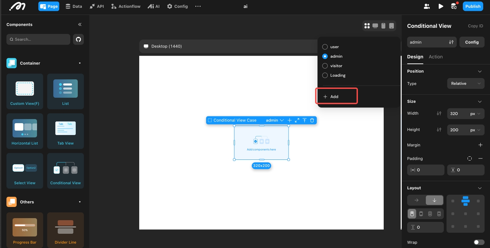

# Custom Database

### Introduction

You can select data tables and fields from the default database to generate a customized database for independent data sharing and management, reducing the risk of private data leakage and improving security when editing and sharing data.

### Basic Functions of Custom Database

1. A custom database is a subset of the default database.
2. Delete operations to the main database are synchronized to the custom database in real-time.
3. New operations in the main database, including adding new data models, fields and relations are not synchronized.
4. Supports renaming and filtering of names and field names when creating custom databases.
5. Supports for editable and actionable individual sharing of custom databases.

### Creating Custom Database

Click the \[+] next to "Data" - "Database" in the upper left corner of the editor and select the required data table and fields in the data table to create a customized database, and you can even configure further filters.

<figure><figcaption></figcaption></figure>

### About Momen

[Momen](https://momen.app/?channel=blog-about) is a no-code web app builder, allows users to build fully customizable web apps, marketplaces, Social Networks, AI Apps, Enterprise SaaS, and much more. You can iterate and refine your projects in real-time, ensuring a seamless creation process. Meanwhile, Momen offers powerful API integration capabilities, allowing you to connect your projects to any service you need. With Momen, you can bring your ideas to life and build remarkable digital solutions and get your web app products to market faster than ever before.
