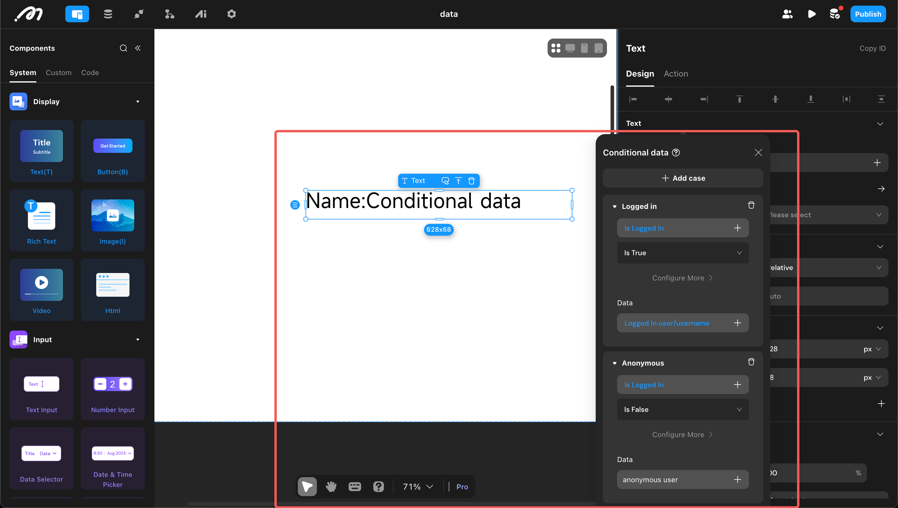

```description
Familiarize yourself with the use of formulas in Momen, mastering various data manipulation techniques such as mathematical operations, data counting, data format conversion, text processing, time processing, and geographical calculations to easily achieve complex data processing.
```
```keywords
Momen, data processing, mathematical operations, data counting, format conversion, text processing, time processing, geographical calculations, JSON processing, examples
```

# Formulas and Conditional Judgments
In addition to being directly used by actions and components, data is also used for formula calculations and conditional judgments.

# Formulas

Formulas are functions used to calculate data. Momen provides various formulas that can perform operations on different types of data such as text, numbers, arrays, and time.

### Text Processing
 | Name | Description | Example| 
|---|---|---|
| STRING_LEN | Returns the length of the text, with Chinese characters, letters, numbers, and symbols all counting as one character. | Text: "Hello World!">> 12 | 
 | REPLACE_PART | Replaces part of the text with new text based on the specified position (first character is 0) and number of characters. | Text: "Hello World!" Start position: 1 Number of characters to replace: 4 New text: "ola">> "Hola World!" | 
 | REPLACE_TEXT | Finds the specified text and replaces it with new text based on the number of occurrences. | Text: "Hello World!" Old text: "o" New text: "" Number of replacements: 1>> "Hell World" | 
 | FIND | Returns the position of the first occurrence of the specified text. The position of the first character is 0, returns -1 if not found. | Text: "Hello World!" Text to locate: "o">> 4 | 
 | CONTAIN | Determines whether the specified text exists, returning a boolean value true if it does; otherwise, false. | Text: "Hello World!" Text to find: "ello">> true | 
 | SUBSTRING | Extracts a substring. Includes the start position but not the end position; the position of the first character is 0. | Text: "Hello World!" Start position: 0 End position: 5>> "Hello" | 
 | LEFT | Returns a specified number of characters from the start of the text. | Text: "Hello World!" Number of characters: 5>> "Hello" | 
 | RIGHT | Returns a specified number of characters from the end of the text. | Text: "Hello World!" Number of characters: 5>> "World" | 
 | LOWER | Converts all letters in the text to lowercase. | Text: "Hello World!">> "hello world!" | 
 | UPPER | Converts all letters in the text to uppercase. | Text: "Hello World!">> "HELLO WORLD!" | 
 | RANDOM_STRING | Generates random text. Note that since random characters are generated on the front end, they are easily controlled and not recommended for use in scenarios such as generating coupon codes. | Minimum length: 5 Maximum length: 10 Lowercase: true Uppercase: true Numbers: true>> "seXr3aoRD" | 
 | SPLIT | Splits the text into an array using the specified character. | Text: "2024/01/08" Separator: "/">> ["2024", "01", "08"] | 

### Mathematical Operations
| Name | Description | Example | 
|---|---|---|
| + | Addition between numbers. | Number 1: 5 Number 2: 10>> 15 | 
 | - | Subtraction between numbers. | Number 1: 5 Number 2: 10>> -5 | 
 | * | Multiplication between numbers. | Number 1: 5 Number 2: 10>> 50 | 
 | / | Division between numbers. | Number 1: 5 Number 2: 10>> 0.5 | 
 | % | Returns the remainder after division, with the same sign as the dividend. | Dividend: -5 Divisor: 10>> -5 | 
 | MIN | Returns the minimum value. | Number 1: 5 Number 2: 10>> 5 | 
 | MAX | Returns the maximum value. | Number 1: 5 Number 2: 10>> 10 | 
 | ROUND_UP | Returns the nearest integer upwards. | Number: 3.5>> 4 | 
 | ROUND_DOWN | Returns the nearest integer downwards. | Number: -3.5>> -4 | 
 | INT | Rounds to the nearest integer. | Number: -3.5>> 3 | 
 | ABS | Returns the absolute value. | Number: -3.5>> 3.5 | 
 | RANDOM_NUMBER | Returns a random integer between specified numbers. Note that since random numbers are generated on the front end, they are easily controlled and not recommended for use in scenarios such as lotteries. | Minimum value: 1 Maximum value: 10>> 6 | 
 | POWER | Exponentiation operation | Base: 2 Exponent: 3>> 8 | 
 | DECIMAL_FORMAT | Decimal formatting. Note that if "Remove all trailing zeros" is selected, it will return data of text type. | Decimal: 3.1415926 Precision: 2 Rounding mode: HALF_EVEN Remove all trailing zeros: true>> 3.14 | 

### Array Processing
 | Name | Description | Example | 
|---|---|---|
| GET_ITEM | Retrieves an item from an array, with the index starting from 0. | Array: ["2024", "01", "08"] Index: 1>> "01" | 
 | ARRAY_TO_ITEM | Retrieves an item from an array (to be deprecated, recommended to use GET_ITEM). | Input array: ["2024", "01", "08"] Index: 1 Output: "01" | 
 | ARR_LEN | Gets the length of the array. | Input array: ["2024", "01", "08"] Output: 3 | 
 | FIRST | Returns the first item of the array. | Input array: ["2024", "01", "08"] Output: "2024" | 
 | LAST | Returns the last item of the array. | Input array: ["2024", "01", "08"] Output: "08" | 
 | RANDOM_ITEM | Returns a random item from the array. | Input array: ["2024", "01", "08"] Output: "01" | 
 | SLICE | Extracts a section of the array. | Input array: ["2024", "01", "08"] Start position: 1 Quantity: 2 Output: ["01", "08"] | 
 | JOIN | Joins an array of text type into a string. | Array: ["2024", "01", "08"] Separator: "-">> "2024-01-08" | 
 | INDEX_OF | Returns the index of the first occurrence of the specified item. | Input array: ["2024", "01", "08"] Specified item: "08" Output: 2 | 

### Time Operations
| Name | Description | Example | 
|---|---|---|
| GET_DATE_TIME | Gets a point in time. | Type: DateTime Configuration: Custom Year: 2024 Month: 1 Day: 8 Hour: 13 Minute: 14 Second: 0>> 2024-01-08T13:14:00.000+08:00 Note: 1. Date: 2024-01-08 represents year-month-day. 2. T is the separator between date and time. 3. Time: 13:14:00.246046 represents hour:minute:second.millisecond. 4. Timezone: +08:00 represents this time is in a timezone that is 8 hours ahead of UTC, which usually corresponds to China Standard Time (CST). | 
 | DELTA | Addition/subtraction operation on time. | Time: 13:38:00.000+08:00 Operation type: Add Hour: 1 Minute: 12 Second: 0>> 14:50:00.000+08:00 | 
 | DURATION | Calculates the interval between two points in time. | Start: 2019-12-01 End: 2024-01-08 Time difference converted to: Year>> 5 | 
 | EXTRACT | Retrieves a specified part of the time. | Time: 13:38:00.000+08:00 Unit: Hour>> 13 | 
 | TO_DATETIME | Converts date and time into DateTime type (timestamp). For example, merging and converting the date and time selected in a Data Selector. | Date: 2024-01-08 Time: 13:38:00.000+08:00>> 2024-01-08T13:38:00.000+08:00 | 
 | TO_DATE_TIME | Retrieves the date or time from a DateTime (timestamp). | DateTime: 2024-01-08 13:38:00.000+08:00 Extract: Date>> 2024-01-08 | 
### Geographical Location

 | Name | Description | Example| 
|---|---|---|
| DISTANCE | Calculates the distance between two geographical locations. The unit can be selected as: meters, kilometers, miles | Location 1: [120.2934,30.3150] Location 2: [120.2934,31.3150] Unit: kilometers>> 866 | 
 | GET_VALUE_FROM_GEO_POINT | Retrieves the longitude or latitude from a geographical location (latitude and longitude). | Location: [120.2934,30.3150] Type: Latitude>> 30.3150 | 
### JSON Processing Methods

 | Name | Description | Example| 
|---|---|---|
| JSON_EXTRACT_PATH | Retrieves data from JSON. | Input JSON: {"data": {"foo": "bar"}} Path: data.foo Output: "bar" | 

# Conditional Judgments

Logical operations on data are used in Conditional View, Conditional data, and conditional branches of Actionflow. For detailed usage, please refer to the relevant documentation.


