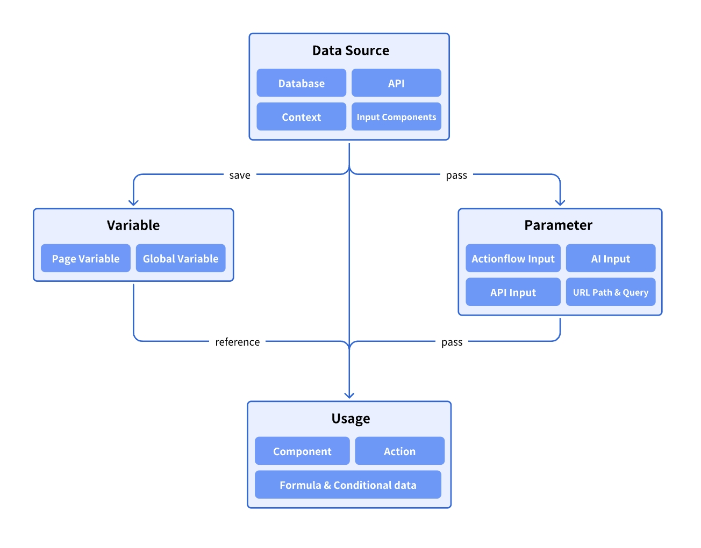
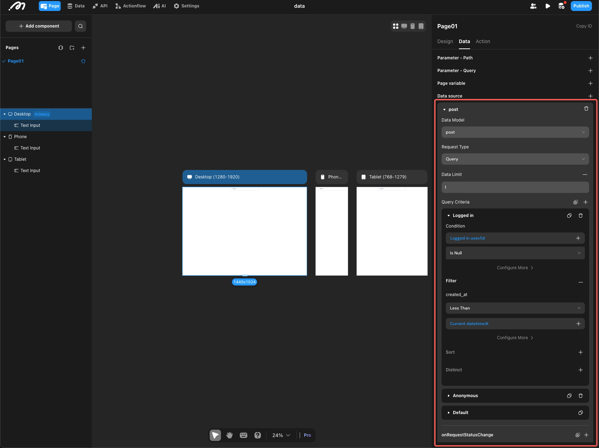
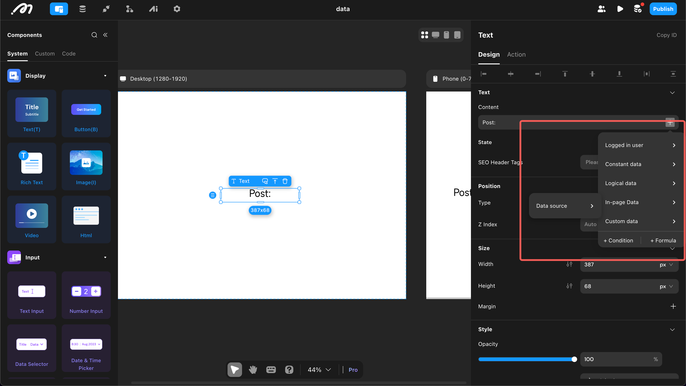
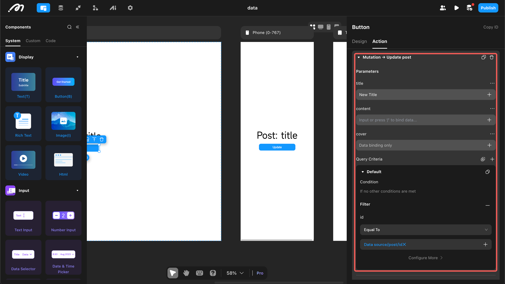

# Overview

Data is the core asset of an application, which is essentially about managing and processing it. Momen provides flexible and powerful data management and utilization capabilities, with the framework as follows:

## Data Source

Momen supports a variety of data sources, including built-in databases, APIs, etc.

* **Data Model and Database**: Momen provides a powerful relational database that is flexible and offers excellent performance. See details: [Data Model and Database](https://docs.momen.app/data/data_model)
* **API**: External data sources are typically accessed via APIs. See details: [API](https://docs.momen.app/data/api)
* **Environmental Data**: This refers to data provided by the environment in which the program is running, mainly including the following categories:
  * Null Types: Null, Empty Text, Empty Array.
  * Time Types: Current time, date, and datetime.
  * User Types: Logged in user data (automatically retrieved from the database, can be re-fetched using the "Refresh Login User Data" action), login status (boolean), user agent (browser/operating system information).
* **Contextual Data**: Mainly includes the following two types:
  * Action Result Data: Many action operations generate result data, which can be referenced by subsequent actions. For example, after calling the database "add data" action, the result of the addition will be returned; after calling an API action, the interface will return response data.
  * List Item Data: When a List View or Select View is bound to a data source, each list item has its corresponding data. This data can be used in various operations of the list item, such as displaying content, responding to user interactions, etc.
* **Input Components**: Momen provides various input components that can be used as data sources, including: Input, Data Selector, Image Picker, and Select View, etc. Please refer to the documentation of the relevant components for details.

## Data Query and Modification

Once the data source is determined, it can be used by components and actions.

### Data Query

On pages and components, you can query database data or obtain external data through APIs. The following example of a **page data source** explains how to query and use data (for component data sources, please refer to [List](https://docs.momen.app/buildui/component-list), [Select View](https://docs.momen.app/buildui/select-view), and other documents).

#### 1. Add Data Source

Open a page, go to "Data," and "Add Data Source."

#### 2. Set Filters

If obtaining data from a database, you need to determine the following:

**Tables** You can select all system tables and developer-created tables.

**Request Type** Two types are available.

* Query: Obtain data once when the page loads (suitable for most scenarios).
* Subscription: Obtain data once when the page loads, and when data in the database meeting the condition changes, it will be automatically pushed to the page (suitable for automatically obtaining the latest chat records and other specific scenarios).

**Data Limit** Refers to the maximum number of data entries to obtain, ranging from 1 to unlimited.

* **If it is 1, a single record entry is returned.**
* **If it is greater than 1, an array is returned. To retrieve a specific data entry, you can use the GET\_ITEM formula (see details:** [**Formula**](https://docs.momen.app/data/formula)**).**

**Data Filters** Multiple filters can be configured.

* Conditional: The condition for filtering; the filter that meets the condition will take effect.
* Filter: Refers to obtaining data that meets the filter condition when extracting data from the database.
* Sort: Choose to sort based on a specific field. If vector storage is enabled for the field, vector sorting can be performed (see details: [Data Model and Database](https://docs.momen.app/data/data_model)).
* Deduplication: Remove duplicate data; multiple deduplication fields can be selected.

#### 3. Use Queried Data

The queried data can be used in the "Page Data" and "Data Source" sections of the data selection menu.

### Data Modification

The system provides comprehensive operations for data addition, deletion, and modification. Before performing these operations, please carefully check and confirm the filter conditions to avoid unexpected situations (e.g., deleting all data, updating all data to the same entry, etc.).

## Referencing via Variables

To achieve data reuse, data can be stored in variables. For more details, see: [Variable](https://docs.momen.app/data/variable).

## Passing via Parameters

Data transmission (e.g., between pages) can be achieved using parameters. For more details, see: [Parameter](https://docs.momen.app/data/parameter).
