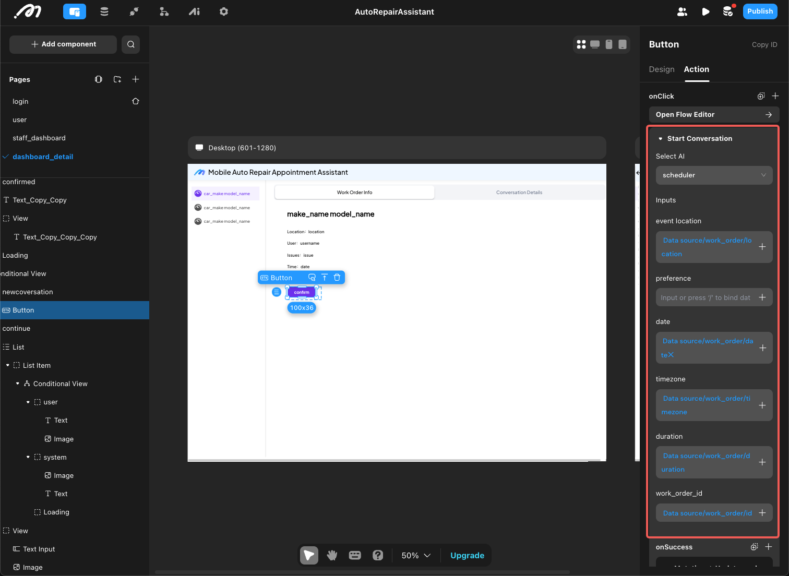

An application consists of different parts, which require data transfer between these parts (such as between pages, components, and action flows). In Momen, data transfer is achieved through parameters.

# Path and Query Parameters: Data Transfer Between Pages

Path parameters and query parameters are both used for data transfer via the page URL, but they occupy different parts of the URL.

For example, to access a blog post on the Momen official website:

<https://momen.app/article/content/how-to-build-an-ai-needs-analysis-bot?utm_source=google>

This URL can be broken down as follows:

- **https://momen.app**: Protocol and domain
- **/article**: Path of the blog page
- **/content/how-to-build-an-ai-needs-analysis-bot**: **Path parameter**. Here, the value of the path parameter 'content' is 'how-to-build-an-ai-needs-analysis-bot'.
- **?utm_source=google**: **Query parameter**. Here, the value of the query parameter 'utm_source' is 'google'.

**Path parameters** directly change the page URL, while **query parameters** only change the parameters of the webpage.

## Application Scenarios

- **Query Parameters:**  
  Generally used for parameter transfer between pages.

- **Path Parameters:**  
  Used for pages with SEO requirements (see: [SEO](https://docs.momen.app/release-and-growth/seo)). If the value of 'blog' is passed as a query parameter, crawlers may treat all blog posts as a single page, making them unsearchable and reducing SEO performance. Using path parameters, each article is recognized as a separate page, improving searchability.

## Configuration Steps

The configuration and usage of both types are the same: declare first, then assign, and reference as needed. The following uses the blog section of the Momen official website as an example.

### Declaration

Add parameters to the page that will receive the data. For example, on the blog page:
- Define the path parameter 'blog' as a filter for remote data to obtain blog articles (required).
- Define multiple query parameters to pass user information (optional).

### Assignment

Assign values to parameters in the action that navigates to the page. For example, on the search results page, in the navigation action to the blog page, assign the searched blog ID to the path parameter 'blog'.

### Reference

Path and query parameters can be referenced within the current page, typically for configuring filter conditions. For example, on the blog page, use the path parameter 'blog' as a filter to fetch blog articles.

# Action Input: Data Transfer in Actions

Many actions require input parameter configuration, such as Actionflow and AI actions. Similar to variables, action input usage involves three steps: declaration, reference, and assignment.

1. **Declaration:** Declare input parameters within the action configuration.
2. **Reference:** Reference these parameters within the action configuration.

3. **Assignment:** Assign values when calling the action.

