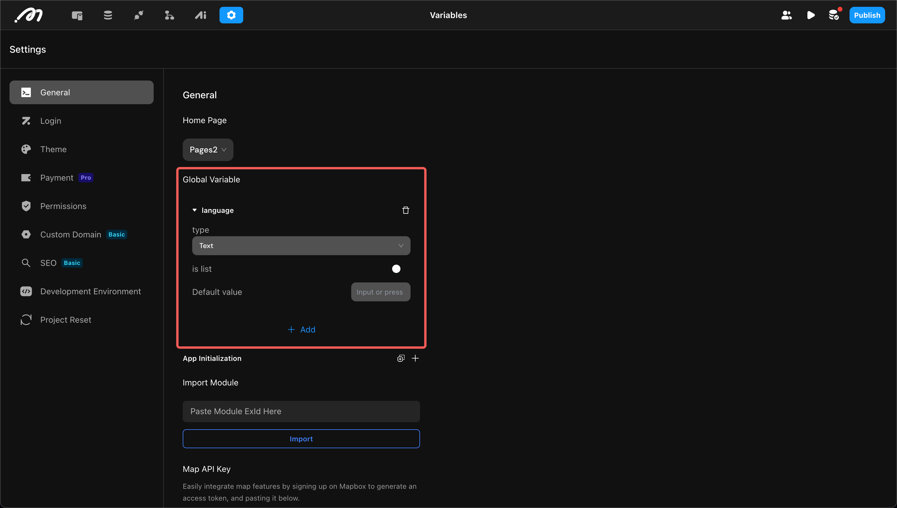
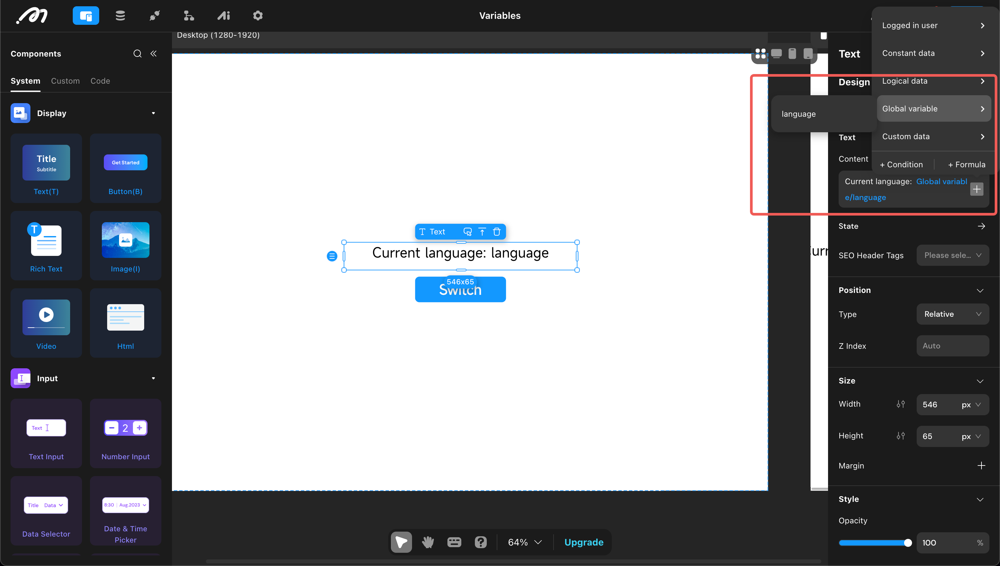
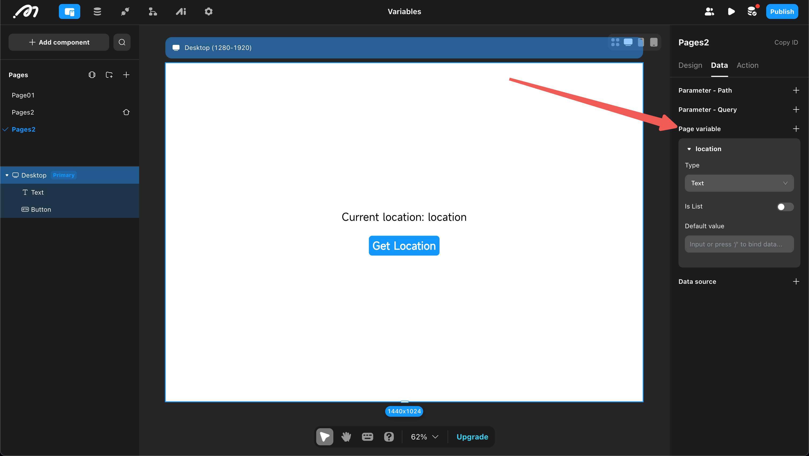
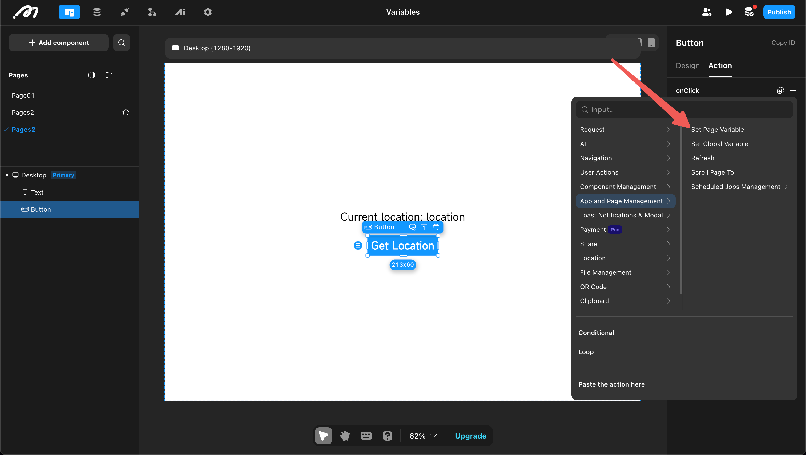
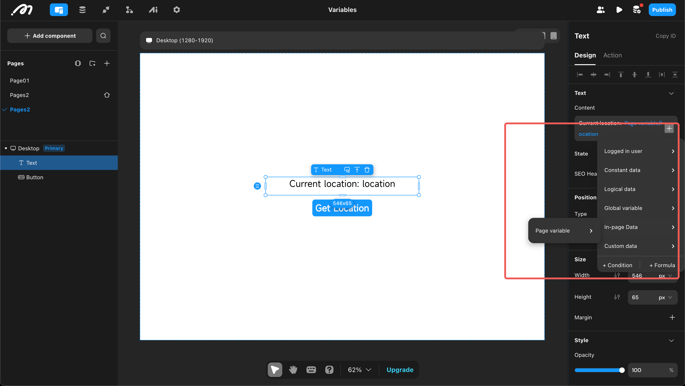

# Variable

In many scenarios, data is not used directly but is stored in a variable for reuse. Variables are divided into "global variables" and "page variables" based on their scope. The use of variables involves three steps: definition, assignment, and reference.

## Global Variables

Global variables can be referenced by all pages and are typically used to store global configuration information.

1. **Definition**

Open "Settings" → "Global" → "Add Global Variable". Choose a variable name, select a type, and optionally set a default value to define a global variable.

2. **Assignment**

Assign values using "Set Global Data", which can be done in global settings or on a page.

  

3. **Reference**

Global variables can be referenced by all pages.

## Page Variables

Page variables can be referenced by all components and actions within a page and are used to store data related to that page.

1. **Definition**

Enter the page, open "Data", and click "Add Page Variable". Choose a variable name, select a type, and optionally set a default value.

2. **Assignment**

Assign values using "Set Page Data".

3. **Reference**

Page variables can be referenced by all components and actions within the page.

