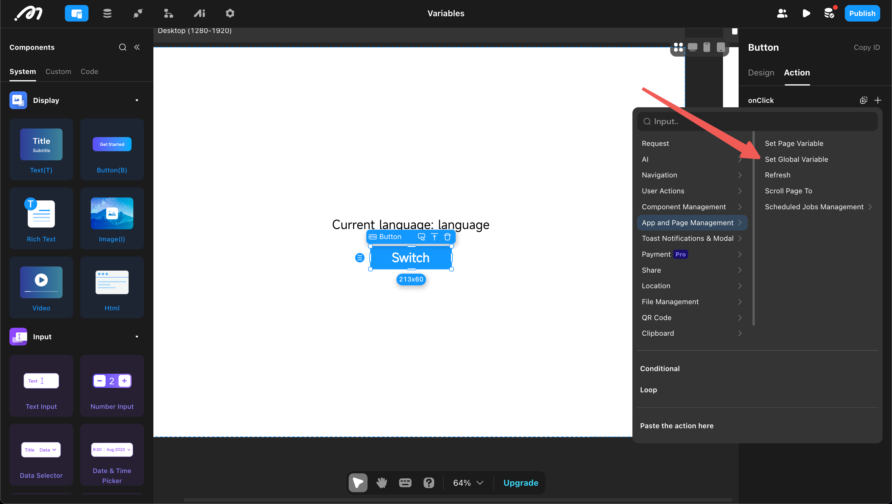
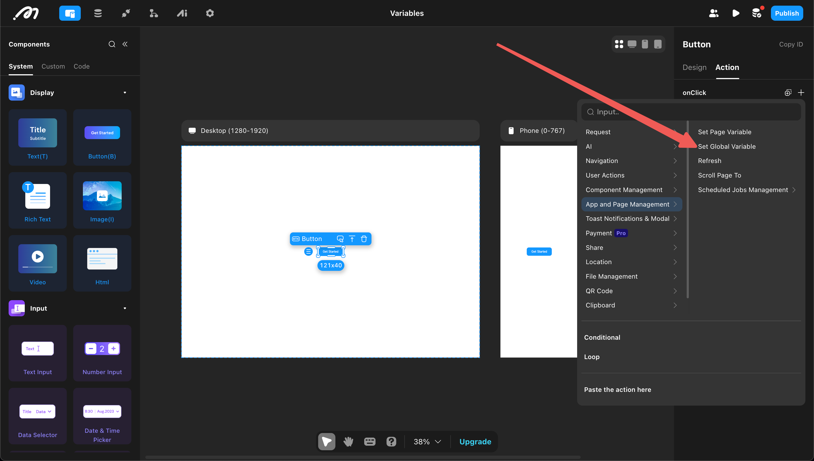

In many scenarios, data is not used directly but is stored in a variable to achieve data reuse. Variables are divided into "global variables" and "page variables" based on their scope. The use of variables involves three steps: "definition," "assignment," and "reference."

## Global Variables

Global variables are variables that can be referenced by all pages, typically used to store global configuration information.

1. Definition

Open "Settings," go to "Global," and then "Add Global Variable." Choose a variable name, select a type, and set a default value (optional) to define a global variable.

2. Assignment

Assign values through "Set Global Data," which can be used in global settings or on a page.

3. Reference

Global variables can be referenced by all pages.

## Page Variables

Page variables are variables that can be referenced by all components and actions within a page, used to store data related to that page.

1. Definition

Enter the page, open "Data," and then "Add Page Variable." Choose a variable name, select a type, and set a default value (optional) to define a page variable.

2. Assignment

Assign values through "Set Page Data."

3. Reference

Page variables can be referenced by all components and actions within the page.

